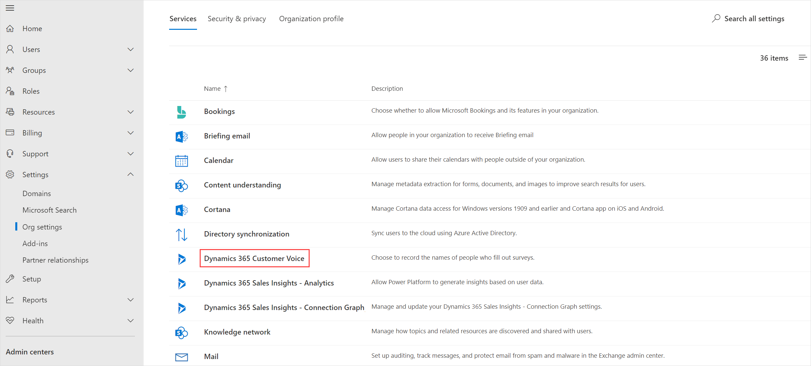
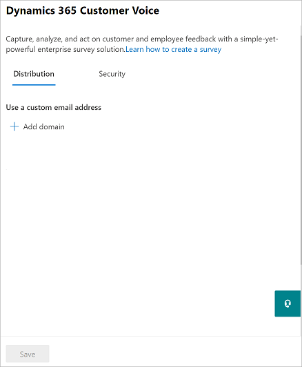

# Administrator settings for Dynamics 365 Customer Voice

As an administrator, you can control various settings such as recording the names of people in your organization and protecting surveys from phishing.

**To access administrator settings**

1. Sign in to [Microsoft 365 admin center](https://admin.microsoft.com/) with your work or school account.

2. Select **Settings** > **Org settings**.

3. On the **Org settings** page, under the **Services** tab, select **Dynamics 365 Customer Voice**.

     

   The **Dynamics 365 Customer Voice** panel is displayed.

    

4. Update the settings as described in the following section.

5. Select **Save**.

## Administrator settings

Following are the available administrator settings.

### Use a custom email address

This setting is available under the **Distribution** tab. Use this setting to create a custom email address for sending survey invitations to your customers. More information: [Customize the sender's email address](customize-sender-email.md)

### Prevent phishing attempts

This setting is available under the **Security** tab. Use this setting to set an automatic scan of surveys within your organization for phishing detection. By default, **Prevent phishing attempts** is selected. Clear this check box if you don't want to enable phishing scans for surveys within your organization.

### Collect names

This setting is available under the **Security** tab. Use this setting to capture the names of survey respondents. By default, **Collect names** is selected. Clear this check box if you want survey responses within your organization to remain anonymous. However, you can enable or disable this setting within individual surveys also. More information: [Participants](distribution-settings.md#participants)

### See also

[Work with survey distribution settings](distribution-settings.md)

[!INCLUDE[footer-include](includes/footer-banner.md)]
