---
title: "Work with alerts in Dynamics 365 Customer Voice | MicrosoftDocs"
description: "Instructions for working with alerts in Dynamics 365 Customer Voice"
ms.date: 01/18/2021
ms.topic: article
ms.service: dynamics-365-customervoice
author: sbmjais
ms.author: shjais
manager: shujoshi
---

# Work with alerts

Alerts are the follow-up activities that are created based on the defined alert rules. Alert rules are defined on satisfaction metrics. Alerts are created based on the responses received by the satisfaction metrics. For example, you can create an alert rule to create an alert whenever the NPS satisfaction metric for a survey response goes below a threshold. More information: [Create an alert rule](#create-an-alert-rule)

Alerts are created at the project level and help to close the loop with the customers by taking appropriate action based on the feedback provided by them.

You can view and manage alerts from the **Alerts** report. The report is available under **Reports** in the left pane. More information: [View and manage alerts](#manage-alert-rules)

## Create an alert rule

Alerts are created based on the satisfaction metric values. You can create an alert rule from the **Alerts** report.

1.  Open the project.

2.  Select **Alerts** in the **Reports** section in the left pane.

3.  Select **Create alert rule** on the toolbar at the top of the page.

4.  In the **Create alert rule** panel, provide the following information:

    - **Name**: Enter a name for the alert rule.

    - **Satisfaction metric**: Select a satisfaction metric on which this
        alert needs to be created.

    - **Condition**: Select a condition and its value from the respective
        lists. An alert is created whenever this condition is true.

    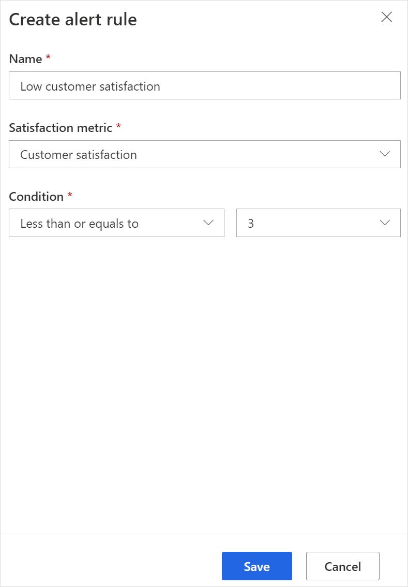

5.  Select **Save**.

## Manage alert rules

After you have created alert rules, you can view, edit, or delete the ones that are no longer required.

1.  Open the project.

2.  Select **Alerts** in the **Reports** section in the left pane.

3.  Select **View alert** **rules** on the toolbar at the top of the
    page.

    Alert rules are displayed in the **View alert rules** panel.

    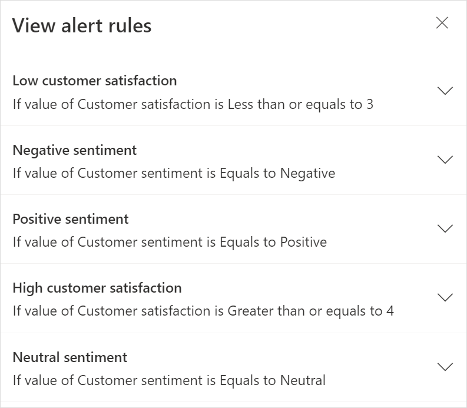

4.  To view an alert rule, expand the corresponding rule.

5.  To edit an alert rule:

    1.  Expand the rule, make the changes, and select **Save**.

    2.  In the confirmation message, select **Save**.

6.  To delete an alert rule:

    1.  Expand the rule and select **Delete**.

    2.  In the confirmation message, select **Delete**.

## View and manage alerts

An alerts report is created for a project as soon as alerts start getting created. To view alerts, select **Alerts** under **Reports** in the left pane.

Alerts are displayed in the grid format with the following information:

- **Customer**: Customer whose response resulted in creation of the alert.

- **Date created**: Date on which the alert is created.

- **Assigned to**: Name of the user to whom the alert is assigned.

- **Name**: Name of the alert rule.

Alerts that are newly created or being worked on, are displayed under the **Open** tab.

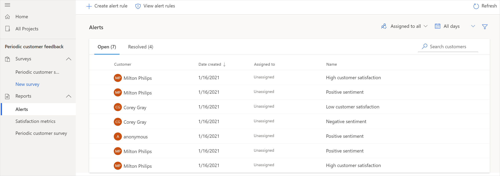

The resolved alerts are displayed under the **Resolved** tab.

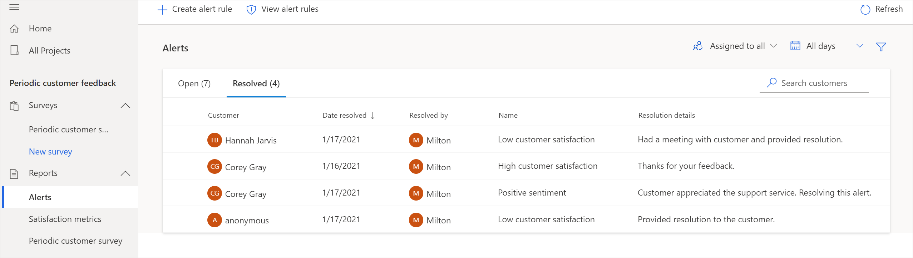

You can perform the following actions for each alert:

- **View**: Displays alert details in the **Alert details** panel.

- **Assign**: Assigns an alert to a user.

- **Reassign**: Reassign an already assigned alert to another user.

- **Resolve**: Marks an alert as resolved and moves it to the **Resolved** tab. This action is available only for the open alerts.

- **Reopen**: Marks a resolved alert as open and moves it to the **Open** tab. This action is available only for the resolved alerts.

- **Delete**: Deletes an alert.

To perform an action, hover over an alert, select the ellipsis button, and then select the required action.

You can also perform bulk actions by selecting multiple alerts and selecting an action from the upper-right corner of the grid. You can select a maximum of 100 alerts. The actions differ for the open and resolved alerts.

### Sort alerts

You can sort the alerts by selecting any of the column header. By default, the alerts are sorted by the date in descending order.

### Filter alerts

You can filter the list of alerts by selecting the **Filter**  icon in the **Alerts** report. In the **Filter** panel, select one or more of the following filter criteria, and then select **Apply**:

- **Alert name**: Name of the alert rule.

- **Satisfaction metric**: Satisfaction metrics for which alerts are generated.

- **Surveys**: Surveys for which alerts are generated.

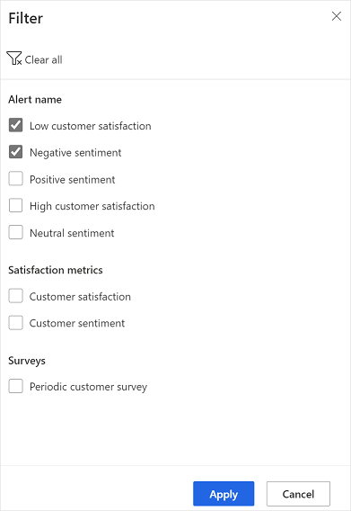

To remove the filter selections, select **Clear all** in the **Filter** panel.

You can also filter the list of alerts based on the following filters available above the **Alerts** grid:

- **Assigned to all**: Select **Assigned to me** to see alerts that are assigned to you. By default, all alerts are displayed in the grid.

- **All days**: Select 7 days, 28 days, 90 days, or a custom date range.

## View alert details

You can view details of an alert by selecting it in the **Alerts** report. When you select an alert, the **Alert details** panel opens to display its details. Alternatively, you can also hover over an alert, select the ellipsis button, and select **View**.

The information displayed in the **Alert details** panel depends on the alert state: open or resolved.

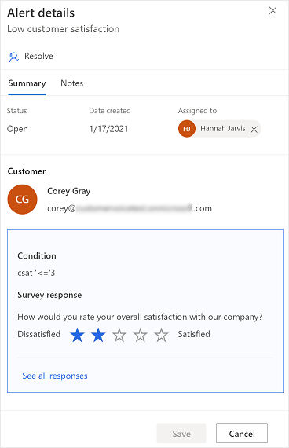

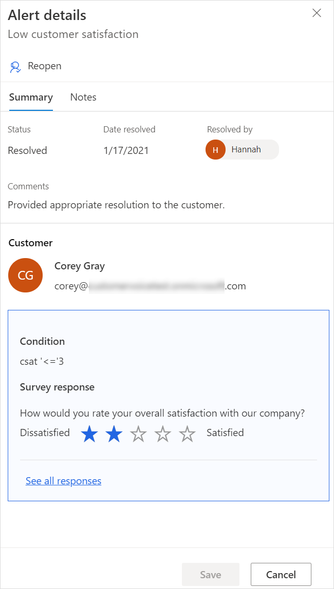

## View customer journey through Dynamics 365 Customer Insights

If the integration between Dynamics 365 Customer Voice and Dynamics 365 Customer Insights is enabled, you can select the customer's name to view their journey. It displays the top three measures and an activity timeline containing the 10 recent actions performed by the customer. To view full profile of the customer, select **View full profile**. The customer's profile is opened in Dynamics 365 Customer Insights. For information on integrating Dynamics 365 Customer Voice and Dynamics 365 Customer Insights, see [Integrate Dynamics 365 Customer Voice with Dynamics 365 Customer Insights](ci-integration.md)

## Resolve an alert

After you've finished working on an alert, you can mark it as resolved and add your resolution comments. You can mark an alert as resolved either from the alerts grid or the **Alert details** panel.

### Resolve an alert from the alerts grid

1.  Open the **Alerts** report.

2.  On the **Open** tab, hover over the alert you want to resolve, select the ellipsis button, and then select **Resolve**.

3.  In the **Resolve alert** panel, enter your comments in the **Comments** box, and then select **Resolve**.

    The alert is marked as resolved and moved to the **Resolved** tab.

You can also select multiple alerts in the grid and select **Resolve** at the upper-right corner of the grid.

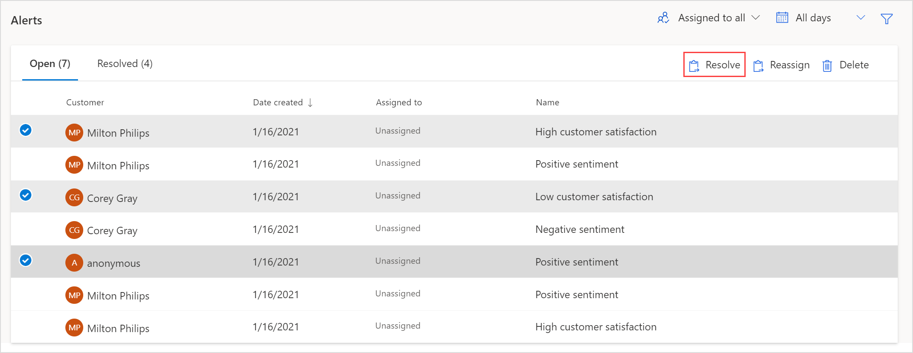

### Resolve an alert from the Alert details panel

1.  Open the **Alerts** report.

2.  On the **Open** tab, select the alert you want to resolve.

3.  In the **Alert details** panel, select **Resolve**.

    

4.  In the **Resolve alert** panel, enter your comments in the **Comments** box, and then select **Resolve**.

    The alert is marked as resolved and moved to the **Resolved** tab.

    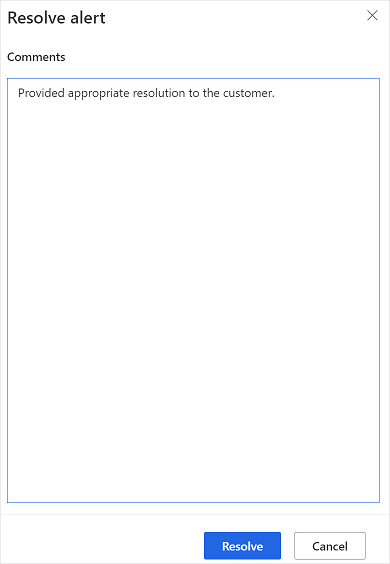

## Reopen an alert

You can reopen a previously resolved alert. You can reopen an alert either from the alerts grid or the **Alert details** panel.

### Reopen an alert from the alerts grid

1.  Open the **Alerts** report.

2.  On the **Resolved** tab, hover over the alert you want to reopen, select the ellipsis button, and then select **Reopen**.

    The alert is marked as open and moved to the **Open** tab.

You can also select multiple alerts in the grid and select **Reopen** at the upper-right corner of the grid.

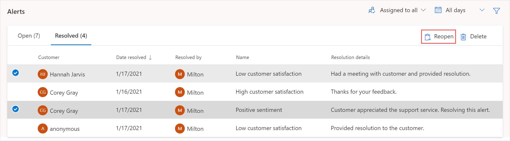

### Reopen an alert from the Alert details panel

1.  Open the **Alerts** report.

2.  On the **Resolved** tab, select the alert you want to reopen.

3.  In the **Alert details** panel, select **Reopen**.

    The alert is marked as open and moved to the **Open** tab.

    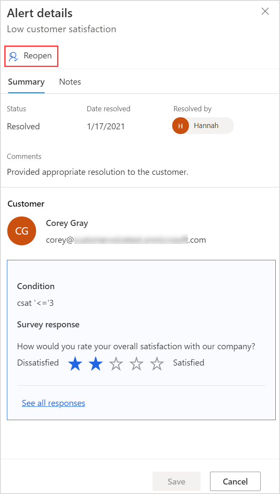

## Assign an alert

When an alert is created, it is not assigned to anyone. You must assign it to a user to work on it. You can assign an alert to a user either from the alerts grid or the **Alert details** panel.

### Assign an alert from the alerts grid

1.  Open the **Alerts** report.

2.  On the **Open** tab, hover over the alert you want to assign, select the ellipsis button, and then select **Assign**.

3.  In the **Assign alert to** pop-up, enter the name or email address of the user to assign the alert to.

    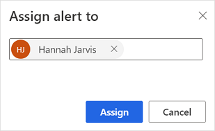

    > [!NOTE]
    > - Only one user can be specified at a time.
    > - You cannot assign an alert to a distribution list.

4.  Select **Assign**.

    The alert is assigned to the specified user and an email is sent to the user to whom the alert is assigned.

You can also select multiple alerts in the grid and select **Reassign** at the upper-right corner of the grid. In the **Assign alert to** pop-up, enter the name or email address of the user to assign the alert to, and then select **Assign**.

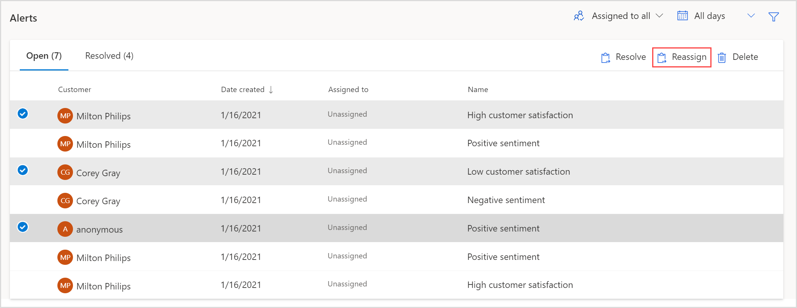

### Assign an alert from the Alert details panel

1.  Open the **Alerts** report.

2.  On the **Open** tab, select the alert you want to assign.

3.  In the **Alert details** panel, select **Assign**.

    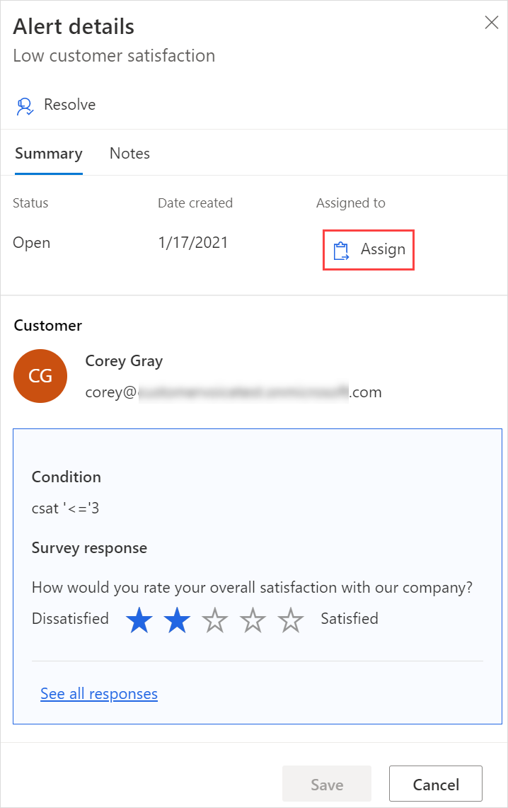

4.  In the **Assign alert to** pop-up, enter the name or email address of the user to assign the alert to.

    

    > [!NOTE]
    > - Only one user can be specified at a time.
    > - You cannot assign an alert to a distribution list.

5.  Select **Assign**.

    The alert is assigned to the specified user and an email is sent to the user to whom the alert is assigned.

## Delete an alert

You can delete an alert that is not required anymore. You can delete an alert only from the alerts grid.

1.  Open the **Alerts** report.

2.  On the **Open** or **Resolved** tab, hover over the alert you want to delete, select the ellipsis button, and then select **Delete**.

3.  In the confirmation message, select **Delete**.

You can also select multiple alerts in the grid and select **Delete** at the upper-right corner of the grid. In the confirmation message, select **Delete**.

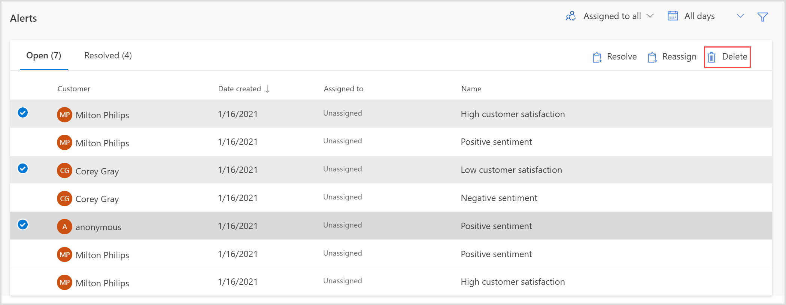

### See also

[Add and configure satisfaction metrics](satisfaction-metrics.md) 
[Integrate Dynamics 365 Customer Voice with Dynamics 365 Customer Insights](ci-integration.md)