# Available question types

Dynamics 365 Customer Voice includes a variety of questions to help you create your survey. Deciding which types of questions you'll ask will help you organize your survey and maintain a good flow from one question to the next. The types of questions available in Dynamics 365 Customer Voice are Choice, Text, Rating, Date, Ranking, Likert, File upload, and Net Promoter Score.

## Choice

A Choice type question gives respondents a list of answers to choose from. You can decide whether to accept a single answer or multiple answers to the question. 

**Single-answer question**

By default, a choice question accepts a single answer. Respondents choose one answer from the list by selecting a radio button.

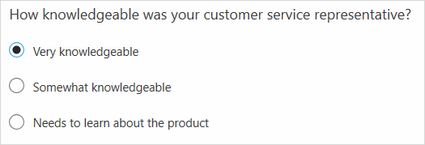

In single-answer questions, you can also display the list of answers in a drop-down list rather than radio buttons. Select **More settings for question** (...), and then select **Drop-down**.

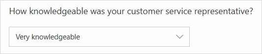 

**Multiple-answer question**

You can accept multiple answers for your question by turning on the **Multiple answers** toggle. Respondents choose one or more answers from the list by selecting one or more check boxes.

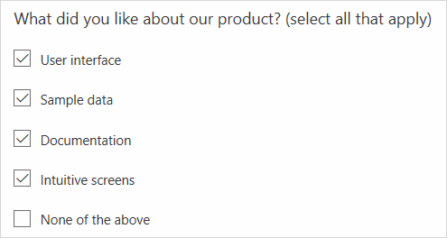

## Text

A Text type question can accept a short (one-line) answer or a long (multiple-line) answer. 

**Short-answer question**

By default, a text question accepts a short answer.

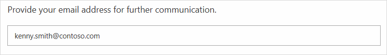

**Long-answer question**

You can accept multiple lines of text for your question by turning on the **Long answer** toggle.

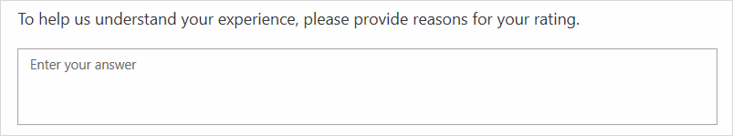

### Add restrictions in text-based questions

You can add restrictions to the kind of answers you'll accept from your respondents to a text-based question. For example, you can restrict their answers to be a number, an email address, or a string in a predefined format (based on a [regular expression](/dotnet/standard/base-types/regular-expression-language-quick-reference)) such as a booking ID.

1. In the text-based question, select **More settings for question** (...), and then select **Restrictions**.
2. Select one of the following options from the **Restrictions** list:
    - **Number**: Only accept input in number format. You can select from various options such as **Only number**, **Greater than**, **Less than**, **Between**, and others.
    - **Email**: Only accept input that's a valid email address.
    - **Custom**: Define a regular expression, and only accept input that matches the defined expression. You can also add an optional description to the regular expression suggesting user the format in which the text input is expected. Let's say you want to define a character limit for the text input field that allows entering up to 200 English characters. You'll enter the regular expression as `\b[A-Za-z0-9]{200}\b`.

## Rating

A Rating type question asks respondents to rate their answer by using stars, numbers, or smiley symbols. 

By default, the star symbol is selected. To change the symbol, select it from the **Symbol** list. You can also change the number of levels by selecting a value from the **Levels** list. For number and star, up to 10 levels are supported. For smiley symbol, up to five levels are supported.

> [!NOTE]
> If you change the number of levels after sending the survey, the previously received responses won't be adjusted in accordance with the new level. For example, you sent a survey with a star rating question that had five levels, and received five responses with a three-star rating. Later, if you change the number of levels to 10, the previously received responses that have a three-star rating won't be adjusted to the 10-level scale.
  
Star and smiley rating questions with five levels are shown in the following images. 

 

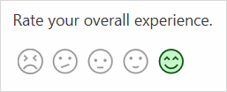 

For ratings questions that use numbers or stars, you can add labels for the numbers or stars by selecting **More settings for question** (...), and then selecting **Label**. A number rating question with labels is shown in the following image.

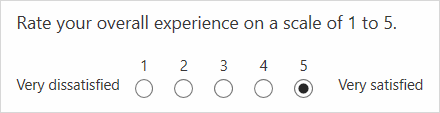

## Date

A Date type question displays a calendar and asks the respondent to select a date.

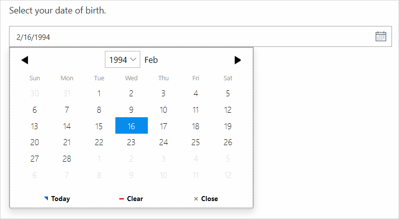

## Ranking

A Ranking type question asks a respondent to rank items by arranging them in the order of the respondent's preference.

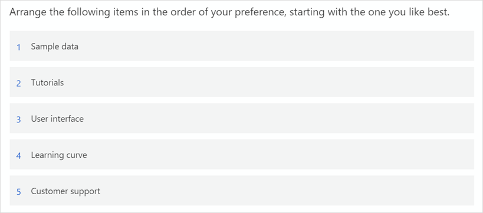

## Likert

A Likert type question displays a list of single-answer questions and a rating scale for the answers, so a respondent can select a value from the scale to answer each question.

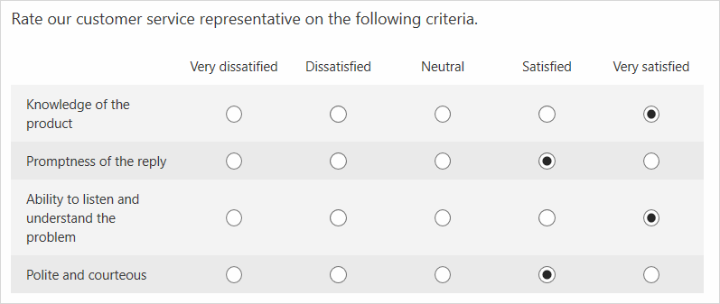

## File upload

A File upload&ndash;type question asks a respondent to upload a file. You can select the number of files (up to 10) that can be uploaded and the maximum file size of each uploaded file (up to 1 GB). You can also select the type of files that can be uploaded.

If you want to restrict the file types that can be uploaded, select **More settings for question** (...), and then select **File type**. For example, you can restrict candidates to upload their resumes in Word or PDF format only.

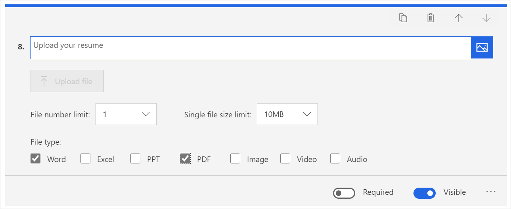

Respondents will see the question as shown in the following image.

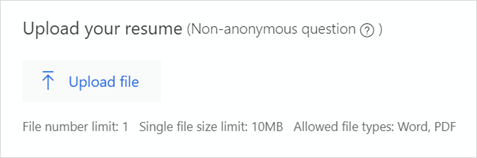

## Net Promoter Score

A Net Promoter Score type question asks a respondent to rate the likelihood of their recommending a product or service to a friend.

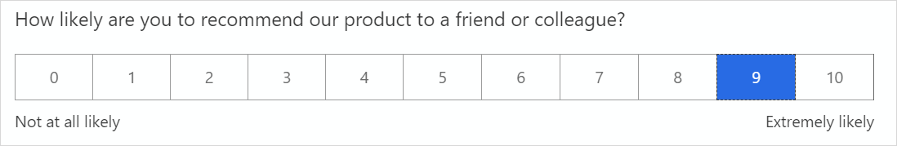

### See also

[Create a survey](create-survey.md) 
[Manage surveys](manage-surveys.md)

[!INCLUDE[footer-include](includes/footer-banner.md)]