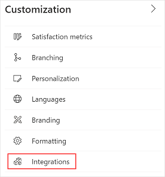
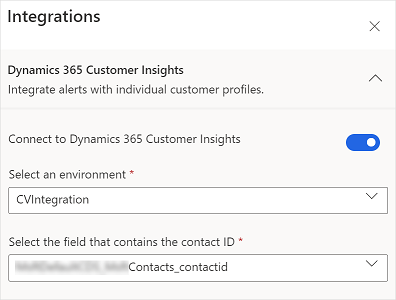

# Integrate Dynamics 365 Customer Voice with Dynamics 365 Customer Insights

Dynamics 365 Customer Insights is a part of Microsoft's customer data platform (CDP) that helps deliver personalized customer experiences. Unify customer data across the full range of sources to get a single view of customers. More information: [Product overview for Dynamics 365 Customer Insights](https://docs.microsoft.com/dynamics365/customer-insights/overview)

You can integrate Dynamics 365 Customer Voice with Dynamics 365 Customer Insights so that a customer service agent can view customer profiles while working on alerts. For more information on alerts, see [Work with alerts](alerts.md).

For example, as a customer service manager you’ve set up alert rules to create alerts based on the responses of the customers. You want to ensure that the customer service agents who work on these alerts get full picture of the customers. You integrate Dynamics 365 Customer Voice with Dynamics 365 Customer Insights so that the customer profile in Dynamics 365 Customer Insights is available to the agents while work on the alerts.

> [!NOTE]
> The integration is applicable to all surveys in a project.

**To integrate Dynamics 365 Customer Voice with Dynamics 365 Customer Insights**

1.	Open the survey.

2.	On the **Design** tab, select **Customization** at the right side of the page, and then select **Integrations**.

    

3.	In the **Integrations** panel, expand the **Dynamics 365 Customer Insights** section.

4.	Turn on the **Connect to Dynamics 365 Customer Voice** toggle and provide the following information:

    - **Select an environment**: Customer Insights environment containing customer’s profile.

    - **Select the field that contains the contact ID**: Contact ID in Microsoft Dataverse where the project or customer is. This is used to connect and fetch customer’s journey.

    > [!NOTE]
    > A customer profile can contain multiple contact IDs. You must select the appropriate contact ID to fetch data.

    

The settings are saved automatically. You can now view customer journey when working with alerts.

### See also

[Work with alerts](alerts.md)