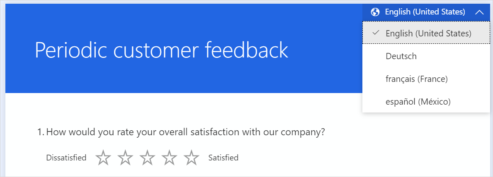
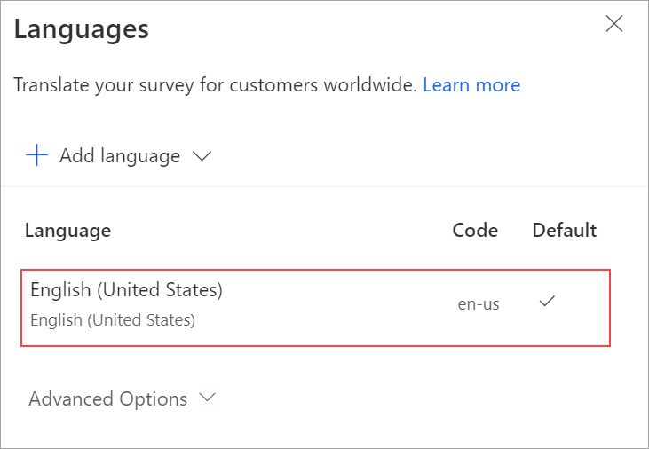
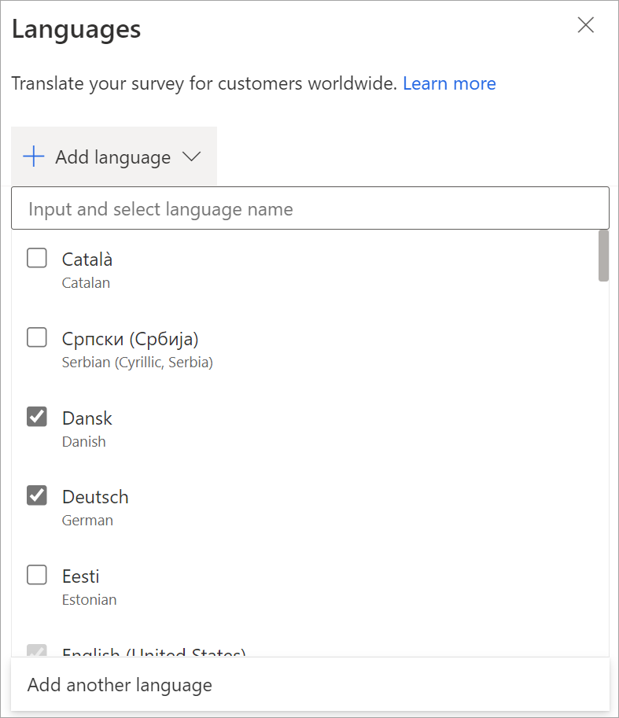
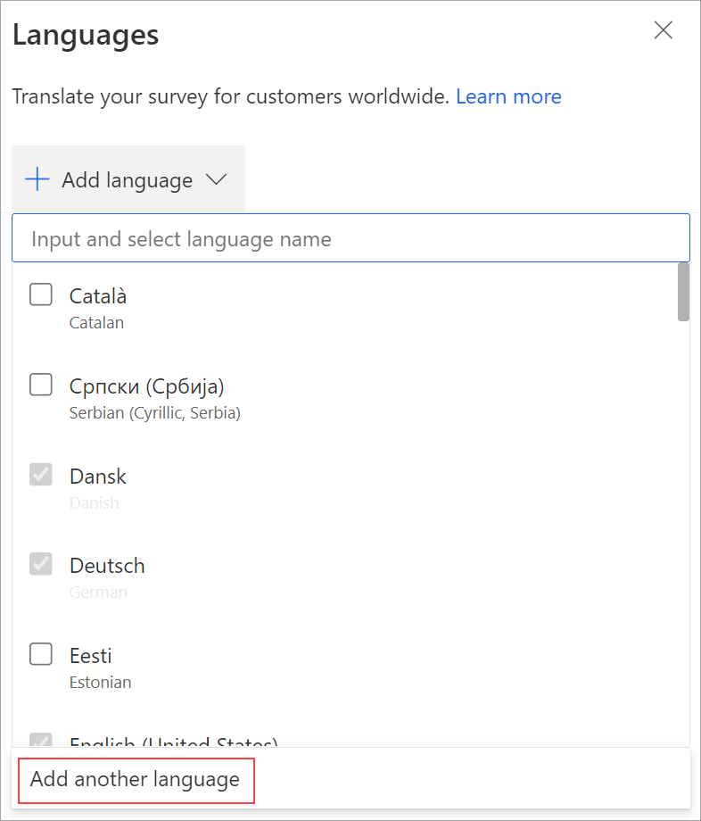
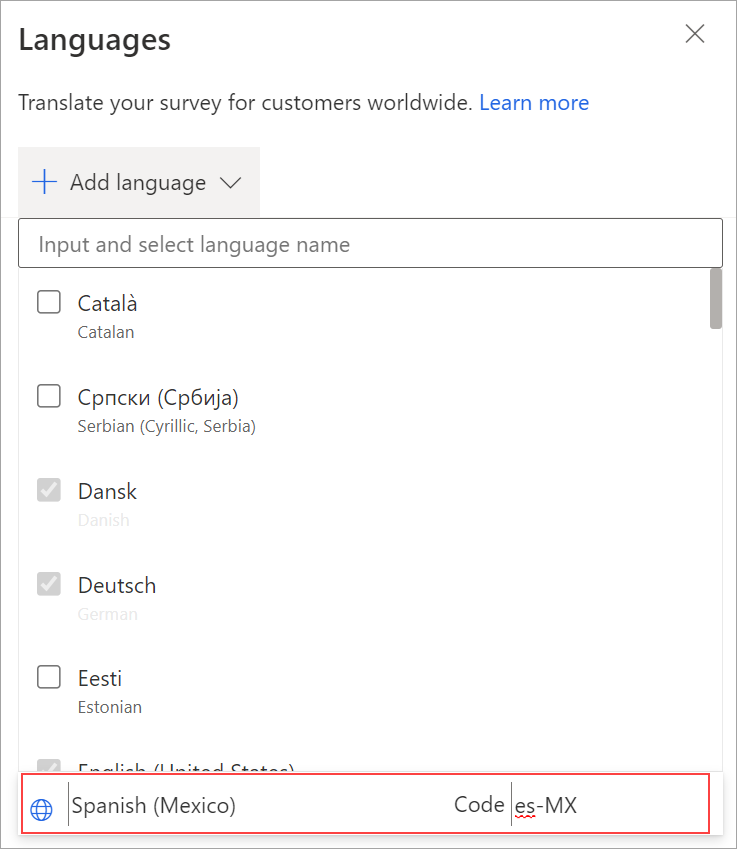
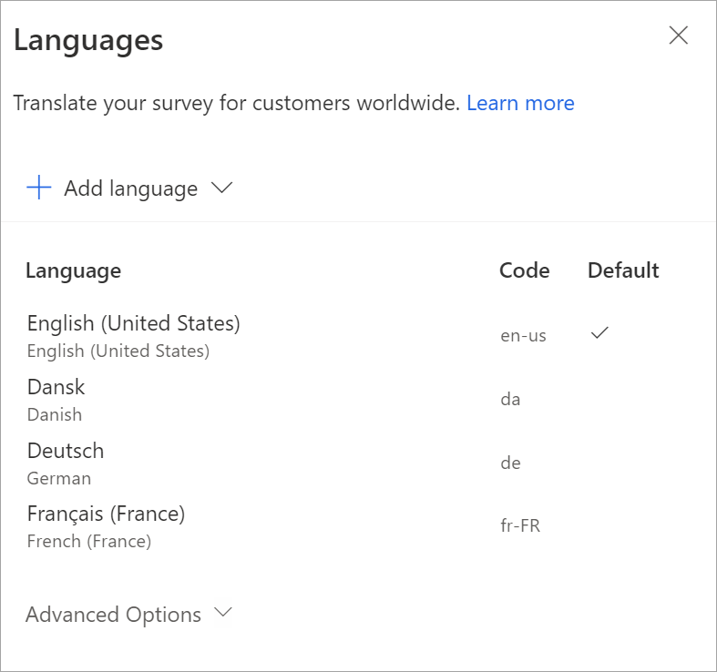
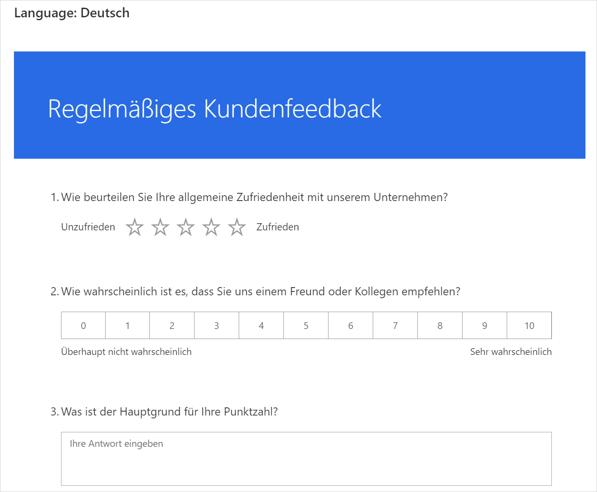
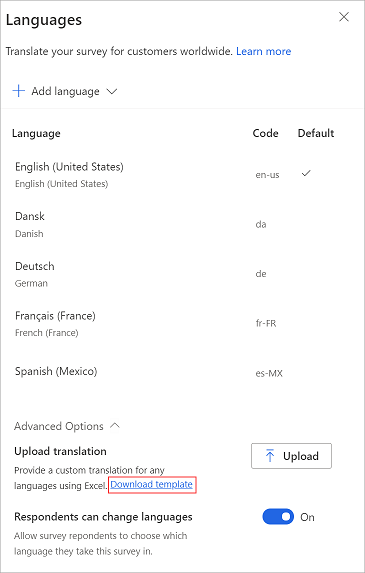
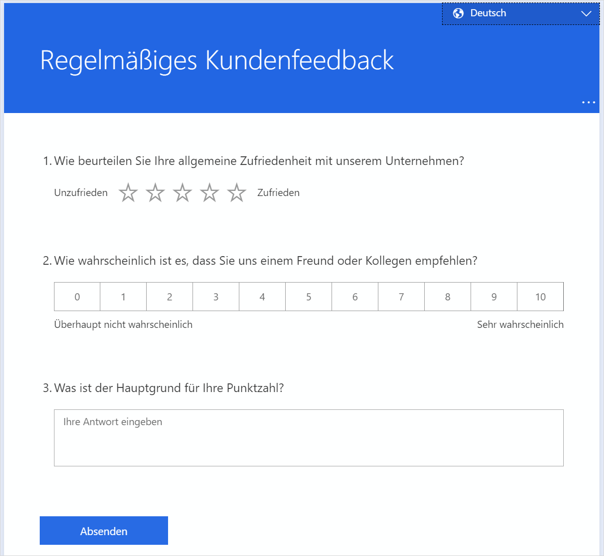

# Create a multilingual survey

A survey created in Dynamics 365 Customer Voice can be translated to multiple languages. After you set up the translations for the survey, respondents can take the survey in the language of their choice. This helps you increase your customer base by presenting the survey in a respondent's preferred language. A survey having translations in multiple languages is known as a *multilingual survey*.

To create a multilingual survey, you must first add the languages and then add translations for each language you added.

When you create a multilingual survey, you can let respondents choose their preferred language from the language selector in the upper-right corner of the survey. Alternatively, you can restrict them from changing the language of the survey. More information: [Restrict respondents from changing the survey language](#restrict-respondents-to-change-survey-language)

 

To create a multilingual survey, you must first add a language (additional or custom) and then add translations for the corresponding strings in the survey.

> [!NOTE]
> Dynamics 365 Customer Voice supports 44 languages out of the box. You can also add custom languages if you need.

## Language types available in Dynamics 365 Customer Voice

### Root language

The *root language* is the language in which the survey was originally created. For example, if you're using Dynamics 365 Customer Voice in French and you're creating all your surveys in French, that's your root language—in short, the language you see in the designer. The root language is automatically set as the default language for the respondent, but you can change this by selecting a different default language from the list of languages supported in Dynamics 365. For more information, go to [Change the default language](#change-the-default-language) later in this topic.

> [!NOTE]
> The root language for a survey can't be changed. For example, let's assume you've used Dynamics 365 Customer Voice in German and created your survey in German. Then you decide to use Dynamics 365 Customer Voice in English. While all the other parts of the application will be displayed in English, the original survey text will continue to be displayed in German. You can't remove the root language of the survey unless you explicitly delete the survey.

### Additional languages

A survey can be rendered in one of the following types of languages in addition to the root language:

- **Out-of-the-box languages**: You select these languages from the list of languages that are supported in Dynamics 365. You can add, edit, and delete them by using the Dynamics 365 Customer Voice interface. System strings are translated automatically.

- **Custom languages**: These languages aren't included in the list of Dynamics 365 supported languages. You can add, edit, and delete a custom language by using the Dynamics 365 Customer Voice interface. You define the display name and code for a custom language. System strings won't be translated automatically and will be visible in the survey's default language.

Adding these languages is described in the following section.

## Add additional languages

After you've completed the setup of your survey in its root language, you can add additional languages to your survey from the **Languages** panel. After adding the languages, you can add translations either in bulk for all languages or to each individual language. System strings are translated automatically for the out-of-the-box languages. For custom languages, system strings aren't translated automatically and will be visible in the survey's default language.

### Step 1: Add additional languages

1. Open the survey.

2. On the **Design** tab, select **Customization** at the right side of the page, and then select **Languages**.

   The **Languages** panel is displayed with the root language selected and set as the default language for the survey.

   

3. In the **Languages** panel, select **Add language**.

4. From the list of languages, browse to and select the out-of-the-box languages you want. You can also search for a language and then select it.

    

    > [!NOTE]
    > You can select multiple languages by selecting the checkboxes next to each language.

5. To add a custom language, in the **Languages** panel, select **Add language**, and then select **Add another language**.

   

6. In the **Enter language name** field, enter the name of the custom language you want to add.

7. In the **Enter code** field, enter the code of the custom language. 

   Let's say you want to add the **Spanish (Mexico)** language to your survey. You searched in the languages list and found only **Spanish (Spain, International Sort)**. In this case, you must manually add **Spanish (Mexico)** to the languages list. You'll define the display name as **Spanish (Mexico)** and the language code as **es-MX**.

   

8. Select anywhere in the **Languages** panel to save the changes.

9. Repeat steps 5 through 8 to add more custom languages.

The added languages are displayed in the panel along with their language codes. You can use these codes in the **locale** variable when you send personalized survey invitations.

> [!NOTE]
> - The language code you enter is validated against the existing list. You can't have two languages defined with the same language code for the survey.
> - You can add up to 86 languages per survey.

### Step 2: Add translations

After adding the out-of-the-box languages and any custom languages, you can choose from two options for adding translations:

- Translate individual languages from the Dynamics 365 Customer Voice interface
- Translate all languages in bulk, by using the Excel file

#### Option 1: Translate individual languages

1. In the **Languages** panel, select the language for which you want to add translations.

   Alternately, you can also hover over a language, select **More options** (...), and then select **Add translation**.

2. Select the survey element, and then enter the translated text. Repeat this step for all survey elements.

    

3. After you've added translated text for all elements in the survey, select **Back** in the upper-left corner of the page to go back to the **Languages** panel.

4. Repeat steps 1 through 3 to add translations for other languages.

#### Option 2: Translate all languages in bulk

1. In the **Languages** panel, expand **Advanced options**, and then select **Download template** to download an Excel file containing strings in the primary language and columns for each of the selected languages. For example, **da** for Danish, **de** for German, **fr-FR** for French (France), and **es-MX** for Spanish (Mexico).

    

2. Open the Excel file and add translations for each language in its respective column.

3. After adding translations for all languages in the Excel file, go to the **Languages** panel, expand **Advanced options**, and then select **Upload**.

4. Browse to and select the Excel file in which you have added translations.

> [!NOTE]
> - The first column in the Excel file contains strings in the primary language and isn't editable.
> - You must ensure that a translation for each string is provided in the Excel file.
> - We recommend that you download the latest Excel file every time you add or edit translations. This ensures that the latest strings and languages are available.
> - We recommend that you _not_ make a copy of the Excel file and add strings to it, or change the file name extension. These actions might result in upload failure.

### Step 3. Verify translations

After uploading the Excel file or adding your own translations, you can preview the survey to see whether everything works as expected. Select the language from the language selector at the upper-right corner of the survey.

 

## Restrict respondents from changing the survey language

If you've created a multilingual survey, you can decide whether your respondents can select the language they prefer (which is the default setting) or view the survey in the language selected for them through their browser language setting or locale variable.

**To restrict respondents from changing their survey language**

1. Open the survey.

2. On the **Design** tab, select **Customization** at the right side of the page, and then select **Languages**.

3. In the **Languages** panel, expand **Advanced options**, and then turn off the **Respondents can change languages** toggle.

   

> [!NOTE]
> When this setting is turned off, a respondent can see only one language and can't change the language at all.

## Change the default language

The default language is the language in which the survey is loaded if no explicit locale variable is passed or if the respondent is using their web browser in a language for which you haven't added a translation.

Let's assume you use the Dynamics 365 Customer Voice application in English. When you create a survey, English is set as the default language for the survey. However, a majority of your survey respondents are from France, so you want to change the default language from English to French.

> [!NOTE]
> The survey will be loaded in the default language only as a last resort&mdash;in a case where the respondent is using a browser language that's different from the available languages and no explicit locale variable has been passed through the URL. 

You can change the default language for your survey from the **Languages** panel. Note that you can change the default language only when multiple languages have been added to the survey.

**To change the default language for a survey**

1. Open the survey.

2. On the **Design** tab, select **Customization** at the right side of the page, and then select **Languages**.

3. From the list of languages, hover over a language, select **...**, and then select **Set as default**.

    

    The default language is marked with  in the **Default** column.

## Manage translations

After adding translations for the languages you want in your survey, you can edit the existing translation or delete a language.

1. Open the survey.

2. On the **Design** tab, select **Customization** at the right side of the page, and then select **Languages**.

3. Do one of the following:

   - To edit translation strings, select the language and edit the translation as required.

   - To delete a language, hover over the language, select **...**, and then select **Delete**.

     > [!IMPORTANT]
     > After you delete a language, you can't retrieve any of the strings that have already been translated.

## Language codes to use in the survey variable

When you create a multilingual survey, you can use the **locale** survey variable to set the default language for displaying the survey. The following table lists the out-of-the-box languages within Dynamics 365 Customer Voice and their associated language codes.

|     Language display name                  |     Language ISO code    |
|----------------------------------------------|----------------------------|
|     Catalan                                  |     ca                     |
|     Serbian   (Cyrillic, Serbia)             |     sr-cyrl-rs             |
|     Danish                                   |     da                     |
|     German                                   |     de                     |
|     Estonian                                 |     et                     |
|     Spanish   (Spain, International Sort)    |     es-ES                  |
|     Basque                                   |     eu                     |
|     French   (France)                        |     fr-FR                  |
|     Galician                                 |     gl                     |
|     Croatian                                 |     hr                     |
|     Indonesian                               |     id                     |
|     Italian                                  |     it                     |
|     Latvian                                  |     lv                     |
|     Lithuanian                               |     lt                     |
|     Hungarian                                |     hu                     |
|     Malay                                    |     ms                     |
|     Dutch                                    |     nl                     |
|     Norwegian Nynorsk   (Norway)             |     nb-no                  |
|     Polish                                   |     pl                     |
|     Portuguese   (Brazil)                    |     pt-br                  |
|     Portuguese   (Portugal)                  |     pt-pt                  |
|     Russian                                  |     ru                     |
|     Romanian                                 |     ro                     |
|     Slovak                                   |     sk                     |
|     Slovenian                                |     sl                     |
|     Serbian (Latin,   Serbia)                |     sr-latn-rs             |
|     Finnish                                  |     fi                     |
|     Swedish                                  |     sv                     |
|     Vietnamese                               |     vi                     |
|     Turkish                                  |     tr                     |
|     Ukrainian                                |     uk                     |
|     Czech                                    |     cs                     |
|     Greek                                    |     el                     |
|     Bulgarian                                |     bg                     |
|     Kazakh                                   |     kk                     |
|     Hebrew                                   |     he                     |
|     Arabic                                   |     ar                     |
|     Hindi                                    |     hi                     |
|     Thai                                     |     th                     |
|     Chinese   (Simplified)                   |     zh-Hans                |
|     Chinese   (Traditional)                  |     zh-Hant                |
|     Japanese                                 |     ja                     |
|     Korean                                   |     ko                     |
|     English   (United States)                |     en-us                  |

## Frequently asked questions

### How many languages can be added to a survey?

You can add up to 86 languages per survey. These can be a combination of out-of-the-box and custom languages.

### How does Dynamics 365 Customer Voice decide which language to show to a particular respondent?

If you're sending a personalized survey invitation through email or Power Automate, you can define the language code by using the out-of-the-box **locale** variable for each invitation.

Let's say the language code in the contact record for your customer, Milton, is set to **ar** in your back-end CRM system. You can pass that as a parameter in your personalized invitation. This will ensure that the survey is loaded by default in Arabic for Milton.

You can also pass the locale parameters for each contact by using a CSV file . More information: [Import contacts from a CSV file](send-survey-email.md#import-contacts-from-a-csv-file)

Let's say that you aren't sending survey invitations through a personalized invitation link, and you know that all the respondents to your anonymous survey must see the survey in Arabic. In this case, you can add an explicit **lang=ar** parameter to the anonymous URL of the survey. This ensures that the survey will be loaded in the Arabic language for all respondents.

If you don't pass the value of the **lang** parameter in the URL, the survey will be loaded in the browser language of the respondent.

So, the order of priority is:

1. The **locale** variable or the **lang** parameter. The **locale** variable is defined for personalized invitations sent through Power Automate or email. The **lang** parameter is defined in the URL.
3. The browser language the respondent is using
4. The fallback language of the survey (in case the browser language is not set up in the survey)
5. Default language of the survey.

### Which should I use for setting up translation strings&mdash;uploading files through Excel or directly updating from the application's interface?

If you've added a large number of languages to your survey and you need to get the translation strings verified by a translation team, you can upload the translations in the Excel file.

If your survey has only a few languages and the translated strings are readily available, you can use the application's interface to set up the translated strings.

### When should I set up the translation?

We recommend that you start setting up translation strings only after you've completely set up the survey in its root language. This will make updating the translation strings more manageable and easier to maintain.

### What happens to email templates?

You'll need to set up localized templates for every language you want to add to the survey. After you add the languages you want to the survey, you can choose them from the **Language** list. You can then create separate email templates for all the languages you added. More information: [Create multilingual email templates](send-survey-email.md#create-multilingual-email-templates)

Let's say you've added seven additional languages to the survey. You'll have to create seven email templates, one for each language. You'll have to pass the value of the language code as a **locale** variable either in email or Power Automate, so that the customer gets the survey in the intended language.

### See also

[Add and configure satisfaction metrics](satisfaction-metrics.md) 
[Add logic by creating branching rules](create-branching-rule.md) 
[Personalize your survey by adding variables](personalize-survey.md) 
[Add branding to your survey](survey-branding.md) 
[Add formatting to your survey](survey-formatting.md) 
[Add formatting to survey elements](survey-text-format.md)

[!INCLUDE[footer-include](includes/footer-banner.md)]
