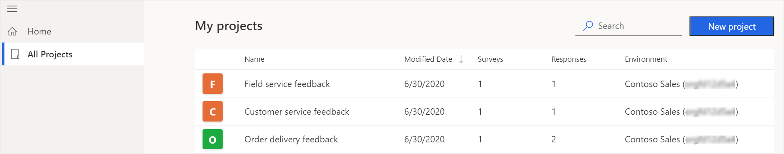
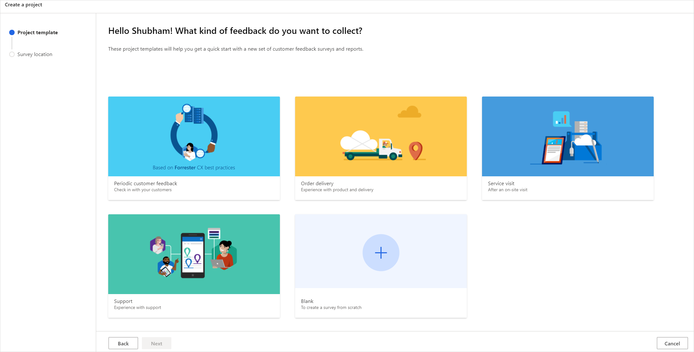
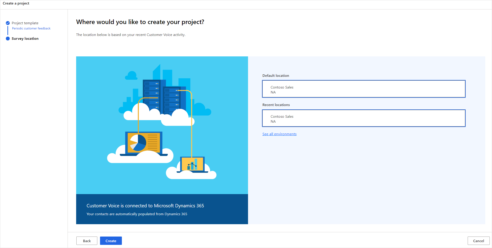

# Create a project

A *project* is a container that consists of surveys, satisfaction metrics, email templates, Power Automate flows, and reports. You can create, distribute, and analyze a survey by creating a project. You can create a project by using a ready-to-use template or by using a blank template to create the project from scratch.

Dynamics 365 Customer Voice offers ready-to-use survey feedback project templates. Each project template includes survey questions, preconfigured satisfaction metrics, email templates, and Power Automate flows for Dynamics 365 business applications. The available project templates are:

- **Periodic customer feedback**: This template is based on Forrester Research customer experience best practices and includes questions to collect customer sentiment at regular intervals. It also consists of a preconfigured email template and the following satisfaction metrics:

    - **Customer sentiment**: A sentiment metric that helps you to identify customer sentiment.

    - **Customer satisfaction**: A satisfaction metric that helps you to measure the level of customer satisfaction.

- **Order delivery**: This template includes questions to collect timely feedback after an order is delivered. It consists of a preconfigured email template and the following satisfaction metrics:

    - **Customer satisfaction**: A satisfaction metric that helps you to measure the level of customer satisfaction.
    
    - **Net Promoter Score**: An NPS metric that helps you to measure customer loyalty.
    
    - **Product sentiment**: A sentiment metric that helps you to identify customer sentiment.

    The **Send a survey when an order is fulfilled in Dynamics 365** Power Automate flow is created automatically when you create a project from this template. The survey is sent to the customer when an order is fulfilled in Dynamics 365, and the response is automatically integrated with the order and customer records. To see the flow, go to [flow.microsoft.com](https://flow.microsoft.com) and select **My flows** in the left pane. The flow is created in the inactive state. You must turn on the flow to use it. You can also customize the flow as per your requirement in Power Automate and then turn on the flow to start using it.

- **Service visit**: This template includes questions to collect timely feedback following a customer visit scheduled with the Dynamics 365 Field Service application. The feedback is automatically integrated with the customer visit record in Dynamics 365, so you can get insights including trends and specific follow-up actions to make sure customer issues are addressed in a timely manner. It also consists of a preconfigured email template and the following satisfaction metrics:

    - **Customer satisfaction**: A satisfaction metric that helps you to measure the level of customer satisfaction.
    
    - **Customer sentiment**: A sentiment metric that helps you to identify customer sentiment.    

- **Support**: This template includes questions that provides an out-of-the-box, end-to-end solution for measuring customer satisfaction for your Dynamics 365 case management process. It consists of a preconfigured email template and the following satisfaction metrics:

    - **Customer sentiment**: A sentiment metric that helps you to identify customer sentiment.
    
    - **Customer satisfaction**: A satisfaction metric that helps you to measure the level of customer satisfaction.

    The **Send a survey when a case is resolved in Dynamics 365** Power Automate flow is created automatically when you create a project from this template. The survey is sent to the customer when a case is resolved in Dynamics 365. To see the flow, go to [flow.microsoft.com](https://flow.microsoft.com) and select **My flows** in the left pane. The flow is created in the inactive state. You must turn on the flow to use it. You can also customize the flow as per your requirement in Power Automate and then turn on the flow to start using it.

Dynamics 365 Customer Voice also includes a **Blank** template you can use to create a survey from scratch and configure it in accordance with your requirements. This template doesn't contain any preconfigured survey questions, workflows, or satisfaction metrics.

> [!IMPORTANT]
> Projects, email templates, and satisfaction metrics are primarily based out of Microsoft Dataverse. Refreshing data on Dataverse environment with another will break Customer Voice projects and surveys on the refreshed environment. 

## Create a project from a template

Creating a project from a template helps you quickly get started with little or no customization. The templates include survey questions that are based on industry best practices and have been curated by subject-matter experts.

1. Sign in to [Dynamics 365 Customer Voice](https://customervoice.microsoft.com/).

2. On the **All projects** tab, select **New project**.

     

     The **Project template** page is displayed with the available project templates.

      

3. To see the survey questions in a project template, hover over the template, and then select **Preview** .

4. Select the required project template, and then select **Next**.

5. On the **Survey location** page, select an environment to create the project in. To see all environments, select **See all environments**.

    

6. In the **All environments** window, select the environment you want, and then select **Select and close**.

7. On the **Survey location** page, select **Create**.

The project will be created with survey questions, satisfaction metrics, and Power Automate flows. You can further configure the survey to meet your needs, or [send it as-is](send-survey.md).

## Create a project from the blank template

Creating a project from the blank template gives you the freedom to choose survey questions, create satisfaction metrics, email templates, and Power Automate flows.

1. Sign in to [Dynamics 365 Customer Voice](https://customervoice.microsoft.com/).

2. On the **All projects** tab, select **New project**.

3. On the **Project template** page, select **Blank**.

4. Select **Next**.

5. On the **Survey location** page, select an environment to create the project in. To see all environments, select **See all environments**.

6. In the **All environments** window, select the environment you want, and then select **Select and close**.

7. On the **Survey location** page, select **Create**.

The project will be created with an empty survey. You can now add questions and customize it the way you want.

### See also

[Create a survey](create-survey.md) 
[Manage surveys](manage-surveys.md) 
[Manage projects](manage-projects.md)

[!INCLUDE[footer-include](includes/footer-banner.md)]
