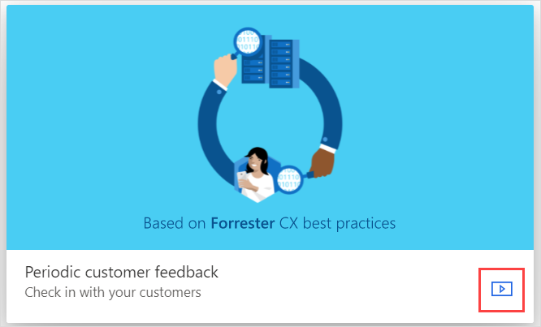

# Create a project

A *project* is a container that consists of surveys, satisfaction metrics, email templates, Power Automate flows, and reports. You can create, distribute, and analyze a survey by creating a project. You can create a project by using a ready-to-use template or by using a blank template to create the project from scratch.

Dynamics 365 Customer Voice offers ready-to-use survey feedback project templates. Each project template includes survey questions, preconfigured satisfaction metrics, email templates, and Power Automate flows for Dynamics 365 business applications. The available project templates are:

- **Customer pulse**, based on Forrester Research customer experience best practices and including questions to collect customer sentiment at regular intervals.

- **Order delivery** to collect timely feedback after an order is delivered. It also includes a workflow to automate sending a survey after the order is complete. The survey is sent to the customer, and the response is automatically integrated with the order and customer records.

- **Service visit** to collect timely feedback following a customer visit scheduled with the Dynamics 365 Field Service application. The feedback is automatically integrated with the customer visit record in Dynamics 365, so you can get insights including trends and specific follow-up actions to make sure customer issues are addressed in a timely manner.

- **Support** provides an out-of-the-box, end-to-end solution for measuring customer satisfaction for your Dynamics 365 case management process. The template includes typical questions and setup needed for the customer service scenario.

Dynamics 365 Customer Voice also includes a **Blank** template you can use to create a survey from scratch and configure it in accordance with your requirements. This template doesn't contain any preconfigured survey questions, workflows, or satisfaction metrics.

## Create a project from a template

Creating a project from a template helps you quickly get started with little or no customization. The templates include survey questions that are based on industry best practices and have been curated by subject-matter experts.

1. Sign in to Dynamics 365 Customer Voice.

2. On the **All projects** tab, select **New project**.

     

     The **Project template** page is displayed with the available project templates.

      

3. To see the survey questions in a project template, hover over the template, and then select **Preview** .

     

4. Select the required project template, and then select **Next**.

5. On the **Survey location** page, select an environment to create the project in. To see all environments, select **See all environments**.

    

6. In the **All environments** window, select the environment you want, and then select **Select and close**.

7. On the **Survey location** page, select **Create**.

The project will be created with survey questions, satisfaction metrics, and Power Automate flows. You can further configure the survey to meet your needs, or [send it as-is](send-survey.md).

## Create a project from the blank template

Creating a project from the blank template gives you the freedom to choose survey questions, create satisfaction metrics, email templates, and Power Automate flows.

1. Sign in to Dynamics 365 Customer Voice.

2. On the **All projects** tab, select **New project**.

3. On the **Project template** page, select **Blank**.

4. Select **Next**.

5. On the **Survey location** page, select an environment to create the project in. To see all environments, select **See all environments**.

6. In the **All environments** window, select the environment you want, and then select **Select and close**.

7. On the **Survey location** page, select **Create**.

The project will be created with an empty survey. You can now add questions and customize it the way you want.
