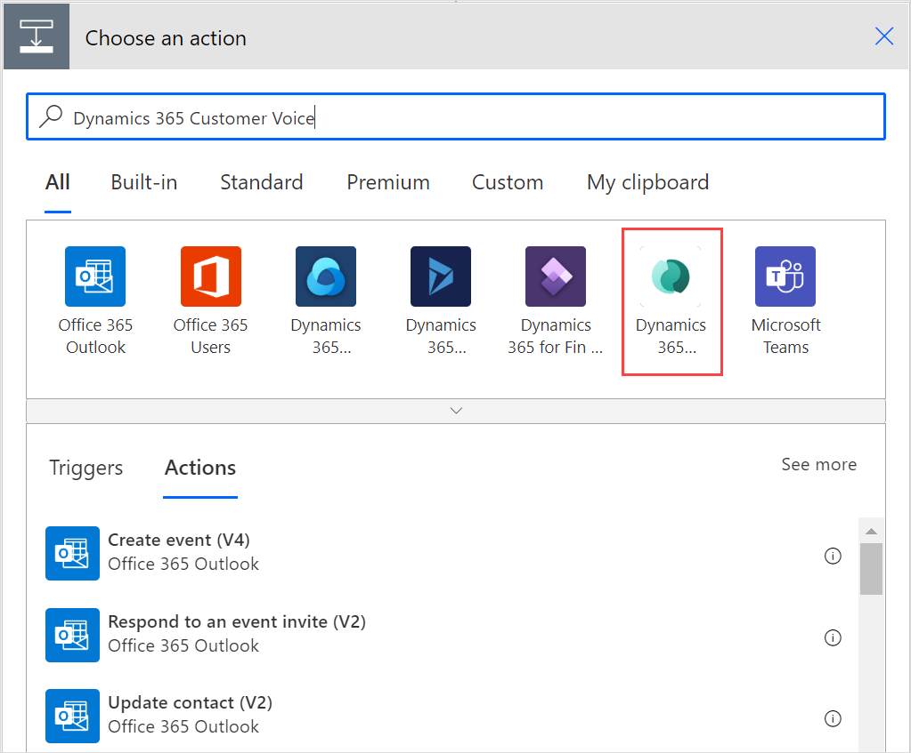
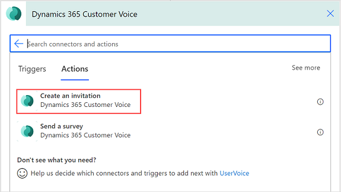
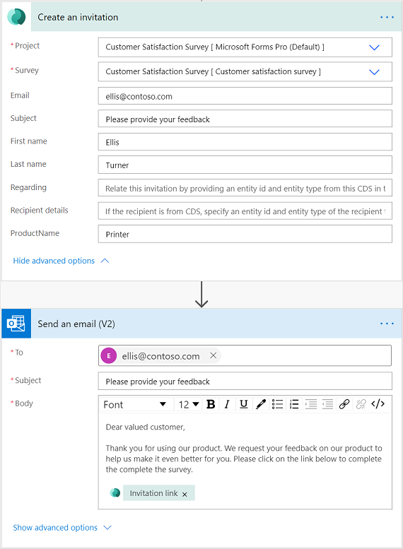

# Create a survey invitation

If you want to send a survey by using a platform other than Dynamics 365 Customer Voice&mdash;such as Outlook, Gmail, or SMS&mdash;you can create a survey invitation by using Power Automate. The survey invitation creates a personalized link that can be distributed by using the platform of your choice. The survey invitation link will be a short URL that can be easily distributed by the platforms that have a lower character limit (for example, SMS or Twitter). The short URL will be in the following format: `https://<region>.microsoft.com/<10-digit code>`

> [!NOTE]
> - When you create a survey invitation, the email address is considered as-is, and is not validated for correctness.
> - Once you create a survey invitation, it can't be updated. If some update is required, you must create a new invitation link.
> - The output of this action will be InviteId, InviteUrl, and UnsubscribeUrl.

1. Sign in to [flow.microsoft.com](https://flow.microsoft.com).

2. Start to create a flow from scratch. More information: [Create a flow in Power Automate](/flow/get-started-logic-flow)

3. In the flow editor, add a trigger to start your flow.

4. After adding the trigger, add a new step, and search for the **Dynamics 365 Customer Voice** connector.

5. In search results, select **Dynamics 365 Customer Voice**.

      

6. Select the **Create an invitation** action.

      

7. In the **Create an invitation** action, enter or select the following information:

    - **Project**: Select the project that contains a survey to be sent.
    - **Survey**: Select the survey to be sent.
    - **Email**: Enter the recipient's email address.
    - **Subject**: Enter the subject of the survey invitation.
    - **Regarding**: Specify a record to associate the survey invitation and response. This value is stored in the survey invitation's **Regarding** field.
        > [!NOTE]
        > - You must enter a table's logical name in this field. For example, if you want to associate the Case table, you must enter _incident_, as it is the logical name of the Case table. Similarly, if you create a custom table with its display name as _Custom Table_ and its logical name as _new\_customtable_, you must enter _new\_customtable_ in this field.
        > - Only tables that are marked for collaboration in activities are supported. For example, the Task table is not supported.
    - **Recipient details**: Specify a contact to associate your survey invitation and response records with. This value is stored in the survey invitation's **To** field. Only a Contact record is supported in this field.

    > [!NOTE]
    > - You must enter a value either in **Email** or **Recipient details** field for executing the **Create an invitation** action.
    > - If you want to associate your survey invitation and response with Microsoft Dataverse, you must enter values in **Regarding** and **Recipient details** fields, respectively. You must also ensure that **Save invited participants as Contacts** is turned on in [survey distribution settings](distribution-settings.md#participants). If **Save invited participants as Contacts** isn't turned on, the survey invitation's **To** field isn't populated. For more information about **Regarding** and **Recipient details** fields and how they're stored in the survey invitation, see [Send a survey action](send-survey-flow.md#send-a-survey-action).
    > - If you've used variables in your survey, they'll be visible in this action and you can specify the values accordingly. More information: [Specify values in a flow](personalize-survey.md#specify-values-in-a-flow)
    > - Once invites are created, they are saved in Microsoft Dataverse. The process of saving invites in Microsoft Dataverse is asynchronous and may take some time. It is recommended that you wait for a few minutes before you use the invite for further processing. You can either [add a delay](/power-automate/desktop-flows/edit-desktop#add-a-delay) after the **Create an invitation** action or create two separate flows, one for creating invites and another for sending invites. You can then trigger the second flow based on the creation of invites in Microsoft Dataverse.

8. Add a new step, and then select the action to send the email. You can use providers such as Outlook, Gmail, or SMS; we've used Outlook to send the survey in this procedure.

9. In the **Send an email** action, do the following:

    - **To**: Enter the recipient's email address.
    - **Subject**: Enter the subject of the email.
    - **Body**: Enter the text you want for the body of the email, and add the **Invitation link** dynamic content.

  After entering the required details, the flow looks as shown in the following image:

   

  The flow runs in accordance with the configured trigger, and then sends the survey.

### See also

[Work with survey distribution settings](distribution-settings.md) 
[Send a survey by using the built-in email composer](send-survey-email.md) 
[Send a survey by using Power Automate](send-survey-flow.md) 
[Embed a survey in a webpage](embed-web-page.md) 
[Send a survey link to others](send-survey-link.md) 
[Send a survey by using QR code](send-survey-qrcode.md)

[!INCLUDE[footer-include](includes/footer-banner.md)]
