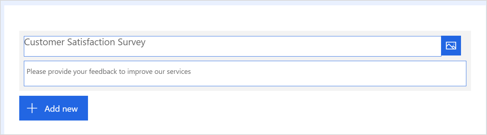
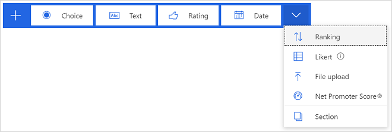
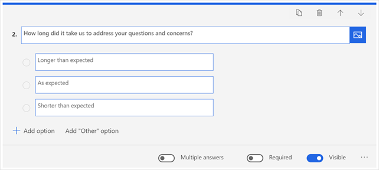
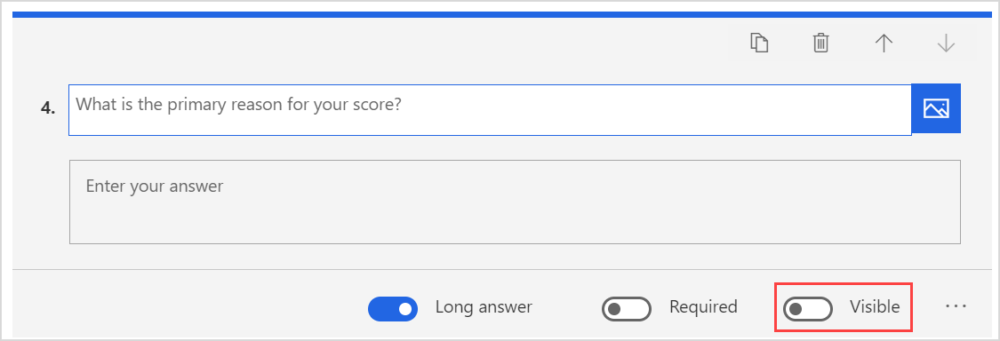

# Create a survey

A survey is created automatically when you create a project (either from out-of-the-box templates or blank). You can also create a survey within a project. After it's created, you can add&mdash;or edit&mdash;questions and customize the survey the way you want. More information: [Create a project](create-project.md)

## Create a survey within a project

1. Open the project in which a survey needs to be created.

2. In the left pane, select **New survey**.

3. Select the default survey title, and then enter a title for your survey. You can also enter an optional description for it.

    

4. Proceed with adding questions to your survey.

## Add or edit questions

1. In the survey designer, select **Add new** to view question types that can be added to your survey. You can also select **More question types** , and choose a question type.

    

    More information on available question types: [Available question types](available-question-types.md)

2. Select the type of question you want to add. For example, **Choice**.

3. Enter the question text and its answer options. 

    

4. Repeat steps 1 through 3 to add more questions. The survey is saved automatically.

5. To change the order of questions in the survey, select a question, and then select the up arrow  or down arrow  on the right side of each question to move it up or down.

6. To copy a question, select it, and then select **Copy question** .

7. To delete a question, select it, and then select **Delete question** .

## Set visibility of a question

By default, every question in a survey is visible to respondents. You can choose to hide a question by default, and then show it based on logic that you define by creating a branching rule. To hide a question from being displayed in a survey, select the question, and then turn off the **Visible** toggle.

> [!NOTE]
> The **Visible** toggle is visible only when you have at least one advanced branching rule defined in the survey.

## Mark a question as required

By default, a question doesn't have to be answered by respondents. If you want to require that the question be answered, select it, and then turn on the **Required** toggle.

## Customize survey header

You can customize the header of your survey to match your company's branding. This includes changing the style, theme color, background image, and adding a logo. More information: [Customize survey header](custom-header.md)

## Add a media to a question

You can add an image or video to a question in your survey. This helps your respondents to understand the context and respond accordingly.

1. Open the survey in which you want to add an image or video to a question, and then select the question.

2. Select **Insert media**  on the right side of the question.

    The **Insert media** panel is displayed.

3. To add an image, select **Image**.

    1. Select **Upload**.
    
    2. Find and select the image by using your file browser, and then upload it.

5. To add a video, select **Video**.

    1. Enter the URL of the video hosted on Microsoft Stream or YouTube.
    
    2. Select **Add**.

## Customize a survey

You can customize your survey in the following ways:

- [Add and configure satisfaction metrics](satisfaction-metrics.md)
- [Add logic by creating branching rules](create-branching-rule.md)
- [Personalize your survey by adding variables](personalize-survey.md)
- [Create multilingual survey](create-multilingual-survey.md)
- [Add branding to your survey](survey-branding.md)
- [Add formatting to your survey](survey-formatting.md)
- [Add formatting to survey elements](survey-text-format.md)

### See also

[Create a project](create-project.md) 
[Manage surveys](manage-surveys.md) 
[Manage projects](manage-projects.md)

[!INCLUDE[footer-include](includes/footer-banner.md)]
