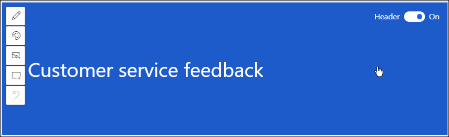
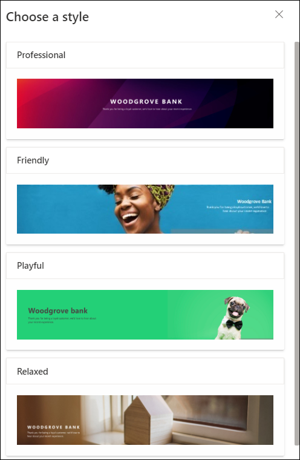
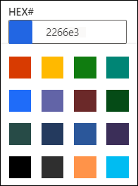
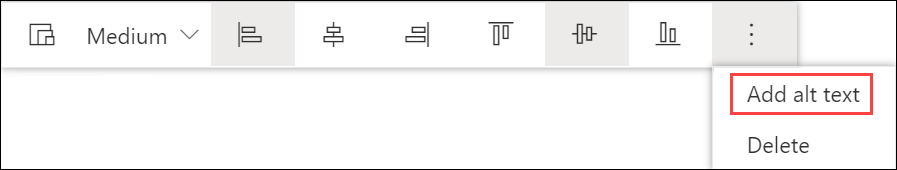
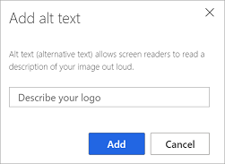
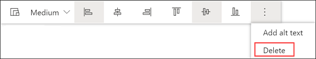

# Customize survey header

You can customize the header of your survey to match your company's branding. This includes changing the style, theme color, background image, and adding a logo. You can change the alignment of the survey's header text, background image in the header, and logo as per your requirement. Also, you can turn off the header if it is not required.

## Turn off survey header

By default, the survey header is displayed. You can turn it off when not needed. For example, when you embed a survey on a web page, you might not want to show the header at all.

1. Open the survey in which you want to turn off the survey header.

2. Hover over the survey header, and then turn off the **Header** toggle in the upper right corner.

    

## Change header style

By default, the header is displayed in a simple style. Dynamics 365 Customer Voice provides a few predefined styles you can choose from. The styles consist of a background image and a default text alignment. When you select a style, the survey's theme is also updated accordingly. However, after applying a style, you can change the background image, text alignment, and theme color. You can also [change the focal point of the background image](#change-focal-point-of-background-image) in the header.

1. Open the survey in which you want to change the header style.

2. Hover over the survey header to see the toolbar.

3. Select **Style**.

    

4. In the **Choose a style** panel, select one of the predefined styles.

    > [!NOTE]
    > The **Compact** style has the least header height as compared to other styles. You cannot add a background image to the survey header when you select this style.

    

## Change header text alignment

You can change the alignment of header text in the combination of the horizontal and vertical alignments. In the horizontal alignment, you can choose the text to be aligned either to the left, center, or right. In the vertical alignment, you can choose the text to be aligned either at the top, middle, or bottom. So, you can position the header text in nine different alignments.

1. Open the survey in which you want to change the alignment of survey header text.

2. Hover over the text to see the alignment toolbar.

    

3. Select an alignment combination.

## Add background image to survey header

You can select a background image for the survey header either from the images provided out of the box or upload an image from your device. If you upload an image from your device, the image must be within the following parameters:

- Maximum file size: 5 MB 
- Supported formats: BMP, GIF, JPEG, and PNG
- Maximum resolution: 800 x 600 (width x height)
- Aspect ratio: 4:3

When you add a background image, the survey's theme is also updated accordingly.

**To add a background image**

1. Open the survey in which you want to add a background image to the header.

2. Hover over the survey header to see the toolbar.

3. Select **Image**.

    

4. In the **Add image** panel, select one of the images provided out of the box or upload an image from your device.

    

    The image is added to the survey header.

    

### Replace or reset background image

After you add a background image to the survey header, you can either replace it with another image or reset it to remove the image. When you reset the image, only the image is removed; the survey's theme stays as it is as it was updated while adding the image.

> [!NOTE]
> For out of the box images, you can only reset the image.

1. Open the survey in which you want to replace or reset the header's background image.

2. Hover over the survey header to see the toolbar.

3. Select **Image**.

    

4. In the **Add image** panel, hover over the uploaded image.

5. To replace the image, select **Replace image**, and then select a new image.

    

6. To reset the image, select **Reset** .

## Change focal point of background image

When you select a style or add a background image, the only portion of the image that is visible is what fits in the header area. You can change the focal point to adjust which portion of the image should be visible. After you set the focal point of the image, you should preview the survey and check how the survey header will look on a mobile device. 

> [!NOTE]
> It is recommended that you should preview the survey and check how the survey header will look on a desktop and mobile device after setting the focal point. This ensures that the header image is displayed properly in both desktop and mobile device.

1. Open the survey in which you want to change focal point of the background image.

2. Hover over the survey header to see the toolbar.

3. Select **Focal point**.

    

4. Drag and adjust the image.

5. Select **Focal point** in the upper left corner to exit the focal point adjustment.

    

## Change theme color of survey

You can select a color to apply to various survey elements such as the survey header, question area, background, footer, and buttons. This lets you customize the look and feel of your survey so it better matches your company's brand. You can also change the survey's theme while changing your survey's branding. More information: [Add branding to a survey](survey-branding.md)

1. Open the survey in which you want to change the theme.

2. Hover over the survey header to see the toolbar.

3. Select **Theme color**.

    

4. Choose a color from the color picker or enter a hexadecimal code in the **HEX#** field.

    

## Add logo to survey header

You can add your company's logo in the header to reflect your company's brand and make the survey look authentic. The logo must be within the following parameters:

- Maximum file size: 5 MB 
- Supported formats: BMP, GIF, JPEG, and PNG
- Maximum resolution: 800 x 600 (width x height)
- Aspect ratio: 4:3

**To add a logo to a survey header**

1. Open the survey in which you want to add a logo to its header.

2. Hover over the survey header to see the toolbar.

3. Select **Logo**.

   

4. Find and select the logo by using your file browser.

After you've added a logo to the survey header, you can:

- [Change the logo size](#change-the-logo-size)
- [Change the logo alignment](#change-the-logo-alignment)
- [Add alt text to the logo](#add-alt-text-to-the-logo)
- [Delete the logo](#delete-the-logo)

### Change the logo size

By default, the logo added is medium size. You can change its size to either small or large. When you add a logo, the text alignment is adjusted accordingly.

1. Hover over the logo to see the toolbar.

    

2. Select **Medium** and then select the logo size from the list.

    

### Change the logo alignment

You can change the alignment of a logo in the combination of the horizontal and vertical alignments. In the horizontal alignment, you can choose the logo to be aligned either to the left, center, or right. In the vertical alignment, you choose the logo to be aligned either to the top, middle, or bottom. So, you can position the logo in nine different alignments.

1. Hover over the logo to see the toolbar.

2. From the alignment options, select an alignment combination.

    

### Add alt text to the logo

Alt text (alternative text) allows screen readers to read a description of your image out loud.

1. Hover over the logo to see the toolbar.

2. Select the ellipsis button, and then select **Add alt text**.

    

3. In the **Add alt text** dialog box, enter a description of the logo in the field provided.

    

4. Select **Add**.

### Delete the logo

1. Hover over the logo to see the toolbar.

2. Select the ellipsis button, and then select **Delete**.

    

## Undo changes

You can undo up to 10 of your last changes in survey header. To undo a change, hover over the survey header, and then select **Undo** on the header toolbar.

### See also

[Add branding to a survey](survey-branding.md)