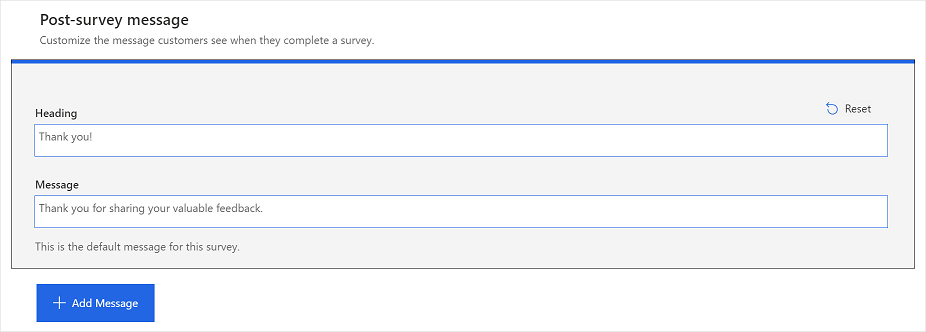
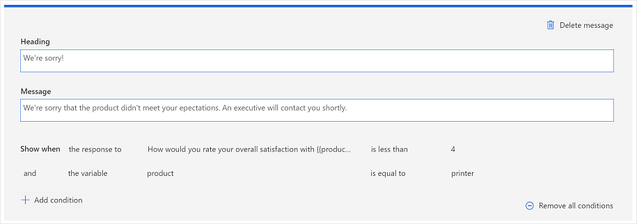
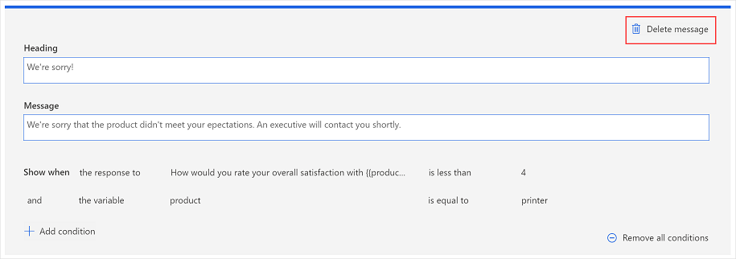

# Customize the post-survey message

A post-survey message is displayed to respondents after they submit a survey. Default content is available for the post-survey message; however, you can add your own content to customize it in accordance with your requirements. You can also add up to four post-survey messages (in addition to the default message) and add conditions to show the appropriate post-survey message based on the response to a question or the value of a variable.<!--note from editor: Suggested, to avoid the use of "per."--> The maximum number of characters supported in the message header and message body are 200 and 1,000, respectively.

You can personalize the post-survey message by adding variables in the message header and body. More information: [Add variables in a survey](personalize-survey.md#add-variables-in-a-survey)

You can add formatting to the post-survey message by changing its font style, font size, and color. You can also add a link to the message by selecting **Link** on the formatting toolbar and then adding the link through the link editor. More information: [Format text in a survey](survey-text-format.md)

If you've created a multilingual survey, you can add translations to post-survey messages for each added language. For information about adding languages and translations, go to [Create a multilingual survey](create-multilingual-survey.md).<!--note from editor: Just FYI, the "More information" strings don't end with a period (I think because it's not a complete sentence). The "For information, go to..." sentences do end with a period. Note that it's "information about," rather than "information on," and now we say "go to" instead of "see." (We still have those "See also" headings, though, so this isn't a universal rule.)-->

## Customize the default post-survey message

1. Open the survey.

2. On the **Design** tab, scroll to the bottom of the survey designer.

3. In the **Post-survey message** section, select the default message.

    

4. Update the text in the **Heading** and **Message** fields.

    

5. To revert your changes to the default text, select **Reset**.

## Add a new post-survey message

1. Open the survey.

2. On the **Design** tab, scroll to the bottom of the survey designer.

3. In the **Post-survey message** section, select **Add Message**.

    

4. Add text in the **Heading** and **Message** fields.

5. In the **Show when** field, select one of the following:

    - **the response to**: Select this option when the message is to be displayed according to the response to a question.<!--note from editor: Suggested.--> After selecting this option, select the question, operator, and the response.

    - **the variable**: Select this option when the message is to be displayed according to the value of a variable.<!--note from editor: Suggested.--> After selecting this option, select the variable, operator, and its value.

    You can add more conditions by using **and/or** operator by selecting **Add condition**.<!--note from editor: I'm not sure what this means. Can it say something like "To add **and** or **or** conditions for showing the response, select **Add condition**."? Or "You can add more conditions that use either the **and** or **or** operator by selecting **Add condition**.?-->

    

6. To remove a branching condition, hover over the condition, and then select **Remove**.

7. To remove all branching conditions, select **Remove all conditions**.

## Delete a post-survey message

1. Open the survey.

2. On the **Design** tab, scroll to the bottom of the survey designer.

3. In the **Post-survey message** section, select the message you want to delete.

4. Select **Delete message**.

    

### See also

[Create a project](create-project.md) 
[Create a survey](create-survey.md) 
[Manage surveys](manage-surveys.md) 
[Manage projects](manage-projects.md)
