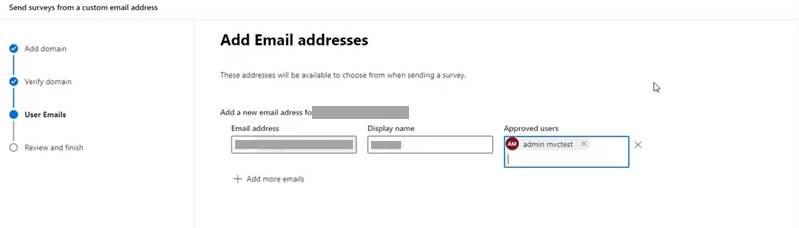
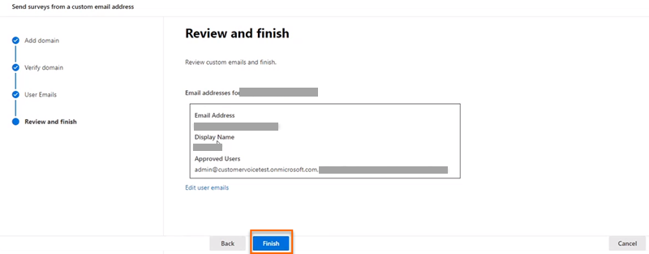

# Customize the sender's email address

By default, surveys are sent from the `surveys@email.customervoice.microsoft.com` email address. The email customization feature helps you create a custom email address based on your organization's domain. You can then use this custom email address to send survey invitations to your customers.

Let's say your company is Contoso Suites, and the company's website is `www.contososuites.com`. You want to create two custom email addresses based on your company's domain, such as `noreply@contososuites.com` and `support@contososuites.com`.

> [!NOTE]
> - Only tenant administrators can add custom email addresses. If you want to send survey invitations from a custom email address, contact your tenant administrator to add it.
> - In US Government Community Cloud, emails are sent from the logged in user's account.
> - The capability to customize sender's email address is not available in US Government Community Cloud.
> - Ensure that your Customer Voice environment is set up successfully before you verify the domain while adding a custom email address. To confirm that your environment is set up successfully, the message `You can start building as soon as Dynamics 365 setup is complete. We'll let you know as soon as it's done.` should not be displayed on the survey design page.

## Add custom email addresses

Take the following steps to add custom email addresses:

1.	Sign in to [Microsoft 365 admin center](https://admin.microsoft.com/) with your work or school account.

2.	Select **Settings** > **Org settings**.

3.	On the **Org settings** page, under the **Services** tab, select **Dynamics 365 Customer Voice**.   
    > [!div class="mx-imgBorder"]
    > 

4.	In the **Dynamics 365 Customer Voice** panel, under the **Distribution** tab, select **+ Add domain**.    
 
5.	On the **Add domain** page, enter the domain name of the email domain you want to create in **Enter your URL**, and then select **Next**.     
    > [!div class="mx-imgBorder"]
    > 
 
6.	Create DNS records in your domain by using the values available under the **Create DNS record** section on the **Verify your domain** page. More information: [Example DNS records](#example-dns-records).    
    > [!div class="mx-imgBorder"]
    > 
 
7.	After creating DNS records, select **Verify**.     
    > [!div class="mx-imgBorder"]
    > 

    >[!NOTE]
    >If the DNS records are not created, an error is displayed specifying that the application is unable to create a key and the domain can't be created.

8.	On the **Add Email addresses** page, enter the following information:    
    - **Email address**: Email address to use for sending survey invitation.
    - **Display name**: Display name for the email user.
    - **Approved users**: Users who can use custom email addresses when sending survey invitations.     
    > [!div class="mx-imgBorder"]
    >     

    >[!NOTE]
    >To add more email addresses, select **Add more emails**, and then provide the required information.
 
10.	After adding the required email addresses, select **Next**.

11.	On the **Review and finish** page, review the entered information, and then select **Finish**.    
    > [!div class="mx-imgBorder"]
    >   
 
12.	A confirmation message is displayed that the custom email address is created, select **Done**.    
    > [!div class="mx-imgBorder"]
    > 

The custom email address is displayed in the **Dynamics 365 Customer Voice** panel.
  
## Edit custom email addresses

After creating a custom email address, you can edit it to change its address, display name, and modify the users allowed to use the email.

1.	Sign in to [Microsoft 365 admin center](https://admin.microsoft.com/) with your work or school account.

2.	Select **Settings** > **Org settings**.

3.	On the **Org settings** page, under the **Services** tab, select **Dynamics 365 Customer Voice**.

4.	In the **Dynamics 365 Customer Voice** panel, hover over the domain that contains the email address you want to edit, select the ellipsis button, and then select **Edit**.
 
5.	On the **Add Email addresses** page, edit the required information, and then select **Next**.

6.	On the **Review and finish** page, review the entered information, and then select **Finish**.
 
## Delete custom email addresses

You can delete custom email addresses that are no longer required.

1.	Sign in to [Microsoft 365 admin center](https://admin.microsoft.com/) with your work or school account.

2.	Select **Settings** > **Org settings**.

3.	On the **Org settings** page, under the **Services** tab, select **Dynamics 365 Customer Voice**.

4.	In the **Dynamics 365 Customer Voice** panel, hover over the domain that contains the email address that you want to delete, select the ellipsis button, and then select **Edit**.
 
5.	On the **Add Email addresses** page, select  for the email you want to delete, and then select **Next**.

6.	On the **Review and finish** page, review the information, and then select **Finish**.

## Example DNS records

Here's an example of a DNS record. The DNS records are used to verify the domain and enable sending survey invitations from the custom email address.

> [!NOTE]
> If the domain is not getting verified, open any open-source DNS lookup tool and check if CNAME and TXT records are published. If any of the records are not published, you need to add those records in your DNS zone.

### TXT record

`TXT name: @`    
`TXT value: msfpkey=abc123abc123abc123abc123`

In this example screen, we're using Microsoft Azure to add the TXT name and value:

> [!div class="mx-imgBorder"]
> 

### CNAME record

`Host name or Alias: fpeurkey1.\_domainkey`      
`Points to address: fpeurkey1contosocom.d01.formspro.dynamics.com`

> [!NOTE]
> You must create two CNAME records using the information provided in step 6 of [Add custom email addresses](#add-custom-email-addresses).

In this example screen, we're using Microsoft Azure to add the CNAME alias and address:

> [!div class="mx-imgBorder"]
> 

> [!IMPORTANT]
> Ensure that the domain name is not duplicated while creating a CNAME record. The domain name is added automatically to the record. For example, in the following image, adding the domain in the **Name** field will result in an incorrect record and lead to the failure of domain verification.
> 

## Frequently asked questions

### Should the email account be a functioning account, or can it be a dummy account?

The email account need not be a functioning account to send emails; however, a mailbox must be configured if the account is expected to receive replies. In most cases, the email address from which survey emails are sent is an unmonitored email account and need not receive emails.

### See also

[Work with survey distribution settings](distribution-settings.md) 
[Send a survey by using the built-in email composer](send-survey-email.md) 
[Send a survey by using Power Automate](send-survey-flow.md) 
[Embed a survey in a webpage](embed-web-page.md) 
[Send a survey link to others](send-survey-link.md) 
[Send a survey by using QR code](send-survey-qrcode.md)

[!INCLUDE[footer-include](includes/footer-banner.md)]
