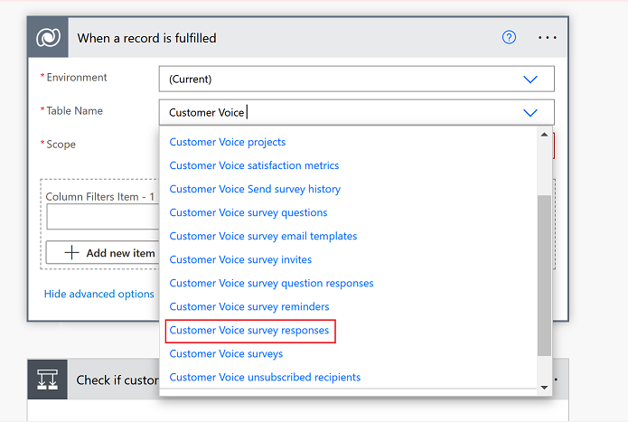

# Dynamics 365 Customer Voice FAQ

We've compiled a list of frequently asked questions and provided brief answers to help you get to your information quickly.

## I created a guest user in Azure Active Directory, but the user is unable to access Dynamics 365 Customer Voice.

Guest user access is not supported in Dynamics 365 Customer Voice. You must create a new user in your tenant and then provide access to the new user.

## How is the owner of a survey response determined?

A response owner is determined by the following logic:

- For responses to a survey invitation, the invitation owner is set as the response owner.
- If the survey invitation owner doesn't have sufficient privileges to own responses, or if the response is anonymous, the survey owner is set as the response owner.
- If the account of a survey owner has been disabled or the survey owner is unable to access the application due to licensing issues, the application user is set as the response owner.

## I deleted data from Microsoft Dataverse but it is visible in reports.

It is recommended not to delete data directly from Microsoft Dataverse. If you delete any data directly from Microsoft Dataverse, it is not synchronized with Customer Voice services. If you want to delete any data, you must delete using the Dynamics 365 Customer Voice interface.

## Why does the application user require the System Administrator role?

The application user requires the System Administrator role to associate survey invites and responses to any of the entities, including custom entities.

## What happens if the project owner leaves the organization?

If the project owner leaves the organization, the project will be deleted once the user is removed from the organization. If the project was shared by the user before leaving the organization, the existing user, with whom the project is shared, must create a [copy of the project](manage-projects.md#copy-a-project) and use the copied project.

## I deleted the old surveys and survey responses, and want to update values in the satisfaction metrics report accordingly.

This is an unsupported scenario. Deleting old surveys and survey responses will not update values in the satisfaction metrics report.

## I want to delete multiple responses from the Dynamics 365 Customer Voice interface.

Deleting multiple responses from the Dynamics 365 Customer Voice interface is not supported.

## I restored Microsoft Dataverse and want Dynamics 365 Customer Voice and survey responses to work with it.

This is an unsupported scenario.

## How can I share my new feature requirements or ideas?

You can share your new feature requirements or ideas on the [Customer Voice Ideas](http://aka.ms/customervoiceideas) page.

## I configured the flow for survey response but it is getting triggered for each question response.

Ensure that the flow is configured correctly. While selecting the table name during flow configuration, select **Customer Voice survey responses**.

## Respondents are getting the "The maximum number of people have already responded to the form" error when trying to submit the responses.

Delete the older responses as the survey response limit is reached. Alternatively, a new survey can be created if old responses cannot be deleted. The maximum number of responses a survey can receive is 500,000. The maximum response limit can be increased to a higher limit of 5 million on request.

[!INCLUDE[footer-include](includes/footer-banner.md)]
