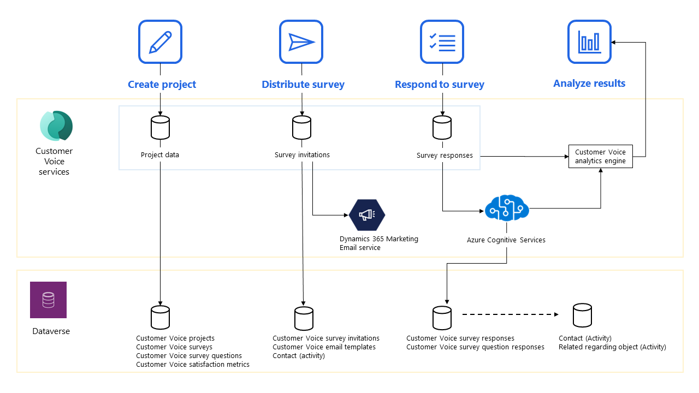

# Data flow in Dynamics 365 Customer Voice

The following data flow diagram provides a visual representation of the flow of information (data) across Customer Voice services and Microsoft Dataverse. It also provides visual information about inputs and outputs of entities and processes. The data in the Customer Voice services area is stored in Microsoft managed storage in North America or Europe, and is encrypted by using Microsoft-managed keys. The data in the Dataverse area is stored in users' Dataverse organizations in the local datacenter.

The following processes are shown in the data flow diagram:

- **Create project**: When a project owner creates a project, its data is stored in Customer Voice services and Dataverse.

- **Distribute survey**: When a survey distributor sends a survey, the survey invitations are stored in Customer Voice services and Dataverse. The survey invitation emails are sent to the recipients by using Dynamics 365 Marketing Email service internally.

  > [!NOTE]
  > You don't need an explicit subscription to Dynamics 365 Marketing to send emails.

- **Respond to survey**: When a respondent responds to a survey, the survey response is first stored in Customer Voice services and then sent to Azure Cognitive Services and the Customer Voice analytics engine for further processing. After responses are processed by Cognitive Services, they're stored in Dataverse.

- **Analyze results**: After data is processed by the Customer Voice analytics engine, it's ready for analysis by viewing the information in charts in Customer Voice.

### See also

[Create a project](create-project.md) 
[Create a survey](create-survey.md) 
[Send a survey](send-survey.md) 
[About reports](about-reports.md)

[!INCLUDE[footer-include](includes/footer-banner.md)]
