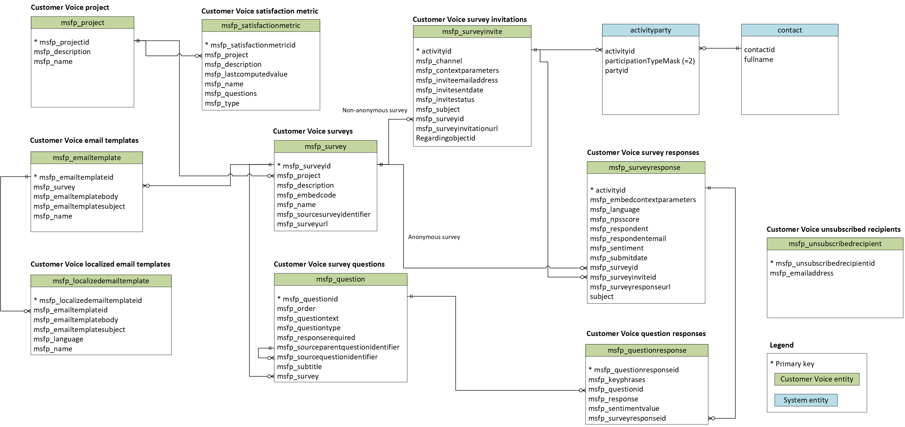

# Entity Reference for Dynamics 365 Customer Voice

Use this reference to understand the available operations that can be performed on specific entities, the default attributes of each entity and the relationship between entities.

Following is a simplified version of the entity relationship diagram of Forms Pro entities. You can generate a detailed entity relationship diagram of Forms Pro entities using the [Metadata Diagram tool](https://code.msdn.microsoft.com/Sample-of-generating-a0ba0e47). To do this, you will just have to mention the entity logical names as parameters while executing the sample. More information: [Use metadata to generate entity diagrams](https://docs.microsoft.com/dynamics365/customer-engagement/developer/use-metadata-generate-entity-diagrams).

> [!div class=mx-imgBorder]
> 

## Entities

|Entity name|Description|
|------|------|
|[msfp_emailtemplate](reference/entities/msfp_emailtemplate.md)|Template for an email message that contains the survey invitation link.|
|[msfp_localizedemailtemplate](reference/entities/msfp_localizedemailtemplate.md)|Stores localized data for email templates.|
|[msfp_question](reference/entities/msfp_question.md)|Question in a survey to collect feedback.|
|[msfp_questionresponse](reference/entities/msfp_questionresponse.md)|Response to a question in a survey.|
|[msfp_survey](reference/entities/msfp_survey.md)|Set of questions to collect feedback.|
|[msfp_surveyinvite](reference/entities/msfp_surveyinvite.md)|Activity that tracks a survey invitation sent to a person.|
|[msfp_surveyresponse](reference/entities/msfp_surveyresponse.md)|Response to a survey.|
|[msfp_project](reference/entities/msfp_project.md)|Set of surveys to collect feedback.|
|[msfp_unsubscribedrecipient](reference/entities/msfp_unsubscribedrecipient.md)|Email address of an unsubscribed respondent.|
|[msfp_satisfactionmetric](reference/entities/msfp_satisfactionmetric.md)|Satisfaction metric defined for a project.|

### See also

[Developer guide for Forms Pro](developer-guide.md) 
[Entity reference for Microsoft Dynamics 365](/dynamics365/customer-engagement/developer/about-entity-reference)
