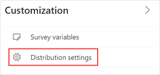
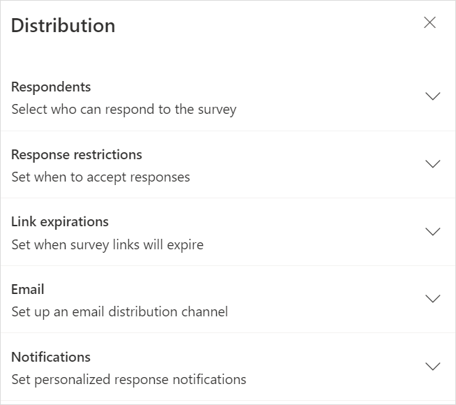
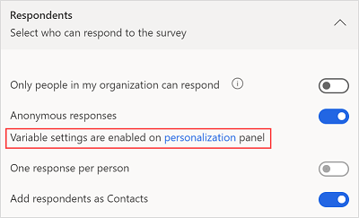
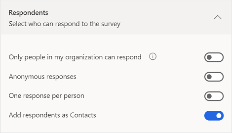
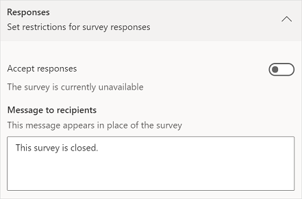
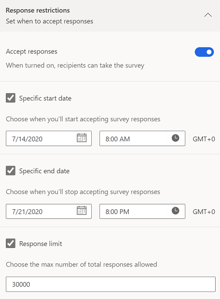
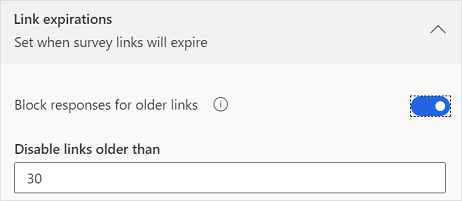

# Work with survey distribution settings

After you've created a survey, you can select distribution settings to control responses to your survey. You can choose to allow anyone to respond to the survey, or only people in your organization. If anyone can take the survey, respondents won't have to sign in, whereas they will have to sign in if you're only allowing people in your organization to respond. You can also define various response and notification options.

**To update survey distribution settings**

1. Open the survey.

2. On the **Send** tab, select **Customization** at the right side of the page, and then select **Distribution settings**.

    

    The **Distribution** panel is displayed.

    

3. Update the settings as described in the following sections.

## Participants

You can select the options to define who can respond to a survey, whether to anonymize responses, and more.

Consider a scenario where you've created a survey to collect customer feedback when a support case is resolved. In this scenario, you'll want feedback from the people outside your organization.

Let's consider another scenario where you've created a survey to collect feedback about an internal organization event. In this case, you'll only want feedback from the people in your organization.

The available settings are:

- **Only people in my organization can respond**: Specify whether anyone with the survey link can respond to the survey, or only people in an organization.

    By default, this setting is turned off and anyone with the survey link can respond to the survey. Respondents aren't required to sign in to open the survey.

    When you turn on this setting, only the respondents who are in the same organization as the survey creator can respond to the survey. Respondents are required to sign in to open the survey.

- **Anonymous responses**: Specify whether to record respondents' names, or keep them anonymous.

    By default, this setting is turned off and the respondent's name is recorded.

    When you turn on this setting, the respondent's first name, last name, and email aren't saved in response records by default. If you've added variables to your survey, their values also will not be stored in response records by default. This is helpful when you want to collect survey responses anonymously. A message is displayed below this option that the variables settings are enabled. You can turn on the toggle for the required variable if you want to store its value in the response record. More information: [Personalize a survey by using variables](personalize-survey.md)

    

- **One response per person**: Specify whether a respondent can submit only one response, or more than one.

    By default, this setting is turned off and a respondent can submit more than one response. 

    When you turn on this setting, a respondent can submit only one response per invitation. This setting is disabled when **Only people in my organization can respond** is turned off and **Anonymous responses** is turned on.

- **Save invited participants as Contacts**: Specify whether the respondent should be added as a contact in Microsoft Dataverse.

    By default, this setting is turned on, and each respondent is added as a contact in Dataverse. This only works with surveys sent through [email](send-survey-email.md) or [survey invitation](create-survey-invite.md). If a contact already exists, it will be updated accordingly.

- **Save survey progress**: Specify whether a survey in progress should be saved and a respondent be able to complete a survey in multiple sittings. By default, this setting is turned off and the data is collected from scratch every time a survey is opened.

    If you want to save a survey in progress, turn on this setting. More information: [Save survey progress](save-survey-progress.md)

    This setting is disabled when the [**Shuffle questions**](survey-formatting.md#shuffle-questions) setting is turned on, and vice versa.

## Responses

You can select whether your survey is open for receiving responses, and also specify a time period when to start and stop receiving responses.

The available settings are:

- **Accept responses**: Specify whether the survey is open and accepting responses. By default, this setting is turned on.

    If you want to stop receiving responses, turn off this setting and enter a message in the **Message to recipients** field. The message you enter will be shown to respondents when they open the survey.

    

- **Select when the survey will be available**: Specify a start date and time to start receiving responses. By default, this isn't selected.

    When you select this option, you can specify a **Start date** and **Start time** when the survey will be open for respondents.

    This setting is displayed only when **Accept responses** is turned on.
        
- **Specific end date**: Specify an end date and time to stop receiving responses. By default, this isn't selected.  

    When you select this option, you can specify an **End date** and **End time** when the survey will stop receiving responses.

    This setting is displayed only when **Accept responses** is turned on. 

- **Response limit**: Specify the maximum number of responses to be received, after which the responses will no longer be counted and the survey will be stopped. By default, this isn't selected.

    When you select this option, you can set the maximum number of responses to be received, in accordance with your requirements. By default, the value is set to 50,000, which is the maximum. You can enter a lower value.

    This setting is displayed only when **Accept responses** is turned on.

## Availability

You can specify the number of days your survey will be open after you send the survey invitation.

The available setting is:

- **Disable survey links**: Specify whether to block responses from older personalized links. By default, this setting is turned off.

    If you want to block responses, turn on this setting and enter a number of days in the **Disable after** field. By default, the value is set to 30. You can enter a lower value or up to the maximum of 1,095. Respondents can use the personalized link to complete the survey from the date they receive the invitation until the specified number of days have passed.

## Email

You can select the custom email address that you want to use for sending email. After you've set up a custom email, select it from the **Sender** list. More information: [Customize the sender's email address](customize-sender-email.md)

## Notifications

You can set response notification options for the sender in addition to the respondent.

The available settings are:

- **Send confirmation email to respondents**: Specify whether respondents should receive an email confirmation of their responses. This setting is enabled only when **Only people in my organization can respond** is turned on and **Anonymous responses** is turned off. By default, this setting is turned off.

    When you turn on this setting, your respondents will see the option **Send me an email receipt of my responses** after completing a survey. After submitting responses, respondents will then receive a confirmation email, which includes a thank-you message and link to view their responses.

- **Receive an email when a survey is submitted**: Specify whether you need an email notification whenever a response is submitted. By default, this setting is turned off.

## Work with personalized links

Personalized survey links or trackable links are generated when a survey is sent by using the built-in email composer and Power Automate. A survey link is unique to its recipient, and helps to record the respondent's name and/or whether the respondent can submit only one response. The personalized link is a short URL in the following format: `https://<region>.microsoft.com/<10-digit code>`

When you send a survey by generating a link or a QR code, the survey links aren't personalized. If the survey links aren't personalized:

- You won't be able to record the respondent's name if the **Only people in my organization can respond** setting is turned off.
- You won't be able to determine whether the respondent has submitted only one response if the **One response per person** setting is turned on.

If you want to limit one response per person for non-personalized links, you must turn on **Only people in my organization can respond** and **One response per person** settings.

### See also

[Send a survey by using the built-in email composer](send-survey-email.md) 
[Send a survey by using Power Automate](send-survey-flow.md) 
[Embed a survey in a webpage](embed-web-page.md) 
[Send a survey link to others](send-survey-link.md) 
[Send a survey by using QR code](send-survey-qrcode.md)

[!INCLUDE[footer-include](includes/footer-banner.md)]
