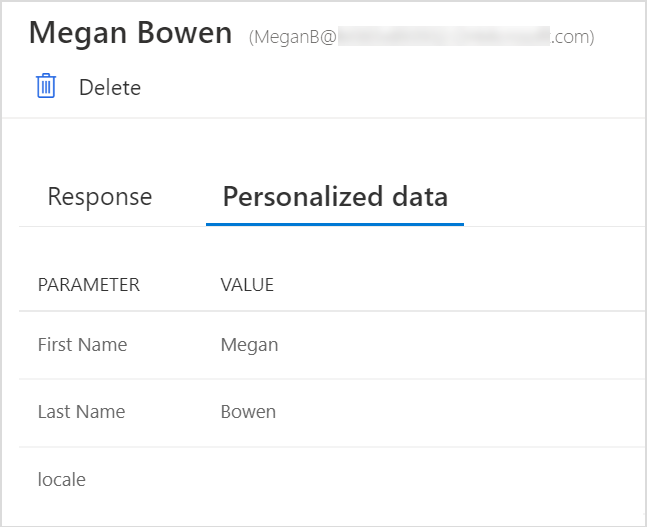
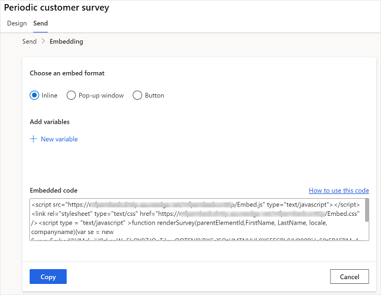

# Embed a survey in a webpage

You can embed your survey in a webpage by pasting the survey's embed code into your webpage's source code. You can choose one of the following embed styles for your survey:

- **Inline**: Displays the survey statically on the webpage.

- **Pop-up window**: Displays the survey in a pop-up window based on the respondent's action.

- **Button**: Displays the survey when a button is selected. By default, the button name is **Provide feedback**.

> [!NOTE]
> When embedding a survey in a webpage, ensure that **Only people in my organization can respond setting** is turned off in [survey distribution settings](distribution-settings.md#participants).

If you've created variables, they'll be used to capture your respondent's information and the context in which the response was provided, and store that data in the survey response. You can also create new variables, if you need. If the appropriate values aren't passed to variables in the embed code, the default values will be used.

The values of variables in a response are displayed on the **Personalized data** tab in a survey response.

> [!div class=mx-imgBorder]
> 

**To embed your survey**

1.  Open the survey you want to embed and go to the **Send** tab.

2.  Select **Embed**.

3.  Under **Choose an embed format**, select one of the following options:

    -   Inline

    -   Pop-up window

    -   Button

4.  Optionally, under **Add variables**, select **New variable** to create a new variable.

    The embed code is generated in accordance with the options you selected.

5.  Select **Copy**, and then paste the embed code into a webpage to embed your survey. You must then update the webpage's source code to render the survey on the webpage. For information about how to update the source code, see [Update a webpage's source code](#update-a-webpages-source-code).  

    > [!div class=mx-imgBorder]
    >   

## Update a webpage's source code

After generating the embed code, you must add it to your webpage's source code and create a method that calls the **renderSurvey** function to render the survey on the webpage. You must ensure that the values in the **renderSurvey** function are passed in the same order as the survey variables that are defined in the **renderSurvey** function in the embed code.

For an inline survey, a parent `div` container with the ID `surveyDiv` must be defined for the survey to be displayed. The minimum width and height of the parent `div` container must be 350 pixels and 480 pixels respectively.

### Scenario to embed an inline survey

Let's say you've created a survey with two additional survey variables (**Email** and **PageTitle**). You want to embed the survey as inline into your webpage and load the survey as soon as the page loads. The embed code is generated as follows:

```JavaScript
<script src="https://www.contoso.com/Embed.js" type="text/javascript"></script><link rel="stylesheet" type="text/css" href="https://www.contoso.com/Embed.css" />
<script type = "text/javascript" >function renderSurvey(parentElementId, FirstName, LastName, Email, PageTitle)
{var se = new SurveyEmbed("JtSG9ha000000000020pTSB1AovM_5u8bQH1UQjlNQjZRWV0000000000","https://www.contoso.com/");
var context = {"FirstName": FirstName,"LastName": LastName,"Email": Email,"PageTitle": PageTitle,};
se.renderInline(parentElementId, context);}</script>
```

In the preceding embed code, the `renderSurvey` function contains the `parentElementId` parameter in addition to the survey variables. The `parentElementId` parameter receives the `div` container ID when it's called.

You must create a `div` container with the ID `surveyDiv` on the webpage where you want to display the survey. This `div` container displays the survey statically in a designated area on the webpage. Because you'll want to load the survey when the page loads, create a method as follows:

```JavaScript
<script>
	 window.addEventListener('load', function () {
            renderSurvey("surveyDiv", "Bert", "Hair", "bert.hair@contoso.com", "Product Overview");
        }, false);
</script>
```

The preceding method calls the `renderSurvey` function and passes the required values accordingly. In this method, static user details are passed, but you can provide a function that retrieves the logged-in user details.

> [!NOTE]
> The above code snippets are provided as an example. You must generate the actual embed code from Customer Voice and create methods as per your requirements.

### See also

[Work with survey distribution settings](distribution-settings.md)<br>
[Send a survey by using the built-in email composer](send-survey-email.md)<br>
[Send a survey by using Power Automate](send-survey-flow.md)<br>
[Send a survey link to others](send-survey-link.md)<br>
[Send a survey by using QR code](send-survey-qrcode.md)


[!INCLUDE[footer-include](includes/footer-banner.md)]
