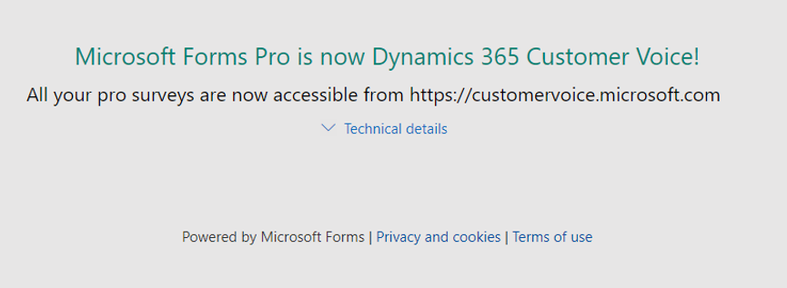
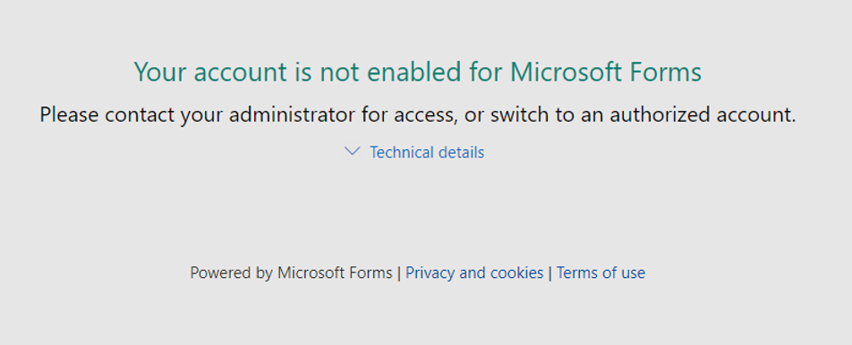
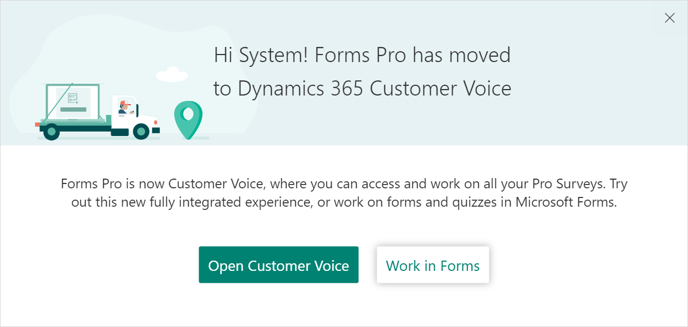
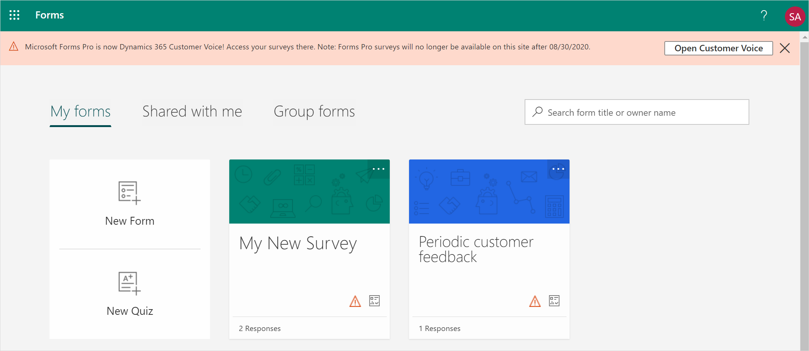

# Transition from Microsoft Forms Pro to Dynamics 365 Customer Voice

Microsoft Forms Pro is rebranded as Dynamics 365 Customer Voice. With this rebranding, all your surveys from Forms Pro are moved to Dynamics 365 Customer Voice and you can perform all the actions in Dynamics 365 Customer Voice that you performed in Forms Pro.

## What happens to Forms Pro surveys?

- All your Forms Pro surveys are available as individual projects in Dynamics 365 Customer Voice. This means that each project contains one survey. You can see all your projects on the **All projects** tab.

- If you created a shared survey in Forms Pro, a shared project is created.

- If you created a flow for your surveys in Forms Pro, it is available in Dynamics 365 Customer Voice.

- If you had a Net Promoter Score (NPS) question or tagged a text question for sentiment analysis in Forms Pro, the corresponding NPS and sentiment metrics are created in Dynamics 365 Customer Voice as part of migration. If you had multiple NPS questions, the first NPS question is mapped to the created satisfaction metrics. If you have tagged multiple text questions for sentiment analysis, a satisfaction metric is created for each of the tagged text question.

  A dashboard is automatically created for each set of metrics, showcasing recent scores and trends. The dashboard is available under **Reports**.

  > [!NOTE]
  > The computation of satisfaction metrics for the migrated surveys might take up to 10 days. The satisfaction metrics report will be displayed after the computation is completed successfully.

- If you created a web browser bookmark for a Forms Pro survey URL, you are redirected to the corresponding project in Dynamics 365 Customer Voice.

- All your survey data (questions and responses) is available in the same environment as you are currently working in.

## Experience for users based on their Forms Pro license

The transition experience differs based on the product license you have. This section provides details.

**Experience for users with only a Forms Pro license**

If you have only a Forms Pro license and try to sign in to Forms Pro using the [https://forms.office.com](https://forms.office.com) URL, the following message is displayed till August 30, 2020 with a link to go to Dynamics 365 Customer Voice.

 

After August 30, 2020, the following message will be displayed:

 

**Experience for users with both Forms and Forms Pro licenses**

If you have licenses for both Forms and Forms Pro, and have created surveys in Forms Pro, you are redirected to the Forms home page. You can choose to go to Dynamics 365 Customer Voice or stay in Forms till August 30, 2020. However, you'll not be able to switch to Forms Pro from Forms.

 

If you choose to stay in Forms, the following message is displayed at the top of the page, stating that your Forms Pro surveys are available in Dynamics 365 Customer Voice and won't be available through Forms after August 30, 2020.

 

If you select a survey tile, you're redirected to the corresponding project in Dynamics 365 Customer Voice. After August 30, 2020, Forms Pro survey tiles will be removed and only forms and quizzes will be available.

**Experience for users with only a Forms license**

If you have a Forms-only license and try to sign in to Forms Pro, the Forms home page is displayed.

> [!NOTE]
> If you are a customer in US Government Community Cloud, you can continue to use Forms Pro. Dynamics 365 Customer Voice will be available on US Government Community Cloud by October 2020.

### See also

[Create a project](create-project.md) 
[Create a survey](create-survey.md) 
[Send a survey](send-survey.md) 
[About reports](about-reports.md)