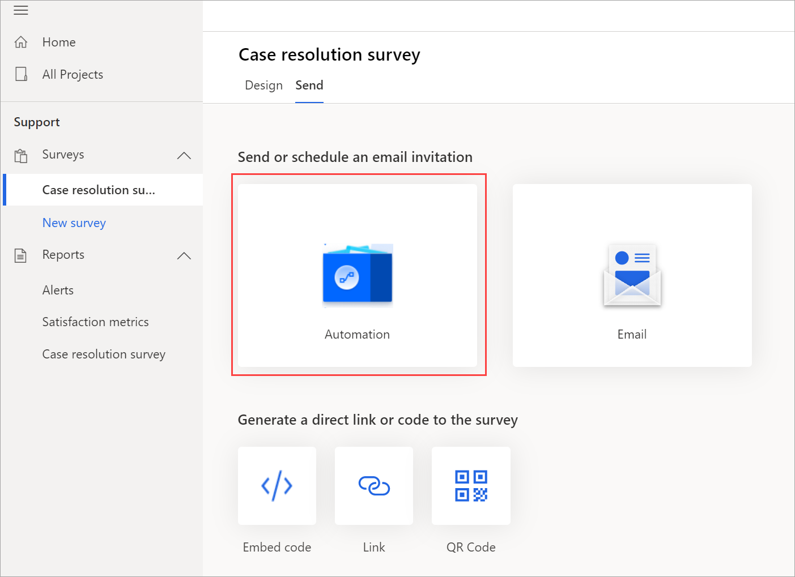
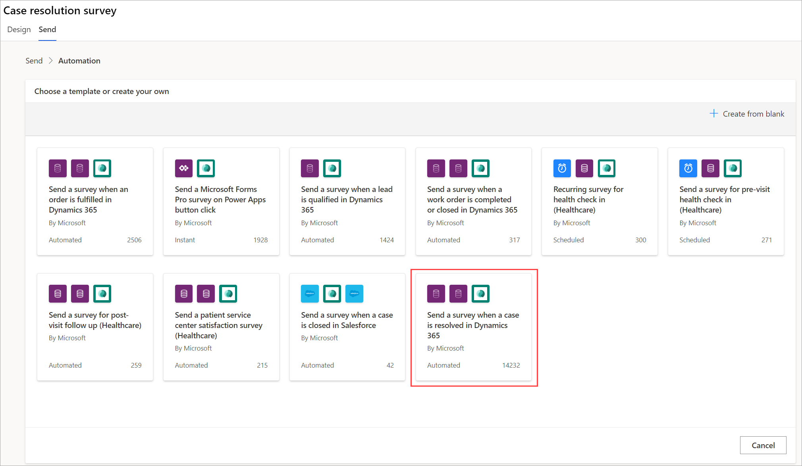
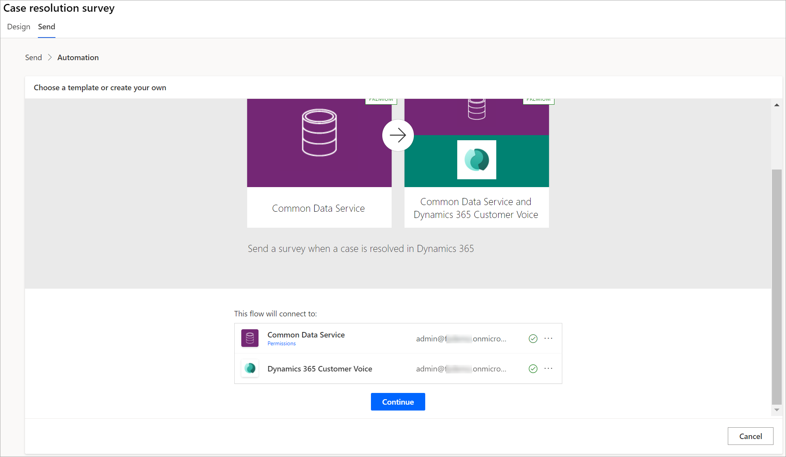
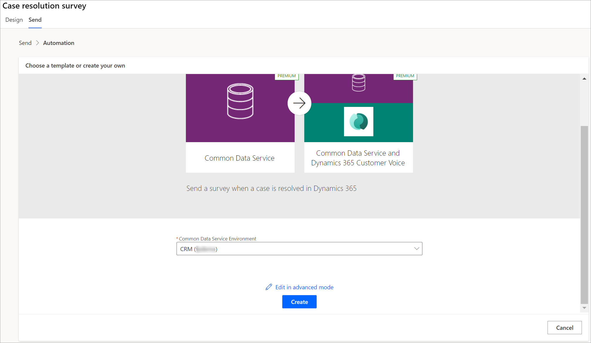
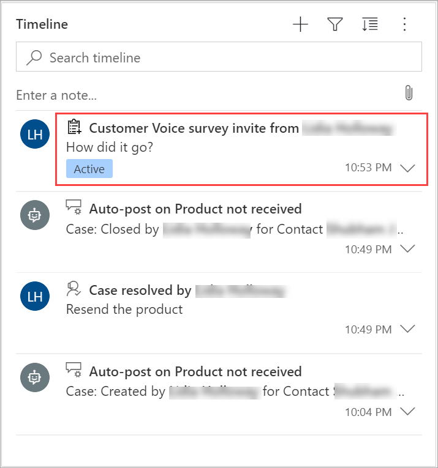
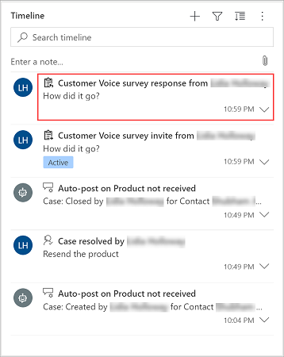
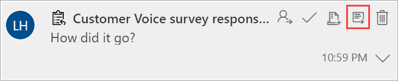
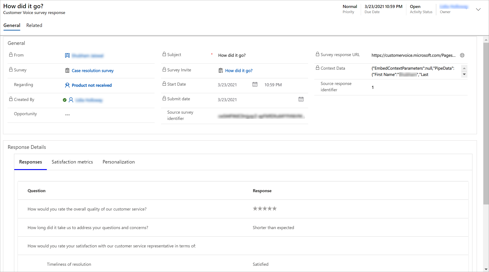

# Integrate Dynamics 365 Customer Voice with Dynamics 365 Customer Service

**Prerequisite**: You must install Dynamics 365 Customer Service in the same tenant as Dynamics 365 Customer Voice. 

You can send a survey automatically to customers as soon as a case is resolved in Dynamics 365 Customer Service. When a customer submits a response to a survey, it's attached to the case. You can open the response record from the case's timeline.

1.	[Create a project](create-project.md) by using the **Support** template.

2.	Modify the survey questions and [customize the survey](create-survey.md#customize-a-survey) as required.

3.	On the **Send** tab, select **Automation**.

    

4.	On the **Choose a template or create your own** screen, select **Send a survey when a case is resolved in Dynamics 365**.

    

5.	Verify the connection details, and select **Continue**.

    

6.	Select **Create**.

    

7.	Go to Dynamics 365 Customer Service and resolve a case. More information: [resolve a case](/dynamics365/customer-service/customer-service-hub-user-guide-resolve-cancel-reassign-a-case)

The survey is automatically sent to the contact or account linked with the case. The survey sent to the survey is visible as a record on the case's timeline.

When the customer submits a response to the survey, the response record is visible as a record on the case's timeline.

To see response details, hover over the response record on the timeline, and then select **Open Record**.

The response detail is displayed in the Dynamics 365 Customer Voice survey response entity form.

### See also

[Create a project](create-project.md) 
[Manage projects](manage-projects.md)

[!INCLUDE[footer-include](includes/footer-banner.md)]
