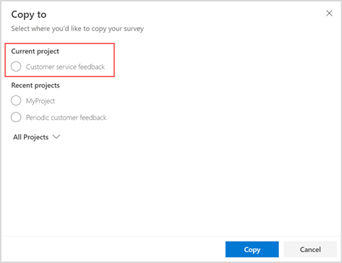
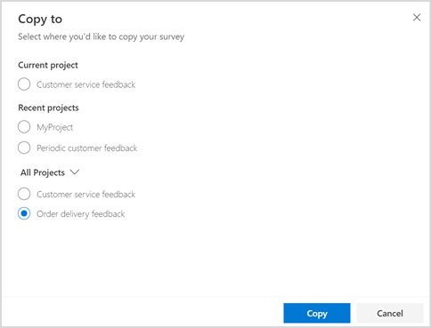
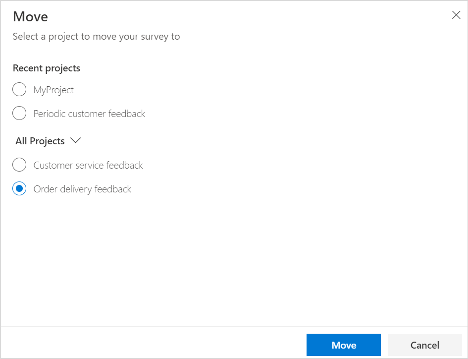
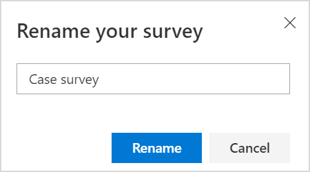

# Manage surveys

After you've created one or more surveys within a project, you can perform the following actions:

- **Copy**: Create a copy your survey in the same or different project in the same environment.
- **Move**: Move a survey to a different project in the same environment.
- **Rename**: Rename your survey.
- **Delete**: Delete the survey that is not required anymore.
- **Share**: Share your survey with other people for collaboration.

## Copy a survey

You can create a copy of your survey in the same project or a different project in the same environment. Dynamics 365 Customer Voice gives the new survey the same name as the existing survey and appends `Copy` to it. You can rename the survey if you want.

**What's copied to the new survey?**

The survey, along with its customizations, is copied as a new survey. 

**What isn't copied to the new survey?**

- Satisfaction metrics and their data
- Power Automate flows
- Email templates
- Survey response data

**To copy a survey**

1. Open the project that includes the survey you want to copy.

2. Hover over the survey, select the ellipsis button , and then select **Copy**.

    The **Copy to** screen is displayed.

3. Do one of the following:

   - To copy your survey in the same project you're currently working in, select the project listed in the **Current project** section.

     

   - To copy your survey to a different project, select a project listed in the **Recent projects** section, or expand **All Projects** and select a project.

     

4. Select **Copy**. A notification is displayed in the upper-right corner when the project is copied successfully.

## Move a survey

You can move a survey to a different project in the same environment. This helps you group similar surveys in one project.

> [!NOTE]
> - You can move a survey from one project to another project only if both the source and target projects have the same owners.
> - If a project has only one survey and you move the survey to a different project, the source project is deleted after the survey is successfully moved.

**What's moved with the survey?**

Survey customizations, email templates, response data, and associated Power Automate flows are moved along with the survey. 

**What isn't moved with the survey?**

Satisfaction metrics aren't moved to the destination project. Satisfaction metrics in the source project, from which the survey was moved, must be manually deleted or updated to select a question to map.

**To move a survey**

1. Open the project from which you want to move the survey.

2. Hover over the survey, select , and then select **Move**.

3. In the **Move** screen, select a project listed in the **Recent projects** section, or expand **All Projects** and select a project.

    
    
    > [!NOTE]
    > If you aren't the owner of any other project, the project list isn't displayed and the **Move** button is disabled.

4. Select **Move**. A notification is displayed in the upper-right corner when the survey is moved successfully.

## Rename a survey

1. Open the project that includes the survey you want to rename.

2. Hover over the survey, select , and then select **Rename**.

    

3. In the **Rename your survey** dialog box, enter a new name, and then select **Rename**.

## Delete a survey

You can delete a survey that you don't need anymore. Deleting a survey removes its associated satisfaction metrics, email templates, survey response data, and satisfaction metrics data. The Power Automate flows associated with the surveys are deactivated. The deletion of a survey is permanent and can't be reverted.

If a project has only one survey, deleting the survey will also delete the project. If a project has multiple surveys, only the survey is deleted.

If a satisfaction metric is mapped to the questions of the survey being deleted, the satisfaction metric is also deleted. If a satisfaction metric is mapped to the questions of multiple surveys, the data of the survey being deleted won't be included for further calculation.

**To delete a survey**

1. Open the project that includes the survey you want to delete.

2. Hover over the survey to be deleted, select , and then select **Delete**.

3. In the confirmation dialog box, select **Delete**.

## Share a survey

You can share your survey with multiple people in your organization so they can collaborate on the structure and layout of the survey. Sharing your survey shares the complete project, so the experience and behavior is the same as that of sharing a project.

To share a survey, open the survey, and select **Share** on the toolbar at the top of the page. Continue by adding co-owners as you would while sharing a project. More information: [Share a project](manage-projects.md#share-a-project)

### See also

[Create a project](create-project.md) 
[Create a survey](create-survey.md) 
[Manage projects](manage-projects.md)

[!INCLUDE[footer-include](includes/footer-banner.md)]
