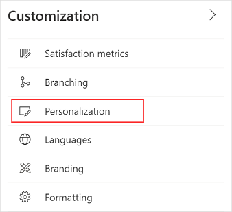
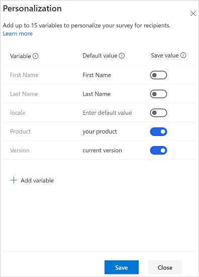

# Personalize a survey by using variables

Variables allow you to personalize a survey by automatically inserting custom information in it. For example, you can use a variable to automatically insert a customer's first name and product name into a question to personalize it. If you plan to send a survey through Power Automate, you can further personalize your survey by adding variables that will be replaced dynamically when a survey is sent through a Power Automate flow.

By default, the following variables are available:

- **First Name**: Inserts the first name of the recipient.

- **Last Name**: Inserts the last name of the recipient.
    
- **locale**: Specifies the locale of the survey while embedding it in the email. More information: [Embed a survey in an email](send-survey-email.md#embed-a-survey-in-an-email)
       
**To create a new variable**

1. Open the survey.
       
2. On the **Design** tab, select **Customization** at the right side of the page, and then select **Personalization**.
    
    
    
3. In the **Personalization** panel, select **Add variable**.
    
4. Enter a name and default value for the variable.

    When a response record is created, the variable's values are saved in the response record.

    

    If **Anonymous responses** is turned on under [survey distribution settings](distribution-settings.md#respondents), a new **Save value** column with the toggle buttons is displayed in the **Personalization** panel. The toggle buttons are turned off by default. You can turn on the toggle for the required variables to store their value in the response record.

    
       
5. To add more variables, repeat steps 3 and 4.
    
5. Select **Save**.
    
> [!NOTE]
> - A variable name can contain a maximum of 30 characters consisting of only English letters and numbers.
> - After you create a variable, you'll not be able to rename it.
> - You can also personalize survey invitations by using variables. More information: [Personalize an email](send-survey-email.md#personalize-an-email)
> - Don't use variables if you plan to send a survey anonymously. The variables won't be replaced with actual data in an anonymous survey.
> - Variables are replaced with the specified default values when sending a survey invitation.
> - You can define a maximum of 15 variables in a survey.

## Add variables in a survey

After you've created the required variables, you can add them in the following survey elements:

- Survey description
- Question text
- Question subtitle
- Section heading
- Section description
- Post-survey message heading
- Post-survey message body

You can also use variables in [branching rules](create-branching-rule.md), in [survey invitations sent through email](send-survey-email.md), and while [embedding a survey in a webpage](embed-web-page.md).

> [!NOTE]
> For Likert questions, you must enter the variable name manually.

**To add variables in survey elements**

1. Open the survey.

2. On the **Design** tab, select the survey element where you want to add a variable. The formatting toolbar appears.

3. Place the cursor at the location where you want to add the variable.

4. From the **Variables** list in the formatting toolbar, select the variable you want to add.

    

    The variable is added within curly braces.

For example, let's say that you've created a variable named **Product** and that you want to display the customer's first name and the product name in a question. Select **First Name** and **Product** from the **Variables** list. *{{First Name}}* and *{{Product}}* are inserted at the cursor location.

Let's say the question is:
*{{First Name}}*, overall, how would you rate your experience with customer service for *{{Product}}*?

That question will look like this when a customer named Bert Hair takes the survey for a product named Contoso Sales:
    
&nbsp;&nbsp;&nbsp;&nbsp;Bert, overall, how would you rate your experience with customer service for Contoso Sales?

## Specify values for variables
    
If you don't specify default values, nothing will be displayed for the variables. You can also specify the values for variables:
    
- When sending email invitations.
- When importing contacts from a CSV file.
- When configuring a flow.

### Specify values when sending email invitations

You can specify default values for the variables by opening the **Customization** pane from the right-side of the page, and selecting **Personalization**. In the **Personalization** panel, specify the default values for the required variables.

### Specify values when importing contacts from a CSV file

You can specify values for the variables when importing contacts from a CSV file. This allows you to personalize the survey as well as the survey invitation emails sent to your recipients. If a default value is specified for a variable in the **Personalization** panel, the default value is overwritten with the value specified in the CSV file. In you don't specify a variable's value in the CSV file, the default variable value is used.

Consider the following scenario.

Grace is a product manager at Contoso Ltd. and she collects quarterly feedback from customers. She uses a CSV file containing customers’ names, the product they use, and the product version. Grace has created variables for product and its version and used them in the survey and the email. She can specify the values for the variables as per the customers in the CSV file. When she sends the invitation email, the survey and email are personalized as per the recipient.

For information on how to import contacts from a CSV file, see [Import contacts from a CSV file](send-survey-email.md#import-contacts-from-a-csv-file).

### Specify values in a flow

To    specify values for variables in a flow:

1.    While configuring a flow, select **Edit in advanced mode**.

2. Go to the step that sends the survey, and expand it.

3.    Select **Show advanced options**.

4. Specify the values for variables.

5. Save the changes.

### See also
    
[Add and configure satisfaction metrics](satisfaction-metrics.md) 
[Add logic by creating branching rules](create-branching-rule.md) 
[Create multilingual survey](create-multilingual-survey.md) 
[Add branding to your survey](survey-branding.md) 
[Add formatting to your survey](survey-formatting.md) 
[Add formatting to survey elements](survey-text-format.md)

[!INCLUDE[footer-include](includes/footer-banner.md)]
