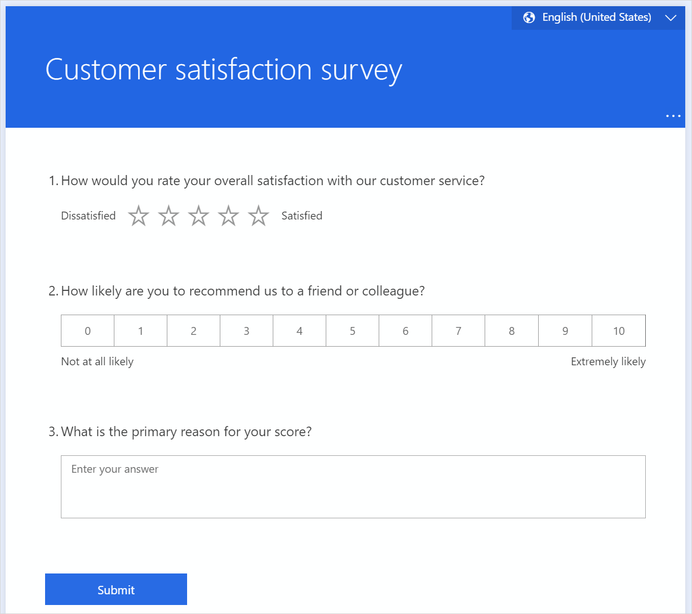
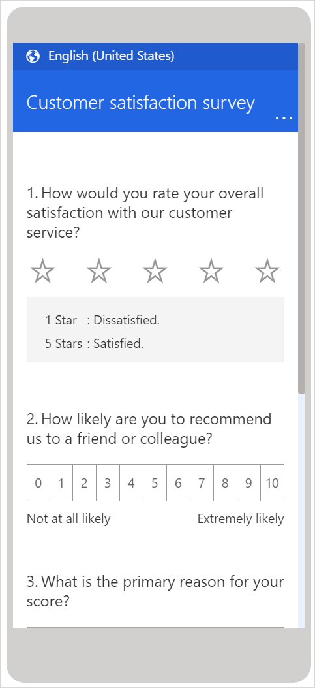

# Preview and test a survey

Before you send a survey to respondents, you must preview it. Previewing ensures that the survey is working as you've designed it. If you find anything that doesn't work<!--Suggested.--> as designed, you can go back to the survey editor and make changes as required. While previewing the survey, you can also answer the questions and navigate through the survey as your respondents would do. If you've created branching rules, this would be a good time to preview and test them<!--Suggested.--> to ensure everything is working as expected.

**To preview and test a survey**

1. Open the survey.

2. Select **Preview** on the toolbar at the top of the page to see how your survey will look on a desktop.

3. To test your survey, enter responses for the questions in preview mode, and then select **Submit**.

    

4. To see how your survey will look on a mobile device, select **Mobile**.

    

5. After previewing and testing your survey, select **Back** in the upper-left corner of the page.

### See also

[Create a new survey](create-new-survey.md) 
[Create a branching rule](create-branching-rule.md) 
[Personalize a survey](personalize-survey.md) 
[Format text in a survey](survey-text-format.md) 
[Create a multilingual survey](create-multilingual-survey.md) 
[Create a multiple-page survey](create-multipage-survey.md)
