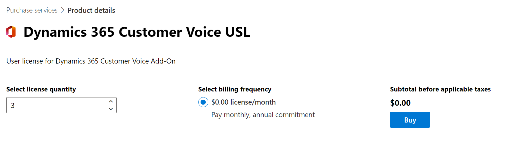
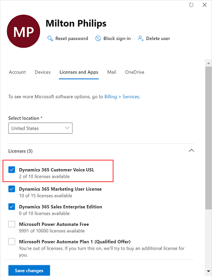

# Purchase Dynamics 365 Customer Voice

Dynamics 365 Customer Voice is included with select Microsoft Dynamics 365 subscriptions and is available as an upgrade for Microsoft 365 subscriptions.

The Dynamics 365 Customer Voice license is based on the number of survey responses received per month. The capacity is measured at the tenant level.

- For a Dynamics 365 enterprise licensed tenant, 2,000 responses are free and the customer can choose to purchase additional responses in bundles of $100 for 2,000 responses per month.
- For a Microsoft 365 licensed customer, there are no free responses included. The customer has to purchase responses in bundles of $100 for 2,000 responses per month.

## Enable Dynamics 365 Customer Voice for users with Dynamics 365 enterprise licenses

Dynamics 365 Customer Voice is included with Dynamics 365 Sales Enterprise, Dynamics 365 Customer Service Enterprise, Dynamics 365 Field Service, Dynamics 365 Marketing, Dynamics 365 Talent, Dynamics 365 Project Service Automation, Dynamics 365 Operations, and Dynamics 365 Relationship Sales. Other Dynamics 365 customers can purchase Dynamics 365 Customer Voice separately.

A tenant with a Dynamics 365 enterprise license has 2,000 responses per month included at the tenant level (irrespective of how many seats the tenant has). If the free responses are exhausted, you can purchase additional responses as mentioned in the following section.

### Purchase additional responses

You can purchase additional responses from the Microsoft 365 admin center.
 
1. Go to the [Microsoft 365 admin center](https://admin.microsoft.com/). 

2. In the left pane, select **Billing** > **Purchase services**.

3. Find **Dynamics 365 Customer Voice Addl Responses**, and then select **Details**.

    

4. Select **Buy**.

    

5. Select the number of add-on licenses to purchase, and complete the purchase process. The purchased capacities are added on top of the 2,000 responses per month.

    
 
### Disable Dynamics 365 Customer Voice for a user

Dynamics 365 Customer Voice is available to all users who have a Dynamics 365 enterprise license. If you want to disable Dynamics 365 Customer Voice for a user:

1. Go to the [Microsoft 365 admin center](https://admin.microsoft.com/).

2. In the left pane, select **Users** > **Active users**.

3. Open the user record for which you need to disable Dynamics 365 Customer Voice.

4. Go to the **Licenses and Apps** tab.

5. Scroll down and expand the **Apps** section, and clear the check boxes of the following apps as applicable:

    - Microsoft Dynamics 365 Customer Voice for Sales Enterprise
    - Microsoft Dynamics 365 Customer Voice for Customer Service Enterprise
    - Microsoft Dynamics 365 Customer Voice for Field Service
    - Microsoft Dynamics 365 Customer Voice for Marketing
    - Microsoft Dynamics 365 Customer Voice for Talent
    - Microsoft Dynamics 365 Customer Voice for Project Service Automation
    - Microsoft Dynamics 365 Customer Voice for Customer Engagement Plan
    - Microsoft Dynamics 365 Customer Voice for Operations
    - Microsoft Dynamics 365 Customer Voice for Relationship Sales

    

6. Select **Save changes**.

### Enable Dynamics 365 Customer Voice for a user without a Dynamics 365 enterprise license

If you need to provide access to Dynamics 365 Customer Voice for users who don't have a Dynamics 365 enterprise license:

1. Go to the [Microsoft 365 admin center](https://admin.microsoft.com/).

2. In the left pane, select **Billing** > **Purchase services**.

3. Find **Dynamics 365 Customer Voice Pro USL**, and then select **Details**. Dynamics 365 Customer Voice Pro USL is a free user license.

    

4. Select **Get now**.

    

5. Select the number of user licenses to purchase, and complete the purchase process.

    

5. Assign the **Dynamics 365 Customer Voice Pro USL** license to users in your organization:

    1. In the left pane, select **Users** > **Active users**.

    2. Open the user record to which you need to add a Dynamics 365 Customer Voice license.

    3. Go to the **Licenses and Apps** tab.

    4. In the **Licenses** section, select **Dynamics 365 Customer Voice Pro USL**.

        
    
    5. Select **Save changes**.

## Purchase Dynamics 365 Customer Voice for users in an Office 365 tenant

If your tenant doesn't have Dynamics 365 enterprise licenses that include Dynamics 365 Customer Voice, follow these steps to purchase Dynamics 365 Customer Voice:

1. Go to the [Microsoft 365 admin center](https://admin.microsoft.com/).

2. In the left pane, select **Billing** > **Purchase services**.

3. Find **Dynamics 365 Customer Voice Addl Responses**, and then select **Details**.

    

4. Select **Buy**.

    

5. Select the number of add-on licenses to purchase, and complete the purchase process. 

    

6. In the left pane, select **Billing** > **Purchase services**.

7. Find **Dynamics 365 Customer Voice Pro USL**, and then select **Details**. Dynamics 365 Customer Voice Pro USL is a free user license.

    > [!div class=mx-imgBorder]
    > 

8. Select **Get now**.

    

9. Select the number of users to purchase, and complete the purchase process.

    > [!div class=mx-imgBorder]
    > 

10. Assign the **Dynamics 365 Customer Voice Pro USL** license to users in your organization:

    1. In the left pane, select **Users** > **Active users**.

    2. Open the user record to which you need to add a Dynamics 365 Customer Voice license.

    3. Go to the **Licenses and Apps** tab.

    4. In the **Licenses** section, select **Dynamics 365 Customer Voice Pro USL**.

        
    
    5. Select **Save changes**.

### Disable Dynamics 365 Customer Voice for a user

1. Go to the [Microsoft 365 admin center](https://admin.microsoft.com/).

2. In the left pane, select **Users** > **Active users**.

3. Open the user record for which you need to disable Dynamics 365 Customer Voice.

4. Go to the **Licenses and Apps** tab.

5. In the **Licenses** section, clear **Dynamics 365 Customer Voice Pro USL**.

    

6. Select **Save changes**.

## Response capacity consumption

One additional license, Dynamics 365 Customer Voice Addl Responses, costs $100 and allows you to receive 2,000 responses per month at a tenant level. This means that everyone in the tenant can use a total of 2,000 responses. You can purchase the licenses in bundles of $100 as required. So if you purchase one Dynamics 365 Customer Voice Addl Responses license (for a bill amount of $1,200), you'll get 24,000 responses (12 &times; 2,000) annually. If you purchase two licenses of $100 each per month for a year (for a bill amount of $2,400), you'll get 48,000 responses (12 &times; 4,000) annually.

You can pay for the licenses by using either of the payment modes: monthly or yearly. Regardless of the payment mode, the response capacity is calculated annually.

> [!NOTE]
> If you select the monthly payment method, you'll be able to consume the responses in accordance with the annual capacity as long as your payment mode is active.

You can send as many survey invitations as you want; invitations aren't counted toward response capacity consumption. Only the responses received, for both anonymous and non-anonymous surveys, are counted toward response capacity consumption.

The tenant administrator receives weekly notifications when the number of survey responses exceeds 80% of the purchased response capacity. The tenant administrator must purchase additional responses to ensure business continuity and avoid possible disruptions to the service after the number of survey responses exceeds the purchased response capacity.

If you have any unused responses remaining in a year, those responses won't be carried forward to the next year. For example, if you bought one additional license and didn't receive any response in the first year, the response capacity for the second year will be 24,000 and not 48,000 (24,000 &times; 2).

Let's understand this with the following example:

You purchase an additional license of $100 per month for a year (for a bill amount of $1,200). You'll get 24,000 responses (12 &times; 2,000) annually. If you exhaust all 24,000 responses in the tenth month from the date of purchase, Dynamics 365 Customer Voice will stop receiving new responses and won't allow new surveys to be created. As soon as your administrator purchases additional responses, you'll start receiving responses and be able to create new surveys.

In this example, suppose you have 5,000 responses remaining at the end of the year. Those responses won't be carried forward to the next year.

### See also

[Plan a survey](plan-survey.md) 
[Create a project](create-project.md) 
[Create a survey](create-survey.md) 
[Send a survey to get responses](send-survey.md) 
[Analyze reports](about-reports.md)
