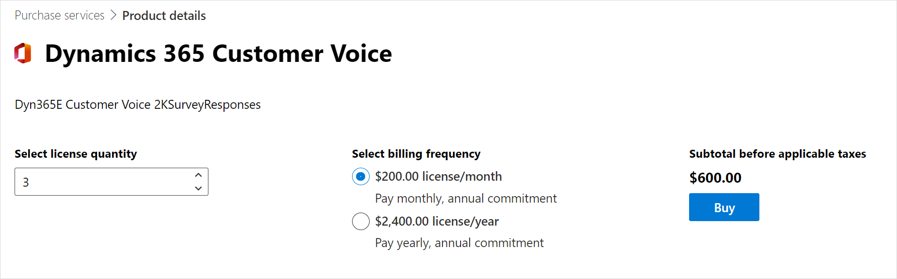

# Purchase Dynamics 365 Customer Voice

Dynamics 365 Customer Voice is included with select Dynamics 365 enterprise products such as Dynamics 365 Sales Enterprise and Dynamics 365 Customer Service Enterprise. If you have other Dynamics 365 products or don't have a Dynamics 365 subscription, you may purchase Dynamics 365 Customer Voice separately. For a complete list of select Dynamics 365 enterprise products, see [Dynamics 365 Customer Voice pricing](https://dynamics.microsoft.com/customer-voice/pricing/)

The Dynamics 365 Customer Voice license is based on the number of survey responses received per month. The capacity is measured at the tenant level.

- For a Dynamics 365 enterprise licensed tenant, 2,000 responses are free and the customer can choose to purchase additional responses in bundles of $100 for 1,000 responses per month.
- For an organization without a Dynamics 365 enterprise license, you must first purchase at least one Dynamics 365 Customer Voice license for 2000 responses per month, and may purchase additional responses in bundles of $100 for 1,000 responses per month.

## Enable Dynamics 365 Customer Voice for users with Dynamics 365 enterprise licenses

A tenant with select Dynamics 365 enterprise products has 2,000 responses per month included at the tenant level (irrespective of how many seats the tenant has). If the free responses are exhausted, you can purchase additional responses as mentioned in the [Purchase additional responses](#purchase-additional-responses) section.

### Disable Dynamics 365 Customer Voice for a user

Dynamics 365 Customer Voice is available to all users who have a Dynamics 365 enterprise license. If you want to disable Dynamics 365 Customer Voice for a user:

1. Go to the [Microsoft 365 admin center](https://admin.microsoft.com/).

2. In the left pane, select **Users** > **Active users**.

3. Open the user record for which you need to disable Dynamics 365 Customer Voice.

4. Go to the **Licenses and Apps** tab.

5. Scroll down and expand the **Apps** section, and clear the check boxes of the following apps as applicable:

    - Microsoft Dynamics 365 Customer Voice for Sales Enterprise
    - Microsoft Dynamics 365 Customer Voice for Customer Service Enterprise
    - Microsoft Dynamics 365 Customer Voice for Field Service
    - Microsoft Dynamics 365 Customer Voice for Marketing
    - Microsoft Dynamics 365 Customer Voice for Human Resources
    - Microsoft Dynamics 365 Customer Voice for Project Operations

    

6. Select **Save changes**.

## Purchase Dynamics 365 Customer Voice for users without a Dynamics 365 enterprise license

If you don't have select Dynamics 365 enterprise products, you must first purchase at least one **Dynamics 365 Customer Voice** license. The **Dynamics 365 Customer Voice** license includes 2,000 responses per month. If the responses included with the license are exhausted, you can purchase additional responses in bundles of $100 for 1,000 responses per month. You must also purchase the free **Dynamics 365 Customer Voice USL** license equal to the number of users who need access to Dynamics 365 Customer Voice.

### Purchase the Dynamics 365 Customer Voice license

1. Go to the [Microsoft 365 admin center](https://admin.microsoft.com/).

2. In the left pane, select **Billing** > **Purchase services**.

3. Find **Dynamics 365 Customer Voice**, and then select **Details**.

    

4. From the **Select license quantity** box, select or enter the number of licenses to purchase. 

5. Select **Buy**, and complete the purchase process.

    

### Purchase the Dynamics 365 Customer Voice USL license

After you purchase the **Dynamics 365 Customer Voice** license, you must purchase the **Dynamics 365 Customer Voice USL** license and assign it to the users in your organization. The **Dynamics 365 Customer Voice USL** license is a free user license.

1. Go to the [Microsoft 365 admin center](https://admin.microsoft.com/).

2. In the left pane, select **Billing** > **Purchase services**.

3. Find **Dynamics 365 Customer Voice USL**, and then select **Details**.

    

4. From the **Select license quantity** box, select or enter the number of licenses to purchase.

5. Select **Buy**, and complete the purchase process.

    

6. Assign the **Dynamics 365 Customer Voice USL** license to users in your organization:

    1. In the left pane, select **Users** > **Active users**.

    2. Open the user record to which you need to add a Dynamics 365 Customer Voice license.

    3. Go to the **Licenses and Apps** tab.

    4. In the **Licenses** section, select **Dynamics 365 Customer Voice USL**.

        
    
    5. Select **Save changes**.

If the responses included with the license are exhausted, you can purchase additional responses as mentioned in the [Purchase additional responses](#purchase-additional-responses) section.

### Disable Dynamics 365 Customer Voice for a user

1. Go to the [Microsoft 365 admin center](https://admin.microsoft.com/).

2. In the left pane, select **Users** > **Active users**.

3. Open the user record for which you need to disable Dynamics 365 Customer Voice.

4. Go to the **Licenses and Apps** tab.

5. In the **Licenses** section, clear **Dynamics 365 Customer Voice USL**.

    

6. Select **Save changes**.

## Purchase additional responses

You can purchase additional responses from the Microsoft 365 admin center.
 
1. Go to the [Microsoft 365 admin center](https://admin.microsoft.com/). 

2. In the left pane, select **Billing** > **Purchase services**.

3. Find **Dynamics 365 Customer Additional Responses Dynamics 365 Customer Voice Addl Responses**, and then select **Details**.

    

4. Select **Buy**.

    

5. Select the number of add-on licenses to purchase, and complete the purchase process. The purchased capacities are added on top of the available responses per month.

## Response capacity consumption

One additional license, Dynamics 365 Customer Voice Addl Responses, costs $100 and allows you to receive 1,000 responses per month at a tenant level. This means that everyone in the tenant can use a total of 1,000 responses. You can purchase the licenses in bundles of $100 as required. So if you purchase one Dynamics 365 Customer Voice Addl Responses license (for a bill amount of $1,200), you'll get 12,000 responses (12 &times; 1,000) annually. If you purchase two licenses of $100 each per month for a year (for a bill amount of $2,400), you'll get 24,000 responses (12 &times; 2,000) annually.

You can pay for the licenses by using either of the payment modes: monthly or yearly. Regardless of the payment mode, the response capacity is calculated annually.

> [!NOTE]
> If you select the monthly payment method, you'll be able to consume the responses in accordance with the annual capacity as long as your payment mode is active.

You can send as many survey invitations as you want; invitations aren't counted toward response capacity consumption. Only the responses received, for both anonymous and non-anonymous surveys, are counted toward response capacity consumption.

The tenant administrator receives weekly notifications when the number of survey responses exceeds 80% of the purchased response capacity. The tenant administrator must purchase additional responses to ensure business continuity and avoid possible disruptions to the service after the number of survey responses exceeds the purchased response capacity.

If you have any unused responses remaining in a year, those responses won't be carried forward to the next year. For example, if you bought one additional license and didn't receive any response in the first year, the response capacity for the second year will be 12,000 and not 24,000 (12,000 &times; 2).

Let's understand this with the following example:

You purchase an additional license of $100 per month for a year (for a bill amount of $1,200). You'll get 12,000 responses (12 &times; 1,000) annually. If you exhaust all 12,000 responses in the tenth month from the date of purchase, Dynamics 365 Customer Voice will stop receiving new responses and won't allow new surveys to be created. As soon as your administrator purchases additional responses, you'll start receiving responses and be able to create new surveys.

In this example, suppose you have 5,000 responses remaining at the end of the year. Those responses won't be carried forward to the next year.

## Purchase Dynamics 365 Customer Voice for customers in US Government Community Cloud

For a Dynamics 365 enterprise licensed tenant in US Government Community Cloud (GCC), 2,000 responses are free and the customer can choose to purchase additional responses in bundles of $100 for 1,000 responses per month. The license name to purchase additional responses is **Dynamics 365 Customer Voice Add-On for GCC**.

For an organization in GCC without a Dynamics 365 enterprise license, you must first purchase at least one **Dynamics 365 Customer Voice for GCC** license. The **Dynamics 365 Customer Voice for GCC** license includes 2,000 responses per month. If the responses included with the license are exhausted, you can purchase additional responses in bundles of $100 for 1,000 responses per month. You must also purchase the free **Dynamics 365 Customer Voice USL for GCC** license equal to the number of users who need access to Dynamics 365 Customer Voice.

To purchase Dynamics 365 Customer Voice for customers in GCC, you must work with the Microsoft account team or a qualified partner to place an order.

> [!NOTE]
> Dynamics 365 Customer Voice is not available for trial in GCC.

### See also

[Plan a survey](plan-survey.md) 
[Create a project](create-project.md) 
[Create a survey](create-survey.md) 
[Send a survey to get responses](send-survey.md) 
[Analyze reports](about-reports.md)

[!INCLUDE[footer-include](includes/footer-banner.md)]
