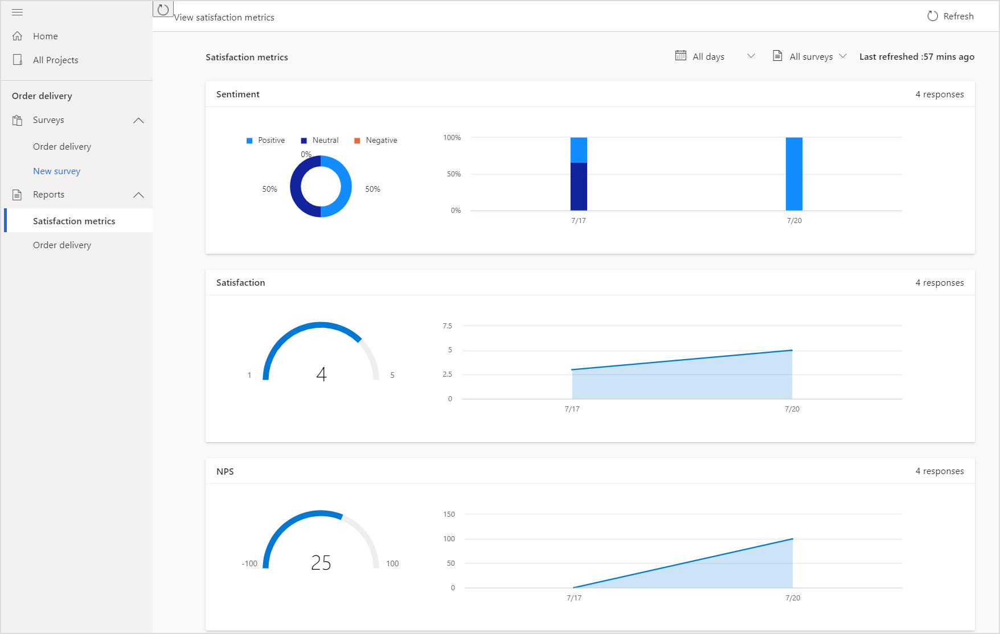

# View a satisfaction metrics report

The satisfaction metrics dashboard is created automatically for each set of metrics, showcasing recent scores and trends. To see the dashboard, open the project, and select **Satisfaction metrics** in the **Reports** section in the left pane.

By default, data is displayed for all surveys in a project and for all dates since the surveys were created. You can filter the data displayed in charts by using the date filter and also select a survey for which you want to see the data. The name of the charts are displayed with the metric name you entered while creating them.

The following charts are displayed for the metrics:

- **Net Promoter Score**: A meter chart shows the score for the metric. The area chart toward the right of the meter chart shows the trend of Net Promoter Score for the selected time period.

- **Sentiment**: A pie chart shows the distribution of positive, neutral, and negative sentiments for the metric. The stacked column chart toward the right of the pie chart shows the distribution of positive, neutral, and negative sentiment for the selected time period.

- **CSAT**: A meter chart shows the score for the metric. The area chart toward the right of the meter chart shows the trend of CSAT scores for the selected time period.

- **Custom score**: A meter chart shows the score for the metric. The area chart toward the right of the meter chart shows the trend of custom scores for the selected time period.

## Filter data in charts

You can filter data in the charts by using the following filters:

- **All days**: Select 7 days, 28 days, 90 days, or a custom date range.

- **All surveys**: Select a survey for which you want to see the data. If your project has multiple surveys, consolidated data from all surveys is displayed by default. If you want to see data only for a particular survey, select it from the **All surveys** filter. 

### See also

[About reports](about-reports.md) 
[View a survey response report](survey-report.md) 
[Add and configure satisfaction metrics](satisfaction-metrics.md)

[!INCLUDE[footer-include](includes/footer-banner.md)]
