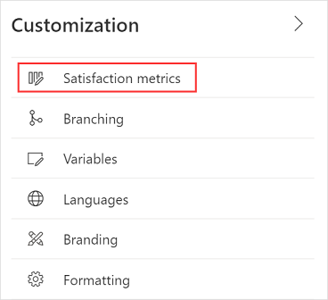
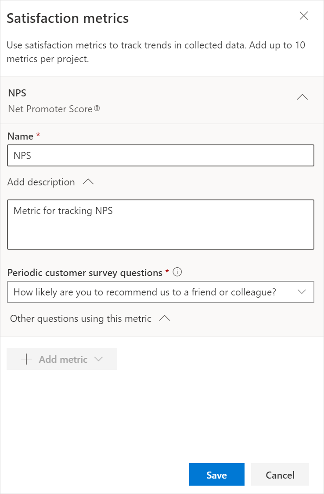

# Add and configure satisfaction metrics

Organizations use various metrics to determine the effectiveness of the experiences they provide to their customers. They track a subset of these metrics daily, and this forms the basis for measuring their performance. These metrics, called *satisfaction metrics*, are measurement systems you can use to measure your customer experience. This ensures that the data you collect through surveys can be analyzed successfully, and you can make decisions accordingly.

Dynamics 365 Customer Voice includes support for adding the following standardized satisfaction metrics and mapping them to survey questions:

- **Net Promoter Score (NPS)**: NPS is a metric used to measure customer loyalty. The score is calculated from the NPS-type question by using a scale from 0 through 10. The respondents are grouped as follows:
  - **Detractors** are those who respond with a score from 0 through 6.
  - **Passives** are those who respond with a score of 7 or 8.
  - **Promoters** are those who respond with a score of 9 or 10.

  NPS is calculated by subtracting the percentage of detractors from the percentage of promoters. The score is a number that can range from &ndash;100 to 100.

- **Sentiment**: Sentiment is a metric used to identify customer sentiment toward a product or a service. Sentiment groups the responses to a text-based question as positive, negative, or neutral.

- **Customer Satisfaction (CSAT)**: CSAT is a metric used to measure the level of satisfaction customers have with a product or a service. CSAT is measured by responses to rating-type questions.  

Satisfaction metrics are defined at the project level. If you create a project from one of the ready-to-use project templates in Dynamics 365 Customer Voice, satisfaction metrics are already created and mapped to survey questions. However, you can add more metrics as needed. If you create a project from the **Blank** project template, you need to add satisfaction metrics and map them to the questions.

After you've received responses to your survey, a dashboard is created automatically for each set of metrics, showcasing recent scores and trends. The dashboard is available under **Reports** in the left pane.

**To add satisfaction metrics**

1. Open the survey.

2. On the **Design** tab, select **Customization** at the right side of the page, and then select **Satisfaction metrics**.

    

3. In the **Satisfaction metrics** panel, select **Add metrics**, and then select the type of metric you want to add.

    

4. Enter the following information:

    - **Name**: Name of the satisfaction metric.

    - **Add description**: Expand the section, and add an optional description for the satisfaction metric.

    - **<survey_name> question**: Choose the question you want to map to the satisfaction metric.

      

5. To see questions from other surveys in the project that are also<!--Edit okay? I wasn't sure what this meant.--> mapped to the metric, expand the **Other questions using this metric** section.

6. Select **Save**.

7. To add more metrics, repeat steps 3 through 6.

**To edit satisfaction metrics**

After you've created the satisfaction metrics you need, you can edit their details or delete the ones that you don't need.

1. Open the survey.

2. On the **Design** tab, select **Customization** at the right side of the page, and then select **Satisfaction metrics**.

3. To edit a metric, expand it, and then update the name and description as required. If you change the question that's mapped to the metric, a confirmation message appears. Select **Change** in the confirmation message to continue.

4. Select **Save**.

5. To delete a metric, hover over the metric, and then select **Delete**.

6. In the confirmation message that appears, select **Delete** to continue with the deletion.
