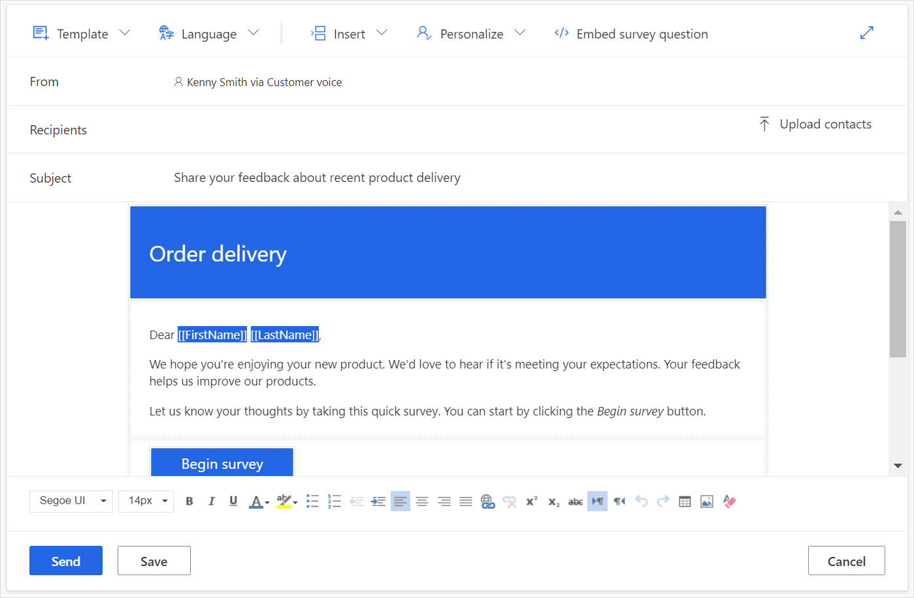
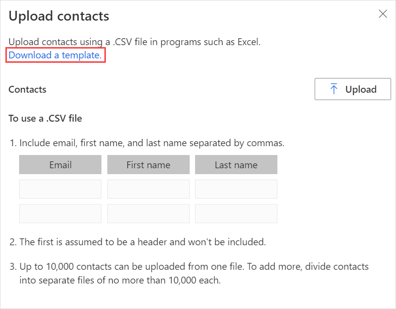
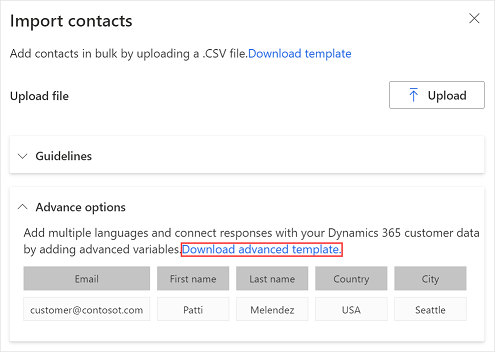
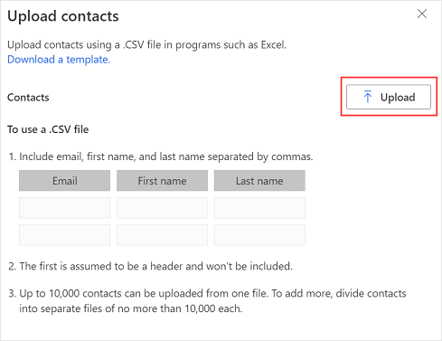
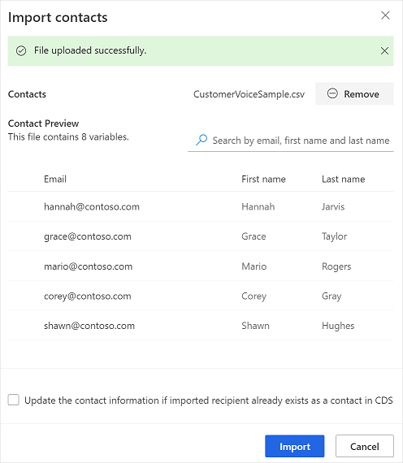
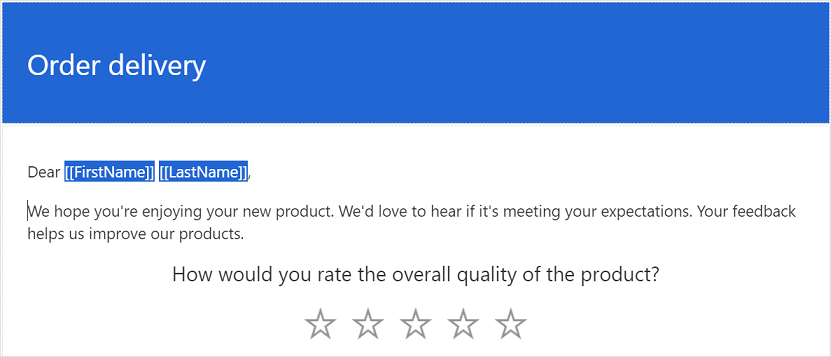

# Send a survey by using the built-in email composer

Dynamics 365 Customer Voice provides an easy way to send your survey to multiple people through email. By using the built-in email composer, you can send customized email invitations to your recipients and track their status.

> [!NOTE]
> - In US Government Community Cloud, emails are sent from the logged in user's account.
> - If you are sending email using the default domain, you can send a maximum of 10,000 emails per day. If you are using a [custom domain](customize-sender-email.md), you can send a maximum of 50,000 emails per day.

**To send a survey by using email**

1. Open the survey and go to the **Send** tab.

2. Select **Email**. A default subject line and email message appear, along with a link to your survey in the message body. You can modify and format the text to meet your requirements.

    > [!NOTE]
    > If you've sent your survey through email once, the invitation summary is displayed. To send your survey by using email, select **Resend** > **Email**.

3. In the **Recipients** field, enter the recipient's name or email address. You can populate the **Recipients** field by using any of the following methods:

    - Entering an email address manually.
    - Entering a name, email address, or a distribution list from Microsoft Entra ID.
    - Entering a contact or contact list/view from Microsoft Dataverse. The contacts are populated from the environment in which your project is created.
    - Importing a CSV file by selecting **Import contacts**. More information: [Import contacts from a CSV file](#import-contacts-from-a-csv-file)

    > [!NOTE]
    > For a distribution group to be listed in the **Recipients** field, ensure the following:
    > - When creating a group by using PowerShell, **MailEnabled** is set to true and **SecurityEnabled** is set to false.
    > - When creating a group by using Azure portal, the group type should not be **Security**.

4. To insert the survey link into your email message, see [Insert a survey link](#insert-survey-link).  

5. To add an unsubscribe link to your email message, see [Insert an unsubscribe link](#unsubscribe-from-a-survey).  

6. To personalize the email by using survey variables, see [Personalize the survey email](#personalize-an-email).

7. To embed the first question of the survey into your email message, see [Embed a survey in an email](#embed-survey-in-an-email).

8. To select an email template, select a template from the **Template** list. More information: [Use email templates](#use-email-templates)

9. To send a multilingual survey, select a language from the **Language** list. To be able to select a language, you must first select an email template. The selected language applies to survey invitation and survey question. 

10. When you're ready to send your survey, select **Send**.

    

> [!NOTE]
> - You can send a survey invitation to a maximum of 10,000 recipients.
> - To customize the **From** address of the email, see [Customize the sender's email address](customize-sender-email.md).

## Import contacts from a CSV file

You can import a maximum of 10,000 contacts by using a CSV file. You can also use this file to associate a survey invitation and response to an entity in Dataverse. You can also specify values for the variables added in the **Personalization** panel. To import contacts, you must first [create the CSV file](#create-a-csv-file), and then [upload the CSV file](#upload-a-csv-file).

### Create the CSV file

Provide details in the CSV file in the following order: Email address, first name, last name. If you want to specify values for variables, you can add them after the last name column in the CSV file. To quickly get started, you can also download a CSV template.

**To download a CSV template**

1. In the email editor, select **Import contacts** in the **Recipients** field.

2. In the **Import contacts** panel, select **Download template**.

    

After the CSV template is downloaded, enter the required information in the following columns:
- **Email address**: Email address of the recipient.
- **First name**: First name of the recipient.
- **Last name**: Last name of the recipient.

If you've added variables to your survey, they’ll be available as separate columns in the CSV file. You can specify the values as per your requirement. 

If you want to associate a survey invitation and response to an entity, you can either add the **RegardingID** and **RegardingEntityName** columns to the CSV file and enter the information or download the advanced CSV template.

**To download an advanced CSV template**

1.	In the email editor, select **Import contacts** in the **Recipients** field.

2.	In the **Import contacts** panel, expand the **Advance options** section, and then select **Download advanced template**.

    

After the CSV template is downloaded, enter the required information in the following columns:

- **Email address**: Email address of the recipient.
- **First name**: First name of the recipient.
- **Last name**: Last name of the recipient.
- **locale**: Language in which the survey needs to be displayed. When the survey is opened by clicking its link, it's displayed in the language specified in the locale column. This doesn't change the language of the first question of survey embedded in the email.
- **RegardingID**: ID of the entity record (GUID) to associate with the survey invitation and response.
- **RegardingEntityName**: Logical name of the entity to associate with the survey invitation and response.

If you've added variables to your survey, they’ll be available as separate columns in the CSV file. You can specify the values as per your requirement. 

### Upload the CSV file

1. In the email editor, select **Import contacts** in the **Recipients** field.

2. In the **Import contacts** panel, select **Upload**.

    

3. Browse to and select the CSV file you want to upload.

    After the file is uploaded successfully, a preview of the imported contacts is displayed in the **Import contacts** panel. 

    If the imported recipient already exists as a contact in Dataverse, and you want to update the contact information as per the CSV file, select **Update the contact information if imported recipient already exists as a contact in CDS**.

    

4. Verify the information and then select **Import**.

## Insert a survey link

The survey link is added to your email message by default. To insert the survey link in a different location in your email message, place the cursor at the location you want, and then select **Insert** > **Survey link**. You can also select text, and then select **Insert** > **Survey link** to display that text as the survey link.

## Insert an unsubscribe link

You can configure your email message to include a link that allows a respondent to unsubscribe from the survey. To insert the unsubscribe link in the email message, place the cursor at the required location, and then select **Insert** > **Unsubscribe link**. You can also select text, and then select **Insert** > **Unsubscribe link** to display that text as the unsubscribe link. By default, the unsubscribe link is added to all email message templates.

## Personalize the survey email

You can use variables to personalize your survey's email subject and email message&mdash;for example, you can add the respondent's first name to the email subject and the email message. Place the cursor where you want the name to appear, select **Insert** > **Personalized variables**, and then select **First Name** from the list. A placeholder is added at the cursor location. The first name of the respondent is automatically inserted when the email is sent. All variables created in a survey are displayed in the **Personalized variables** list.

To create a new variable, select **New variable** from the **Personalized variables** list. If default values haven't been defined for survey variables, nothing is displayed for the variables. For more information about creating variables and providing values for them, see [Personalize a survey](personalize-survey.md).

## Embed a survey in an email

If you have added a Choice (single answer), Rating (star or smiley symbol), or Net Promoter Score question as the first question in your survey, you can embed it in your email message. To embed the question, place the cursor where you want to embed the question, and then select **Insert** > **First question of the survey**. The question is embedded at the cursor's location and the email message is adjusted accordingly. When a respondent selects an option to answer the question, the whole survey is opened in a web browser and the respondent can continue with completing the survey.

> [!NOTE]
> - You can't embed a question in an email if you've enabled question shuffling in the survey.
> - If you want to send an embedded survey in an email through Power Automate, you must embed the question in an email and save it as a new email template. While configuring a flow, you must select the new email template. More information: [Use email templates](#use-email-templates)

If you've created a multilingual survey, you can use survey variables to set the default locale for displaying the survey. To set the default locale, open the **Personalization** panel, and then specify a value for the **locale** variable. The value must be a language code, for example **en** or **fr**.

## Use email templates

You can use an email template&mdash;a preformatted email message&mdash;to quickly create and send email messages. If you create a survey from the blank template, **Default Template** is selected for use in an email message. If you've created a project from one of the out-of-the-box templates, the corresponding email template is selected by default.

> [!IMPORTANT]
> Projects, email templates, and satisfaction metrics are primarily based out of Microsoft DataVerse. Refreshing data on Dataverse environment with another will break Customer Voice projects and surveys on the refreshed environment. 

> [!NOTE]
> You can save a maximum of 10 email templates.

### Create a new email template

1. In the email editor, select **Template** > **Create new**.

2. In the **Create new template** dialog box, enter a name for the template, and then select **Add**.

3. From the **Template** list, select the newly created template.

4. Modify the email message, and then select **Save**.

### Import an email template from other surveys

You can import an email template from other surveys in the same or a different project.

1. In the email editor, select **Template** > **Import from** > **Surveys**.

2. Select either the current project or any other project, and then select the survey from which you want to import an email template.

3. Select a template, and then select **Import**.

### Import a personal email template

If you've been transitioned from Forms Pro, your email templates from Forms Pro are migrated as personal templates in Dynamics 365 Customer Voice. You can then import the required templates in your surveys.

1. In the email editor, select **Template** > **Import from** > **My templates**.

2. Select a template, and then select **Import**.

### Create multilingual email templates

By default, the email template is created in the default language of the survey. If you've added languages to your survey, you can create email template in those languages, and send email in the customer preferred languages. This creates versions of an email template in the selected languages.

1. In the email editor, select **Language** > **Choose language**.

2. Select the languages in which you want to create email template, and then select **Add**.

3. From the **Language** list, select a language, and update the email message in the selected language.

4. Select **Save**.

5. Repeat step 3 through 4 to update email message for all the added languages.

To send survey invitation in a language other than the default, select an email template and the required language, and then send the email.

If you're using Power Automate to send survey invitations, specify the language of the survey or email template in the **Locale** field. If an email template is created in the specified language, the survey invitation is sent in the specified language. Otherwise, the survey invitation is sent in the default language.

## Format email messages

You can format your email message by using the formatting toolbar at the bottom of the email editor. The formatting toolbar allows you to add formatting to your text, add table and images to your email message, and much more. You can also view the HTML source of your email message and modify the HTML code directly.

**To apply formatting to your email message**

- Select the text that you want to format, and then select the appropriate action on the formatting toolbar.

**To view and edit the HTML code**

1. Select  on the formatting toolbar.

2. On the **Source** screen, edit the HTML code, and then select **OK**.

### See also

[Work with survey distribution settings](distribution-settings.md) 
[Send a survey by using Power Automate](send-survey-flow.md) 
[Embed a survey in a webpage](embed-web-page.md) 
[Send a survey link to others](send-survey-link.md) 
[Send a survey by using QR code](send-survey-qrcode.md)

[!INCLUDE[footer-include](includes/footer-banner.md)]
