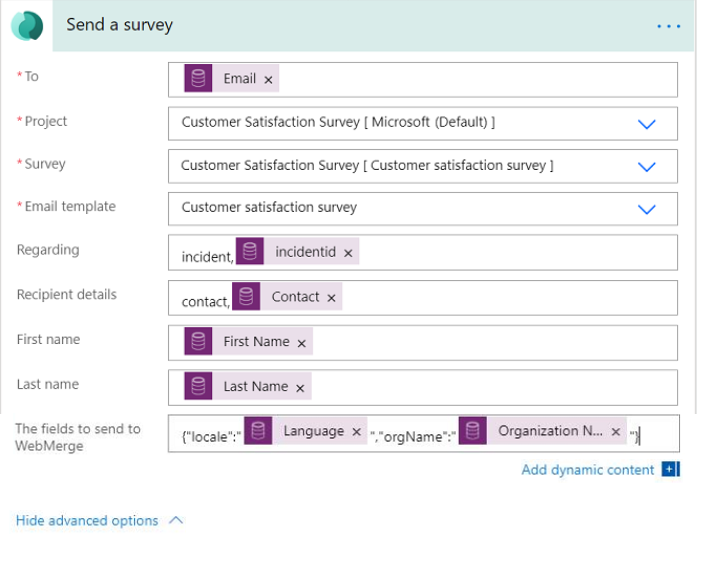
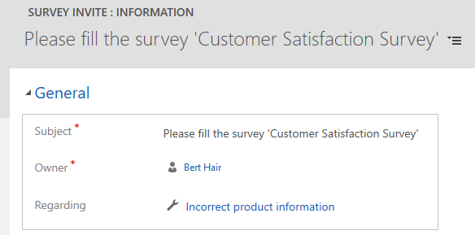

# Send a survey by using Power Automate

[!INCLUDE[cc-data-platform-banner](includes/cc-data-platform-banner.md)]

After creating a survey, you can send it to respondents based on a business trigger&#8212;resolution of a case or fulfillment of an order, for example. You can either select a built-in template or create a flow from scratch by using Power Automate. The following Power Automate templates are available out of the box in Dynamics 365 Customer Voice:

- **Send a survey when a case is resolved in Dynamics 365**: This template sends a survey when a case is resolved in Dynamics 365.
- **Send a survey when a lead is qualified in Dynamics 365**: This template sends a survey when a lead is qualified in Dynamics 365.
- **Send a survey when an order is fulfilled in Dynamics 365**: This template sends a survey when an order is fulfilled in Dynamics 365.
- **Send a survey on Power Apps button click**: This template sends a survey to the specified list of recipients when a button is selected in Power Apps.
- **Send a survey when a work order is completed or closed in Dynamics 365**: This template sends a survey when a work order is completed or closed in Dynamics 365.

**To send a survey by using Power Automate**

1.  Open the survey, and go to the **Send** tab.

2. Select **Automation**.

    > [!NOTE]
    > If you've sent your survey through email once, the invitation summary is displayed. To send your survey by using Power Automate, select **Resend** > **Automate**.

3.  To configure a built-in flow, select a template. More information: [Create a flow from a template in Power Automate](/flow/get-started-logic-template)

5.  To create a flow from scratch, select **Create from blank**. More information: [Create a flow in Power Automate](/flow/get-started-logic-flow)

    > [!NOTE]
    > - The flow will use the default email template for sending emails. If you want to send email by using a specific email template, ensure that you've selected it from the **Email template** list in the [send a survey](#send-a-survey-action) action.
    > - While configuring a flow, you might see duplicate templates on the template page. To resolve this issue, navigate out of the tab, and then come back to create the flow again.
    > - If you've added variables to your survey, you must specify values for it in the flow. More information: [Specify values in a flow](personalize-survey.md#specify-values-in-a-flow)

5.  Select **Create**.

When you send a survey by using Power Automate, a survey invitation record is created. You can associate your survey invitation and response with Microsoft Dataverse.

## Send a survey action

This action sends a survey to a specified list of recipients and creates a survey invitation for each recipient. You can also associate your survey invitation and response with Dataverse. When you create a flow from scratch, this can be achieved through the **Regarding** and **Recipient details** fields in a flow. If you choose to create a flow from a template, the **Regarding** and **Recipient details** fields are populated accordingly.

Let's say you need to send a survey every time a case is closed. You can use the **Regarding** field to specify the case record so that when an invitation and response are created for a particular case resolution, they're attached to that case. The case manager then can set up reports to show customer satisfaction (CSAT) scores by case, or reopen a case if the CSAT is very low.

Use the **Recipient details** field to associate your survey invitation and response records to the appropriate contact (the recipient). This allows sales personnel, or anyone, to see the contact record and the response of the customer. This can help them formulate their conversation with the customer accordingly.

> [!div class="mx-imgBorder"]
> 

### Attributes

|Name|Description|
|---|----|
|To|The email address to send the survey invitation to. If you're entering multiple email addresses, separate them by a semicolon. **Note**: The email address should be valid and should not return null.|
|Project|The project containing a survey to be sent.|
|Survey|The survey to be sent. **Note**: You must select a survey from the list and not enter a custom value.|
|Email template|The email template to use while sending the invitation. **Note**: You must select an email template from the list and not enter a custom value.|
|Regarding|The record that associates the survey invitation and response. This value is stored in the survey invitation's **Regarding** field.   **Note:** <ul><li>You must enter a table's logical name in this field.</li><li>Only tables that are marked for collaboration in activities are supported. For example, Task table is not supported </li>|
|Recipient details|The contact to associate your survey invitation and response records with. This value is stored in the survey invitation's **To** field. **Note**: Only the Contact record is supported.|
|The fields to send to WebMerge | To use dynamic properties for a survey, use this field to specify survey variables in JSON format. For example, "{"locale":"\<LOCALE>","orgName":"\<NAME>"}", where <LOCALE> and <NAME> are the variable value. |
|||

> [!NOTE]
> If you've used variables in your survey, they will be visible in this action and you can specify the values accordingly. More information: [Specify values in a flow](personalize-survey.md#specify-values-in-a-flow)

The values from the **Regarding** and **Recipient details** fields are stored in the survey invitation, as shown in the following image.

> [!div class=mx-imgBorder]
>   

> [!NOTE]
> The **To** field isn't displayed by default on the form. You must go to **Advanced Find**, search for the invitation, and then add the required columns to see their values.
>
> [!div class=mx-imgBorder]
>  

### See also

[Work with survey distribution settings](distribution-settings.md) 
[Send a survey by using the built-in email composer](send-survey-email.md) 
[Embed a survey in a webpage](embed-web-page.md) 
[Send a survey link to others](send-survey-link.md) 
[Send a survey by using QR code](send-survey-qrcode.md)

[!INCLUDE[footer-include](includes/footer-banner.md)]
