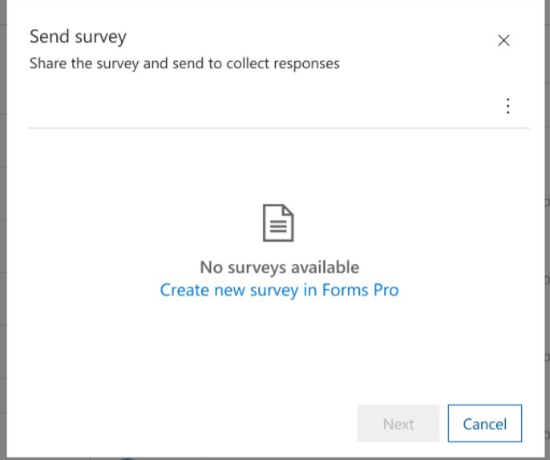
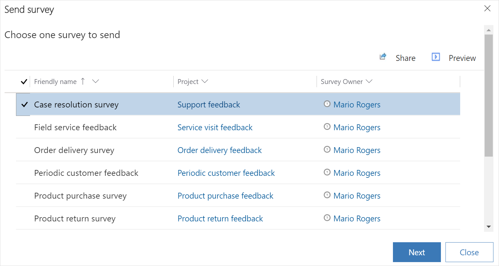
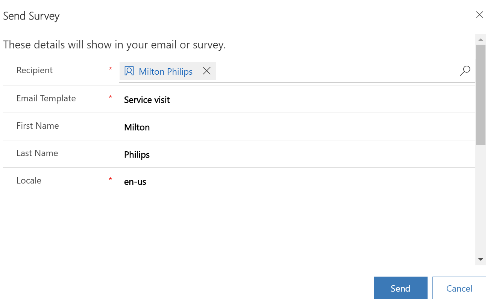
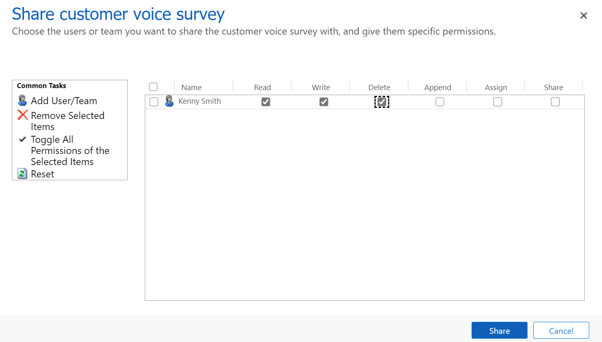

---
title: "Send a survey from Dynamics 365 applications | MicrosoftDocs"
description: "Instructions for sending a survey from Dynamics 365 applications"
ms.date: 10/16/2020
ms.topic: article
ms.service: dynamics-365-customervoice
author: sbmjais
ms.author: shjais
manager: shujoshi
---

# Send a survey from Dynamics 365 applications

**Prerequisites**:

-   An administrator must install the Send survey app in your environment to send survey from Dynamics 365 applications. If the option to send survey is not visible, contact your administrator.

-   An administrator must configure the Power Automate flow to send surveys. More information: [Configure Power Automate flow](#configure-power-automate-flow)

You can send a survey to your customer from within the Dynamics 365 application's interface. This helps you to send a survey at the right time in the customer's journey. Let's consider the following scenarios:

**Scenario 1**: You have created a Power Automate flow to send a survey every time a lead is qualified. But, if you want to send a survey during the process of lead qualification, you need to go to Dynamics 365 Customer Voice and send the survey. With this capability, you can send the survey while working on the lead.

**Scenario 2**: As a sales representative, you don't have access to surveys in Dynamics 365 Customer Voice. With this capability, you can send the survey from Dynamics 365 application without requiring access to Dynamics 365 Customer Voice.

As a salesperson, you can send a survey from the following entities:

-   Contact
-   Opportunity
-   Lead
-   Activity
-   Case
-   Contract

You can only send surveys that are shared with you or created by you. If no surveys are shared with you, you can create a new survey (only if you have permission to create a survey) and then send it to your customers. If you have Share privilege on the Customer Voice survey entity, you can share a survey with other users or team. More information: [Share a survey](#share-a-survey)

**To send a survey from Dynamics 365**

1.  In the sitemap of the customer engagement app, select the entity from which you want to send a survey.

2.  From the list of records, open a record.

3.  On the toolbar at the top of the page, select **Send Survey**.

    If you don't have any surveys created or shared with you, select **Create new survey** to create a new survey. You'll be redirected to Dynamics 365 Customer Voice for the survey creation. More information: [Create a project](create-project.md)

    

    If you have surveys created or shared with you, you'll be provided with a list of surveys.

    

    If you don't want to send a survey from the available list of surveys, you can create a new survey by selecting **+ New Survey**. You'll be redirected to Dynamics 365 Customer Voice for the survey creation. More information: [Create a project](create-project.md)

4.  In the **Choose one survey to send** dialog box, select a survey to be sent.

    > [!NOTE]
    > You can select only one survey at a time.

5.  To preview the survey, select **Preview**.

6.  To share the survey, see [Share a survey](#share-a-survey).

    

7.  Select **Next**.

8.  In the **These details will show in your email or survey** dialog box, select the following information:

    - **Recipient**: By default, name of the contact associated with the entity is populated. You can also remove and select a different recipient, if required. You can select only one recipient at a time.

    - **Email template**: Email template to be used to send survey invitation.

    - **Locale**: Language of the email template.

    If you've used variables in your survey, they will be displayed as fields and you can specify their values accordingly.

    

9.  Select **Send**.

## Check survey invitation status

When you send a survey invitation, it can be in one of the following statuses:

- **Sending**: Survey invitation email is being sent.

- **Sent**: Survey invitation email is sent successfully.

- **Failed**: Survey invitation email is not sent due to an incorrect email address or other error.

**To check survey invitation status**

1.  Go to **Advanced Find**.

2.  In the **Look for** list, select **Customer Voice survey invitation status**.

3.  Add the **Status Reason** column.

4.  Select **Results**. A list of survey invitations is displayed with their corresponding status.

    

## Share a survey

If you have Share privilege on the Customer Voice survey entity, you can share a survey with other users or team.

1.  In the **Choose one survey to send** dialog box, select a survey to be shared.

2.  Select **Share**.

    

    > [!NOTE]
    > If you don't have permission to share surveys, the **Share** button is not displayed.

3.  In the **Share customer voice survey** dialog box, add the required users or team.

    

4.  Select **Share**.

## Configure Power Automate flow

The **Send survey on create of custom entity record** Power Automate flow is created automatically when the Send survey app is installed. This flow sends the survey when you select **Send Survey** from an entity record. An administrator must set the connection references manually and turn on the flow.

**To configure Power Automate flow**

1.  Go to [flow.microsoft.com](https://flow.microsoft.com/) and select **My flows** in the left pane.

2.  Find the **Send survey on create of custom entity record** flow and select **Edit** on the toolbar at the top. The flow editor opens.

    A warning symbol `image` is displayed in the header of conditions and actions having the connection error.

    `image of the flow`

3.  Select the condition or action, and then select the appropriate connection.

4.  Save the changes and turn on the flow.

### See also
[Create a project](create-project.md)
