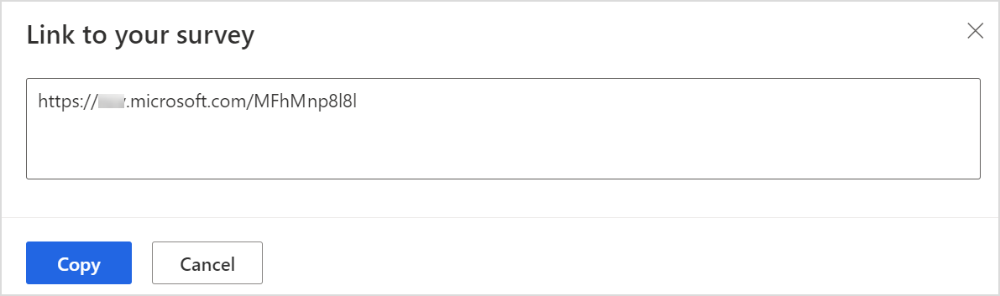
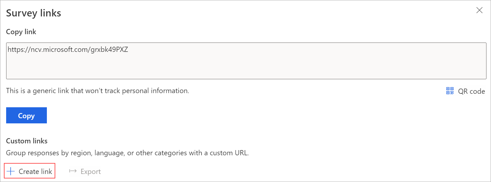
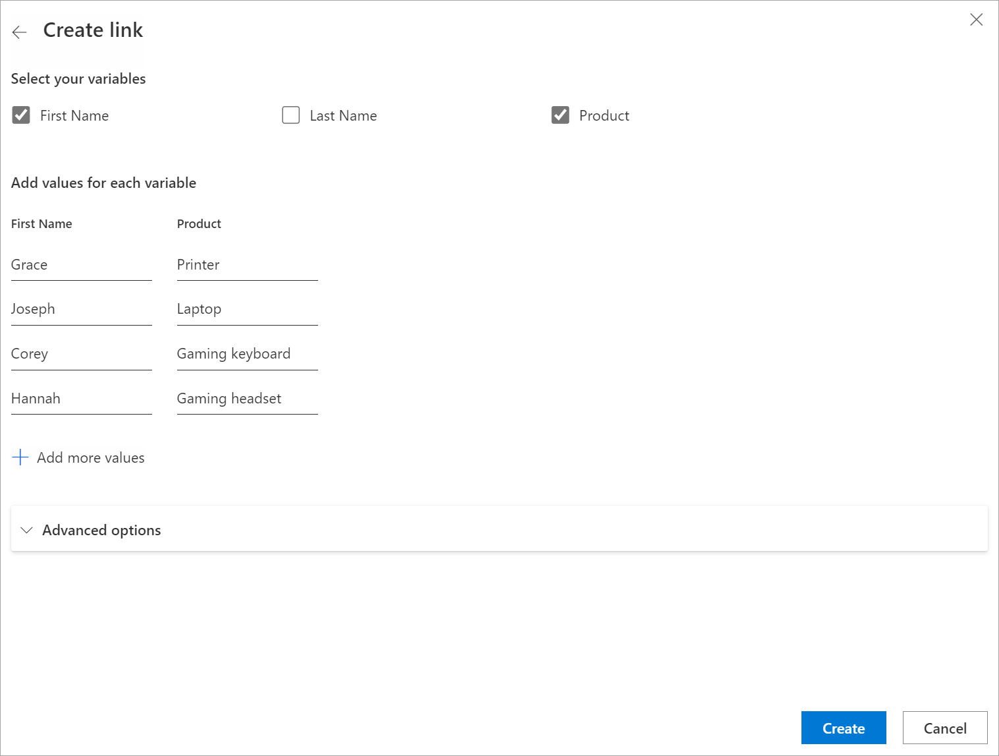
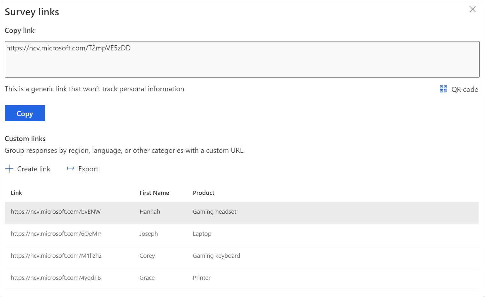
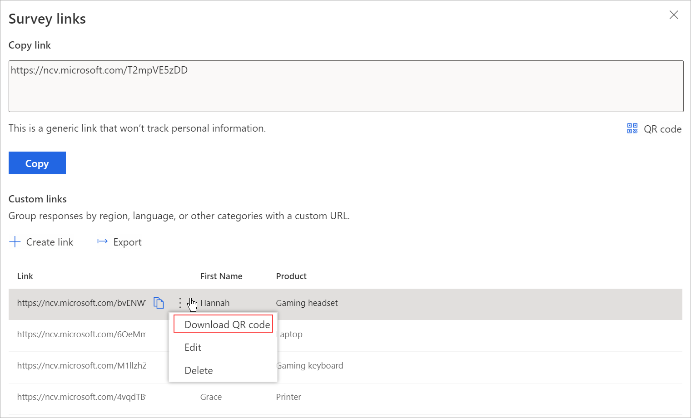
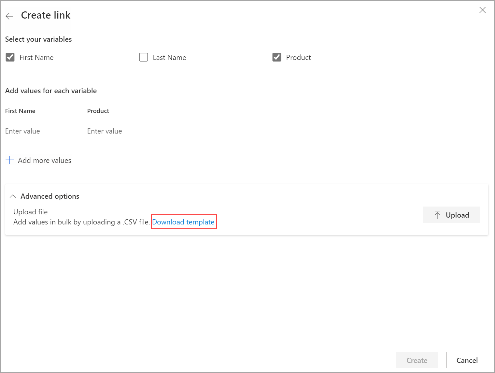
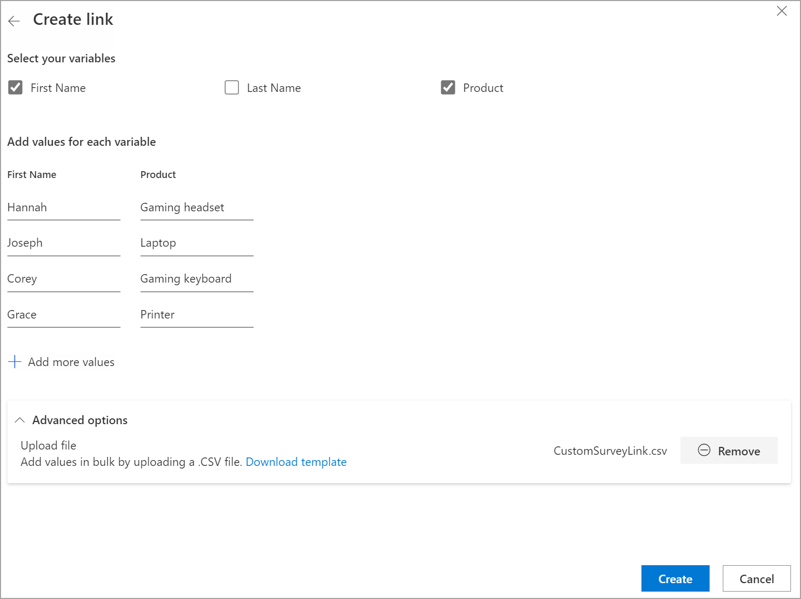
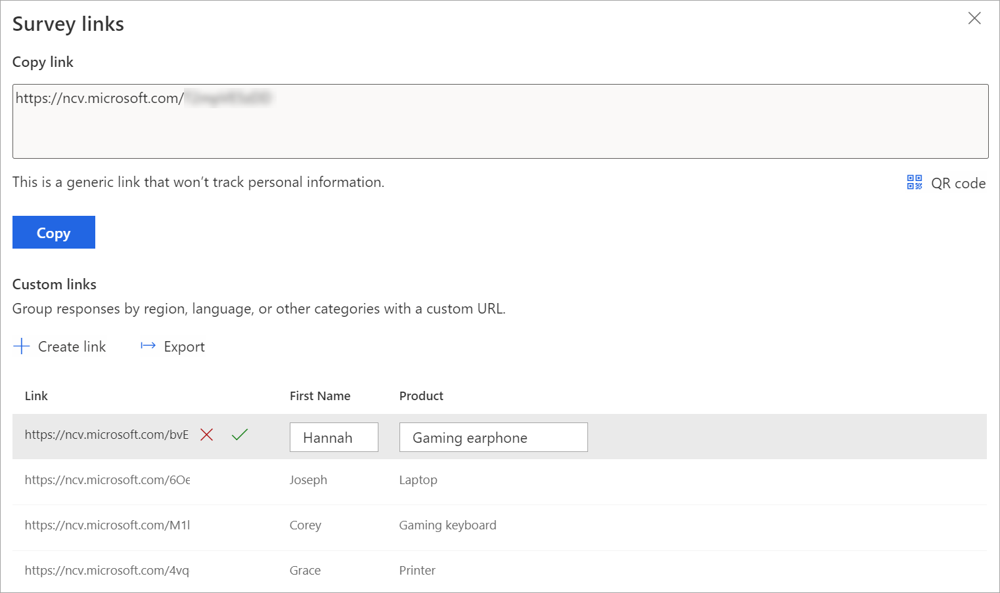
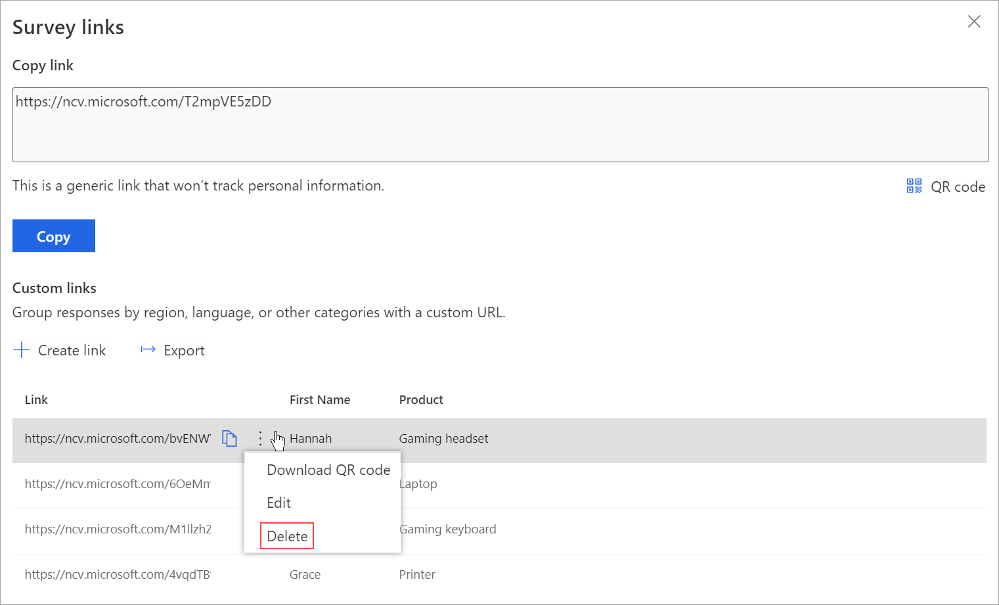

# Send a survey link to others

If you want to collect feedback from recipients using a common survey link, or if you want to send email outside of Dynamics 365 Customer Voice, you can create a link for your survey. You can then send your survey by pasting the link in an email, on a webpage, or in any mode of communication you want to use. The recipients can select the link and complete the survey. The survey link will be a short URL that can be distributed easily by the platforms that have a lower character limit (for example, SMS or Twitter). The short URL will be in the following format: `https://<region>.microsoft.com/<10-digit code>`.

You can create a generic survey link or custom survey links. A generic survey link is a common link that you can share with your intended audience. Custom survey links are created using survey variables and are different for an audience group. For example, as a restaurant manager, you can create multiple survey links based on the restaurant's location. Location is defined as a survey variable in this case. This helps to categorize survey responses as per the Location survey variable. If each location is mapped to an account in Dynamics 365, the survey responses are mapped as activities to respective accounts.

> [!NOTE]
> - The survey link generated is a non-personalized link. If the **Only people in my organization can respond** setting is turned off in [distribution settings](distribution-settings.md), you won't be able to record the respondent's name or determine whether the respondent has submitted only one response. More information: [Work with personalized links](distribution-settings.md#work-with-personalized-links)
> - If you've personalized your survey by using variables, they won't be replaced with their values and the variable names will be displayed as they are.
> - You can create a maximum of 10000 custom links.

## Create a generic link

1. Open the survey, and go to the **Send** tab.

2. Select **Link**.

    > [!NOTE]
    > If you've sent your survey through email once, the invitation summary is displayed. To get your survey's link, select **Resend** > **Link**.

    The **Survey links** panel is displayed.

3. In the **Copy link** section, select **Copy**.

    

    Paste the survey link in a place that's visible to your intended audience. They can select the link to access your survey.

4. To download the QR code for the generic link, select **QR code**.

    Share the QR code wherever your intended audience can scan it with a QR code scanner, such as on a mobile device.

## Create custom links

1. Open the survey, and go to the **Send** tab.

2. Select **Link**.

    > [!NOTE]
    > If you've sent your survey through email once, the invitation summary is displayed. To get your survey's link, select **Resend** > **Link**.

    The **Survey links** panel is displayed.

3. In the **Custom links** section, select **Create link**.

    

4. In the **Create link** panel, select variables to create custom links.

5. Under **Add values for each variable**, add values to each of the selected variables.

    > [!NOTE]
    > You must avoid the following special characters while adding values for variables: #, %, &, \, ', and <.

6. To add more values, select **Add more values**.

7. After you enter all the values, select **Create**.

    

    The custom links are created based on the selected variables and displayed in the **Survey links** panel.

    

8. To copy a link, hover over the link, and then select .

    

9. To export all links, select **Export**. The links are downloaded in an Excel file.

10. To download QR code for a custom link, hover over the link, select **More actions** (three dots), and then select **Download QR code**.

    

## Create custom links by using a CSV file

You can create custom links in bulk by uploading a CSV file. You can also associate survey responses to an entity by specifying regarding entity details.

1. Open the survey, and go to the **Send** tab.

2. Select **Link**.

    > [!NOTE]
    > If you've sent your survey through email once, the invitation summary is displayed. To get your survey's link, select **Resend** > **Link**.

    The **Survey links** panel is displayed.

3. In the **Custom links** section, select **Create link**.

    

4. In the **Create link** panel, select variables to create custom links.

5. Expand the **Advanced options** section, and select **Download template**.

    The selected variables are available as separate columns in the CSV file. Specify the values as per your requirement. If you want to associate a survey response to an entity, you can add the **RegardingID** and **RegardingEntityName** columns to the CSV file and enter the information.

    

6. After you create the CSV file, go to the **Create link** panel, expand the **Advanced options** section, and then select **Upload**.

7. Browse to and select the CSV file you want to upload. The values from the CSV file are populated under **Add values for each variable**.

    

8. Select **Create**.

    After the file is uploaded successfully, links are created, and displayed in the **Survey links** panel.

9. To copy a link, hover over the link, and then select .

10. To export all links, select **Export**.

11. To download QR code for a custom link, hover over the link, select **More actions** (three dots), and then select **Download QR code**.

## Edit a custom link

1. Open the survey, and go to the **Send** tab.

2. Select **Link**.

    > [!NOTE]
    > If you've sent your survey through email once, the invitation summary is displayed. To get your survey's link, select **Resend** > **Link**.

    Custom links are displayed in the **Survey links** panel.

3. Hover over the link you want to edit, select **More actions** (three dots), and then select **Edit**.

    

4. Edit the values for variables as required.

    

5. Select  to save the changes.

6. Select  to discard the changes.

## Delete a custom link

1. Open the survey, and go to the **Send** tab.

2. Select **Link**.

    > [!NOTE]
    > If you've sent your survey through email once, the invitation summary is displayed. To get your survey's link, select **Resend** > **Link**.

    Custom links are displayed in the **Survey links** panel.

3. Hover over the link you want to edit, select **More actions** (three dots), and then select **Delete**.

    

4. In the confirmation message, select **Delete**.

### See also

[Work with survey distribution settings](distribution-settings.md) 
[Send a survey by using the built-in email composer](send-survey-email.md) 
[Send a survey by using Power Automate](send-survey-flow.md) 
[Embed a survey in a webpage](embed-web-page.md) 
[Send a survey by using QR code](send-survey-qrcode.md)

[!INCLUDE[footer-include](includes/footer-banner.md)]
