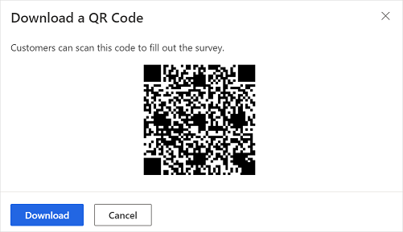

# Send a survey by using QR code

A QR (Quick Response) code is a type of matrix barcode. You can print the QR code or display it on your website. A QR code stores information such as a URL for a website. A QR code can be scanned by using any smartphone or tablet. 

A QR code for your survey contains a direct link to your survey. You can include the QR code on receipts, posters, or any print media to reach your recipients and collect feedback. Recipients can scan the QR code to access the survey.

> [!NOTE]
> - The survey link generated is a non-personalized link. If the **Only people in my organization can respond** setting is turned off in [distribution settings](distribution-settings.md), you won't be able to record the respondent's name or determine whether the respondent has submitted only one response.
> - If you've personalized your survey by using variables, they won't be replaced with their values and the variable names will be displayed as-is.

**To send a survey by using a QR code**

1. Open the survey, and go to the **Send** tab.

2. Select **QR code**.

    > [!NOTE]
    > If you've sent your survey through email once, the invitation summary is displayed. To get your survey's QR code, select **Resend** > **QR code**.

3. In the **Download a QR code** pop-up window, select **Download**.

    > [!div class=mx-imgBorder]
    > 

    Share the QR code wherever your intended audience can scan it with a QR code scanner, such as on a mobile device.

### See also

[Work with survey distribution settings](distribution-settings.md) 
[Send a survey by using the built-in email composer](send-survey-email.md) 
[Send a survey by using Power Automate](send-survey-flow.md) 
[Embed a survey in a webpage](embed-web-page.md) 
[Send a survey link to others](send-survey-link.md)

[!INCLUDE[footer-include](includes/footer-banner.md)]
