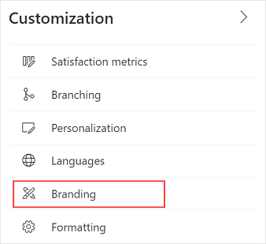
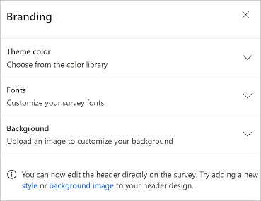
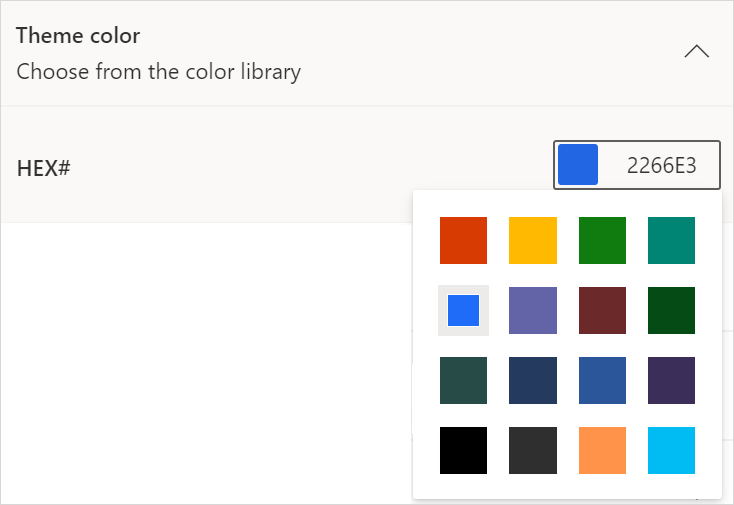
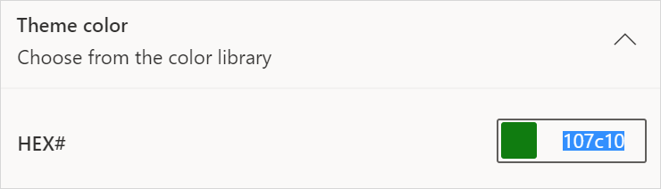
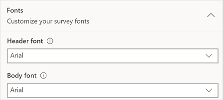
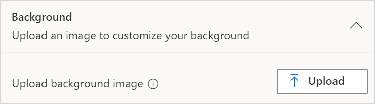
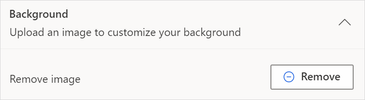

# Add branding to a survey

You can customize the appearance of your survey to match your company's branding. This includes changing the color, font, background image, or uploading a custom CSS<!--note from editor: Style Guide says to spell out "unless the abbreviation is familiar to your audience." I think it probably is, do you agree?--> file.

**To add branding to a survey**

1. Open the survey.

2. On the **Design** tab, select **Customization** at the right side of the page, and then select **Branding**.<!--note from editor: Here and throughout, I don't think these graphics need to be so big. -->

   

   The **Branding** panel is displayed.

   

3. Update the branding options, as described in the following sections.

## Theme color

You can select a color to apply to various survey elements such as the survey header, question area, background, footer, and buttons. This lets you customize the look and feel of your survey so it better matches your company's brand.<!--note from editor: Suggested.-->

- Expand the **Theme color** section, and then do one of the following:<!--note from editor: I tried to follow the established pattern for procedure formatting. I'm sure users will understand what you're saying, but I think the "loose" paragraphs (without any structure) aren't as clear a signal that a step-by-step procedure is about to appear.-->

  - Select the default color to open the color picker, and then choose a color.

    

  - Enter a hexadecimal<!--note from editor: Via Writing Style Guide.--> code in the **HEX #** field.

    

## Fonts

You can select a font to apply to the survey header and body elements.

- Expand the **Fonts** section, and then choose values for the following:

  - **Header font** is applied to the survey header, survey description, section header, and section description. By default, the header font is Segoe UI.

  - **Body font** is applied to questions, answer options, button labels, header text, and footer text. By default, the body font is Segoe UI.

  

You can also change font style, font size, and the color of the text for individual elements of the survey. More information: [Format text in a survey](survey-text-format.md)

## Background

You can select a background image for the survey.<!--note from editor:  -->

<!-- Shubham: Mention image limitations, like size, type, etc. -->

**To upload a background image**

- Expand the **Background** section, and then select **Upload**. You can choose an image from your local drive or OneDrive.

  

**To remove an existing background image**

- Expand the **Background** section, and then select **Remove**.

  

## Customize CSS

You can change the look and feel of your survey beyond the available branding options by using a custom CSS file. You can either create a CSS file on your own and then upload it<!--Edit okay?--> or download a sample CSS file, edit it, and then upload the file.

**To download a sample CSS file**

- Expand the **Customize CSS** section, and then select **Download sample CSS**.

**To upload the CSS file**

- Expand the **Customize CSS** section, and then select **Upload**.

**To remove an existing CSS file**

- Expand the **Customize CSS** section, and then select **Remove**.
