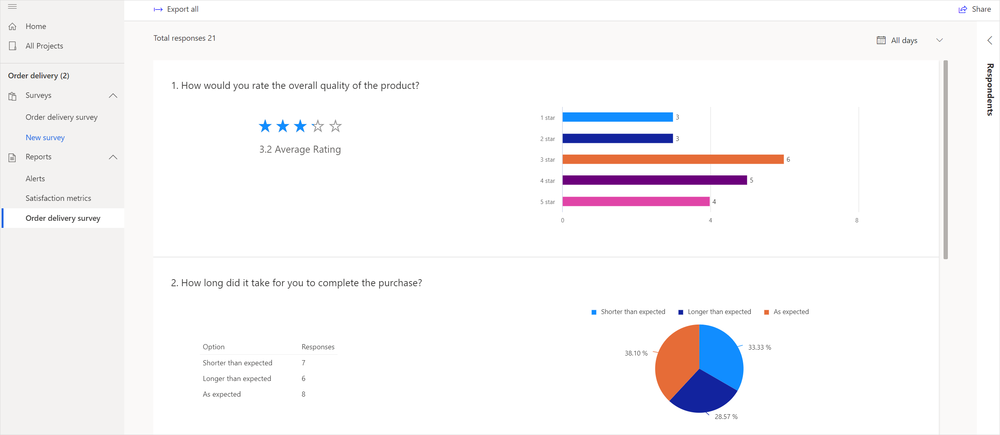
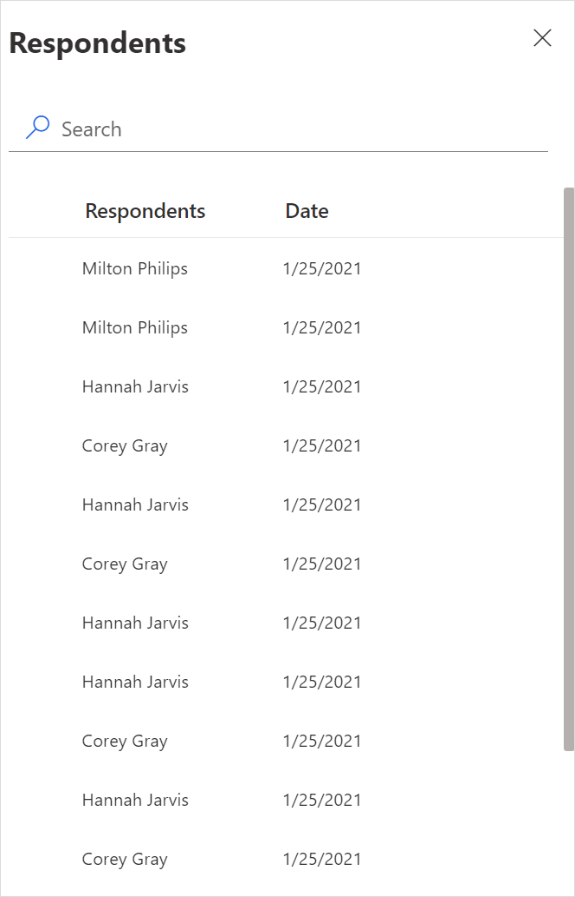
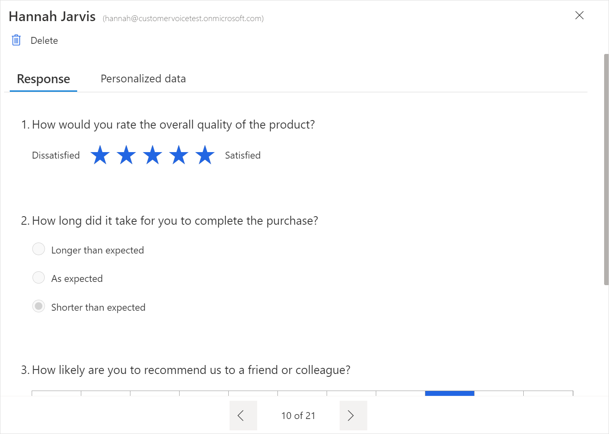
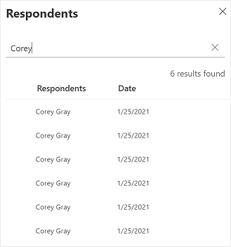
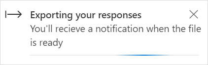
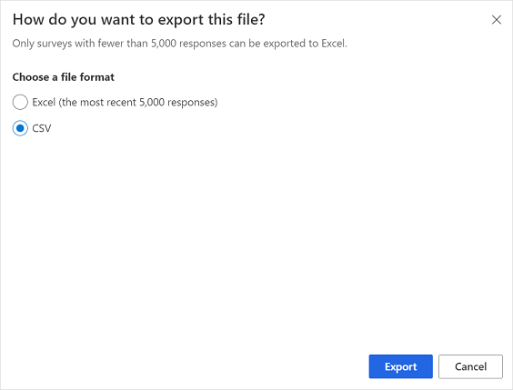
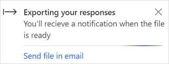
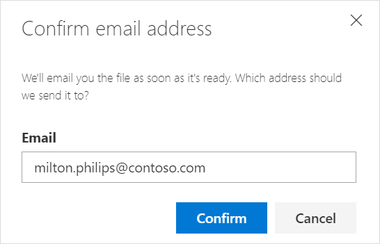

# View a survey response report

A survey response record is created after a respondent (tracked and anonymous) submits a survey. To see survey responses, open the project, and select the survey name in the **Reports** section in the left pane. A graphical representation of the responses is displayed.

## View individual responses

You can view individual responses to each question in a survey submitted by a respondent (tracked and anonymous).

**To view individual responses**

1. Open the project.

2. In the left pane, select the survey name in the **Reports** section.

3. Select **Respondents** at the right side of the page. The respondents are displayed in the **Respondents** panel.

    

4. Double-click a respondent's name to see their response.

    

5. To search for a respondent, enter the respondent's name or email in the **Search** field. 

    

## Filter data in charts

You can filter data in the charts by using the **All days** filter available above the charts. Select 7 days, 28 days, 90 days, or a custom date range from the filter. Note that you can specify a custom date range for a maximum of 90 days.

## Export survey responses

You can export survey responses into an Excel file or a CSV file for further analysis and processing. Each question in your survey becomes a column, and each response becomes a row in the Excel or CSV file. If you've added variables in your survey, they are also included in the exported file.

If your survey has less than 5,000 responses, the responses are exported to an Excel (.xlsx) file by default. If your survey has more than 5,000 responses, you can choose to export the responses to an Excel file or a CSV file.

### Survey with less than 5,000 responses

If there are less than 5,000 responses, the survey responses are exported to an Excel (.xlsx) file. To export survey responses, select **Export** in the upper-left corner of the report. A notification is displayed in the upper-right corner when the responses are being exported and after the export is complete.

### Survey with more than 5,000 responses

If there are more than 5,000 responses, you can choose to export responses to an Excel (.xlsx) file or a CSV file. If you choose to export responses to the Excel file, only the most recent 5,000 responses are exported. To export all responses, you must choose to export responses to the CSV file.

**To export survey responses**

1. Select **Export** in the upper-left corner of the report. The **How do you want to export this file?** screen is displayed.

2. Under **Choose a file format**, select one of the following options:

    - **Excel (the most recent 5,000 responses)**: Exports the most recent 5,000 survey responses to an Excel file.

    - **CSV**: Exports all survey responses to a CSV file.

    

3. Select **Export**.

   A notification is displayed in the upper-right corner when the responses are being exported and after the export is complete. If you choose to export to CSV, the notification contains a link that allows you to send the CSV file to your email address.

   

   Select **Send file in email**, and confirm the email address in the **Confirm email address** dialog box.

   

## Delete a survey response

You can delete a response you don't need anymore. To delete a survey response, open the individual survey response from the **Respondents** panel, and then select **Delete**.

### See also

[About reports](about-reports.md) 
[View a satisfaction metrics report](satisfaction-metrics-report.md)

[!INCLUDE[footer-include](includes/footer-banner.md)]
