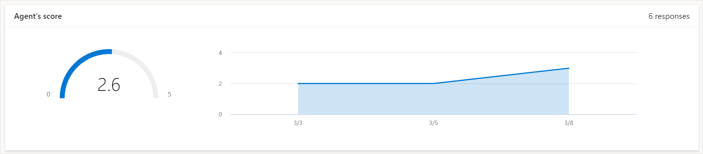
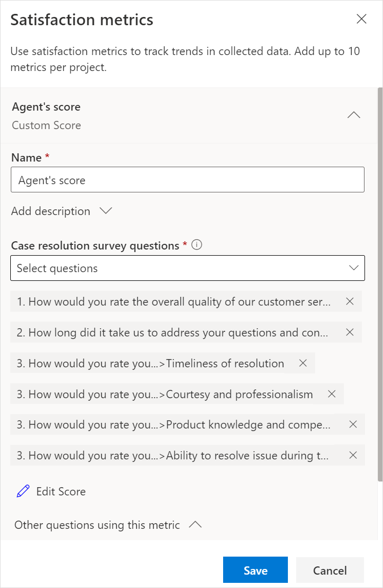
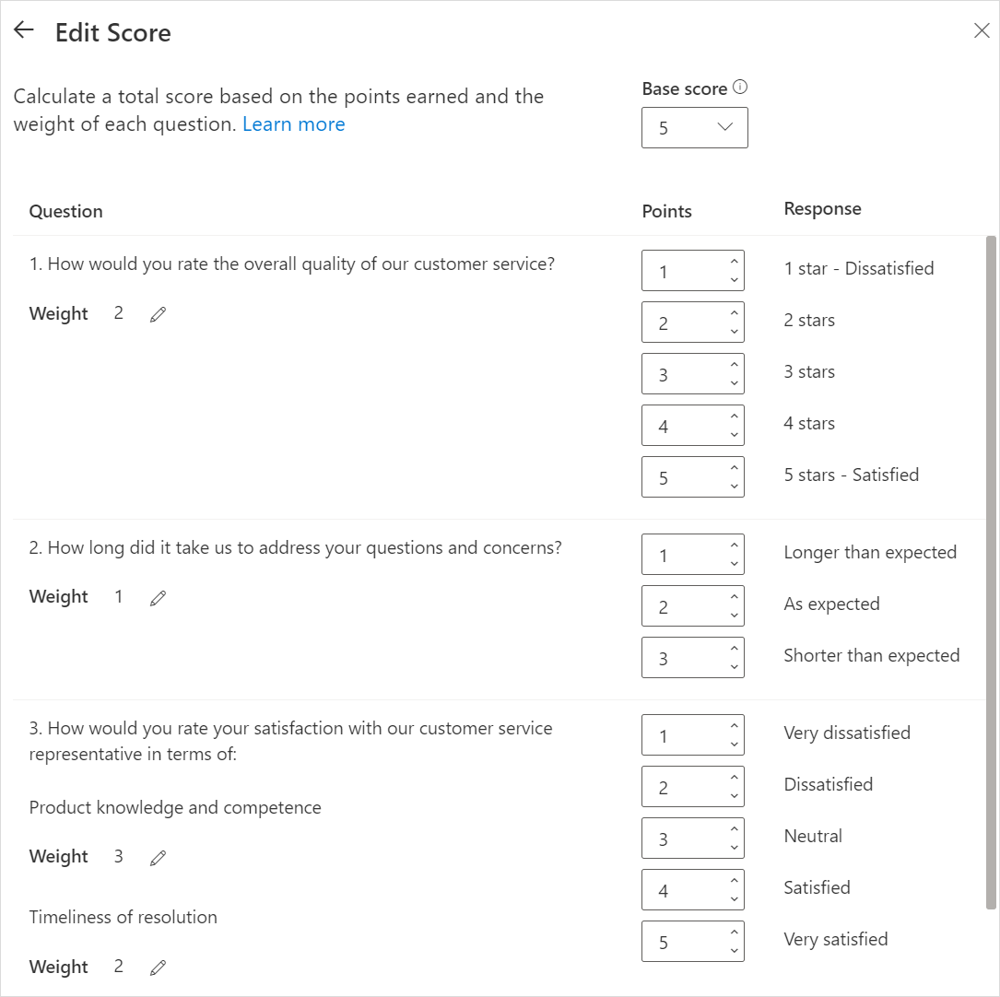

# Survey scoring

Survey scoring allows you to assign a point value to individual answer options. Point values are added to generate a survey-level score for each survey response. A survey with point values assigned to answer options is known as a scored survey. You can use scored surveys to measure your respondent's overall satisfaction level. A scored survey can help you get a better picture of customer service, agent performance, and so on.

For example, as a service provider company, you have created a survey to measure the performance of your customer service agents. The survey consists of five questions with the following answer options:

- Very dissatisfied 
- Dissatisfied 
- Neutral 
- Satisfied 
- Very satisfied 

A point value is attached to each answer option as follows: 

- Very dissatisfied = 1
- Dissatisfied = 2
- Neutral = 3
- Satisfied = 4
- Very satisfied = 5

From this survey, a total score out of 25 can be calculated. A score of 5 through 10 indicates that a customer service agent's performance needs to be improved. A score of 11 through 20 indicates that a customer service agent's performance is up to the mark. A score above 20 indicates that a customer service agent's performance is exceeding expectations.

A survey's score is calculated with the help of the following components:

- **Base score**: This is the number of points the survey is scored from. Each question will be normalized to fit within this score. You can select a base of 5, 10, or 100.

  By default, the base score of a survey is set to 10.

- **Weight**: Weight allows you to measure the importance of a particular question higher or lower than other questions. For example, let's say you have a survey asking for customer feedback regarding the food delivery service. There are three questions that ask about the timeliness of the service, packaging of the food, and quality of the food. In this example, the quality of food is more important than the packaging of food. Therefore, a higher weight will be assigned to the question about quality, giving a more accurate and relevant result.

  By default, the value of weight for all questions is 1.

- **Point**: Point is the value assigned to individual answer options. The maximum point you can assign to an answer option is 100.

  By default, the point values are assigned in the ascending order of the answer options.

The score of a question response is calculated by multiplying weight with the normalized point value. All the question response scores are added to generate a survey-level score.

Dynamics 365 Customer Voice allows you to apply survey scoring logic to the following question types:

- **Net Promoter Score (NPS)**: You can add weight and update the point values, if required. The normalized point value of the selected response will be multiplied by the weight to generate the question score.

- **Rating (Number, Star, and Smiley)**: You can add weight and update the point values, if required. The normalized point value of the selected response will be multiplied by the weight to generate the question score.

- **Single choice question (radio button and drop down)**: You can add weight and define the scoring order (ascending or descending). The point value for each answer option depends on the order of the answer option in the survey. For example, if there are five answer options and they are in ascending order, option 1 will have point value of 1, option 2 will have point value of 2, and so on. If the answer options are in descending order, option 1 will have point value of 5, option 2 will have point value of 4, and so on. The normalized point value of the selected response will be multiplied by the weight to generate the question score. 

- **Likert**: You can add weight to each of the statements in a question of type Likert. The scoring order and point values are defined in the same way as in the single choice question. The point value of the selected response will be multiplied by the weight to generate the question score.

You can select questions in a survey for which the score needs to be calculated. The **Custom score** satisfaction metric holds the value of the survey score. After you've received responses to your survey, you can [view the satisfaction metrics report](satisfaction-metrics-report.md) to see the survey score showcasing the average score and trend over a period of time.

## Add scoring to a survey

1. Open the survey.

2. On the **Design** tab, select **Customization** at the right side of the page, and then select **Satisfaction metrics**.

    

3. In the **Satisfaction metrics** panel, select **Add metrics**, and then select **Custom Score**.

    
  
4. Enter the following information:

    - **Name**: Name of the satisfaction metric.

    - **Add description**: Expand the section, and add an optional description for the satisfaction metric.

    - **<survey_name> question**: Choose the questions you want to map to the satisfaction metric.

      

5. Select **Edit Score**.

6. In the **Edit Score** panel, select a base score for the survey, assign weight for each question, and assign point values for each answer option.

   

7. Select the back arrow at the upper left of the **Edit Score** panel.

8. In the **Satisfaction metrics** panel, select **Save**.

## Edit scoring of a survey

After you've created a **Custom Score** satisfaction metric, you can edit its details. You can change the questions used in calculating the survey score, the base score for the survey, the weight for each question, and the point values for each answer option. You can also delete the ones that you don't need.

1. Open the survey.

2. On the **Design** tab, select **Customization** at the right side of the page, and then select **Satisfaction metrics**.

3. Expand the **Custom Score** metric and then update the name and description as required.

4. If required, change the questions used in calculating the survey score.

5. Select **Edit Score** and change the survey scoring logic as required.

6. Select the back arrow at the upper left of the **Edit Score** panel.

7. In the **Satisfaction metrics** panel, select **Save**.

### See also

[Add and configure satisfaction metrics](satisfaction-metrics.md) 
[View satisfaction metrics report](satisfaction-metrics-report.md)
