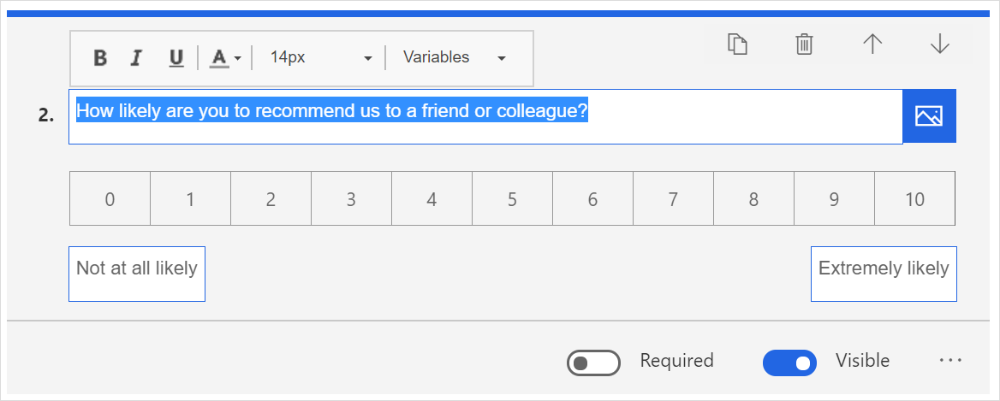
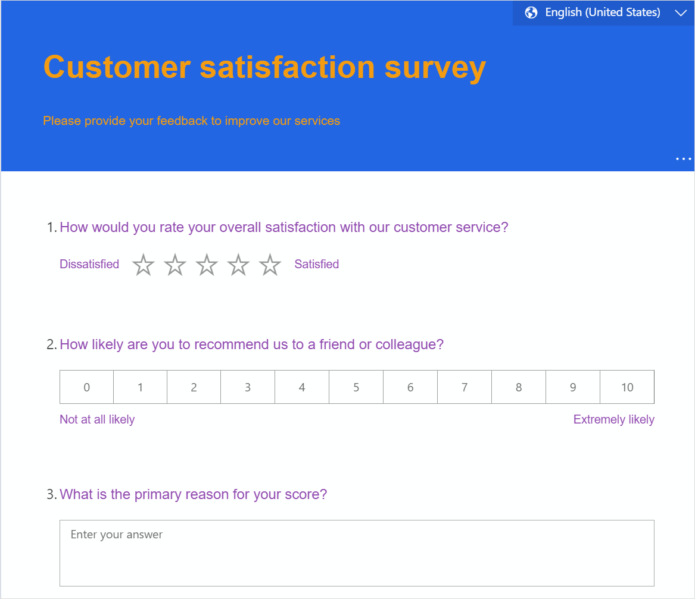

# Format text in a survey

You can customize the look of your survey by changing the font style, font size, and color of the text. You can apply formatting to the following elements:

- Survey title
- Survey description
- Question text
- Question subtitle
- Question options
- Section heading
- Section description
- Thank-you message
- Footer text
- Labels for Net Promoter Score and Rating questions
- Statements for Likert questions

> [!NOTE]
> - The text formatting capability isn't supported for options of Ranking and Likert questions.
> - You can change the font of your survey header and body elements from the **Branding** panel. More information: [Fonts](survey-branding.md#fonts)

**To format survey text**

1.	Open the survey.

2.	On the **Design** tab, select the text that you want to format. The formatting toolbar appears.

3. Choose formatting for your survey text.

   

In the following illustration, custom formatting has been applied to the survey title, description, and questions.

> [!NOTE]
> To format the thank-you message and footer text, you must first turn on **Customize message**, select the message or text, and then use the formatting toolbar. More information: [Customize footer and thank-you messages](custom-footer-thank-you.md)

### See also

[Create a survey](create-survey.md) 
[Preview and test a survey](preview-test-survey.md) 
[Create a branching rule](create-branching-rule.md) 
[Personalize a survey](personalize-survey.md) 
[Create a multilingual survey](create-multilingual-survey.md) 
[Create a multiple-page survey](create-multipage-survey.md)
