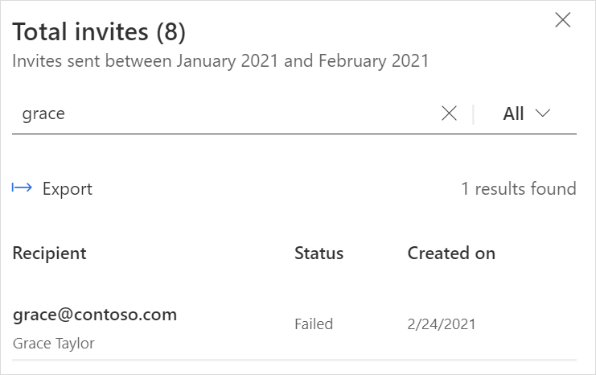
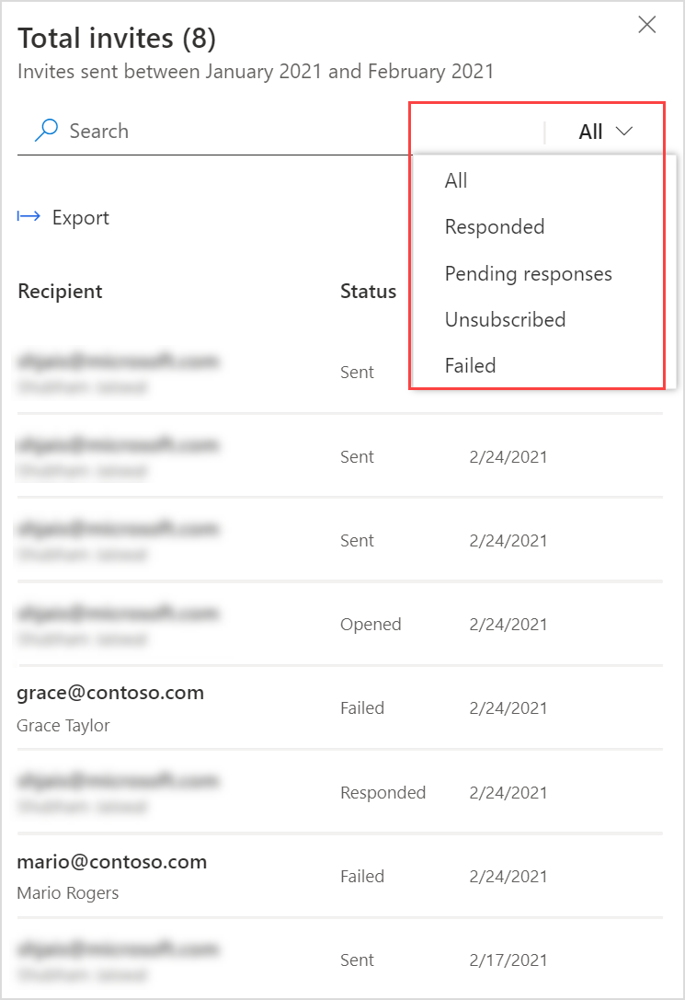
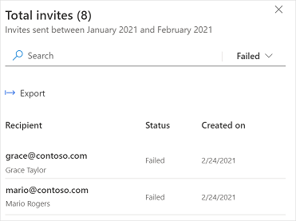
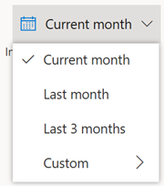

# View a survey invitations report

A survey invitation record is created for each survey email that's sent, either manually or with Power Automate. The survey invitations associated with a survey are available on the **Send** tab.

The following survey invitation statistics are displayed in the upper part of the page, and an **Invites tracking** chart is displayed below the statistics:

- **Total invites**: Displays the total number of survey invitations sent.

- **Responded**: Displays the total number of recipients who responded to the survey invitations.

- **Not responded**: Displays the total number of recipients who haven't responded to the survey invitations. A pie chart is displayed that shows the distribution of survey invitations by status:

    - **Unread**: The survey invitation email wasn't read.

    - **Read**: The survey invitation email was read or opened.

    - **Opened**: The survey was opened, but hasn't been completed yet.

- **Unsubscribed**: Displays the total number of recipients who have unsubscribed from receiving survey-related emails.

- **Failed**: Displays the total number of survey invitations that weren't delivered to recipients due to an incorrect email address or other error.

## View invitation details

You can view details about an invitation statistic by selecting **Details** in the upper-right corner of the statistic tile. For example, if you want to see details about the total number of invitations, select **Details** on the **Total invites** tile.

The details are displayed on a panel on the right side of the page.

To search for a recipient, enter the recipient's name or email address in the **Search** field. The data is filtered to show results that match the search term.

By default, the **Total invites** tile displays details for all statistics. You can view details for a specific statistic by selecting the **All** filter in the **Search** field, and then selecting the option you want.

For example, the following image shows details for the failed invitations.

## Filter invitation details

You can filter data in the invitation report by using the **Recent invites** filter available above the **Pending responses** tile. Select **Last month**, **Last 3 months**, or select **Custom** and create the range of months that you're interested in.

## Export invitation details

You can export invitation details to a CSV file either from the statistic tile or the invitation details panel.

<!--markdownlint-disable MD036-->
**To export invitation details from the statistic tile**

1. In the statistic tile, select the vertical ellipsis , and then select **Export**.

    

2. In the confirmation message, select **Export**.

**To export invitation details from the invitation details panel**

1. In the invitation details panel, select **Export**.

    

2. In the confirmation message, select **Export**.

## Delete a survey invitation

You can delete a survey invitation that you don't need anymore. To delete a survey invitation, go to the invitation details panel, hover over the invitation, select **Delete**, and then select **Delete** in the confirmation message.

### See also

[Send a survey to get responses](send-survey.md) 
[Work with survey distribution settings](distribution-settings.md) 
[Send a survey by using the built-in email composer](send-survey-email.md)  

[!INCLUDE[footer-include](includes/footer-banner.md)]
