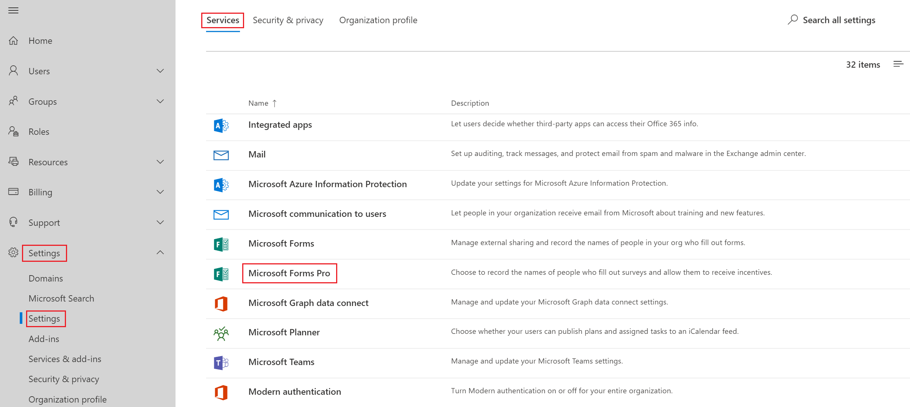

# Administrator settings for Forms Pro

As an administrator, you can control various settings such as recording the names of people in your organization, protecting surveys from phishing, and providing incentives for completing a survey.

**To access administrator settings**

1. Sign in to [Microsoft 365 admin center](https://admin.microsoft.com/) with your work or school account.

2. Select **Settings** > **Settings**.

3. On the **Settings** page, under the **Services** tab, select **Microsoft Forms Pro**.

   > [!div class=mx-imgBorder]
   >  

   The **Microsoft Forms Pro** pane is displayed.

   > [!div class=mx-imgBorder]
   > 

4. Update the settings as described in the following section.

5. Select **Save changes**.

## Administrator settings

Following are the available administrator settings.

### Record names of people in your org

Use this setting to capture the names of survey responders. By default, **Record names by default** is selected. Clear this check box if you want survey responses within your organization to remain anonymous. However, you can enable or disable this setting within individual surveys also. More information: [Only people in my organization can respond](invite-settings.md#only-people-in-my-organization-can-respond)

### Phishing protection

Use this setting to set an automatic scan of surveys within your organization for phishing detection. By default, **Add internal phishing protection** is selected. Clear this check box if you don't want to enable phishing scans for surveys within your organization.

### Survey incentive

Use this setting if you want to allow survey authors in your organization to add Microsoft Rewards incentives to their surveys. By default, **Allow survey authors to add incentives to surveys created using Microsoft Forms Pro** isn't selected. Select this check box to allow incentives to be added to surveys to help increase the response rate. More information: [Offer survey incentives to your respondents](survey-incentives.md)

### See also

[Work with survey settings](invite-settings.md)  
[Offer survey incentives to your respondents](survey-incentives.md)