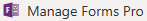
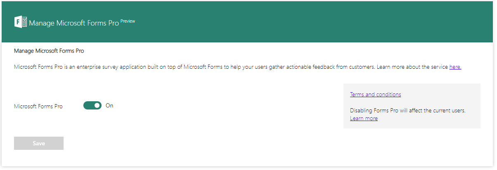

# Administer Forms Pro

[!include[cc-beta-prerelease-disclaimer](includes/cc-beta-prerelease-disclaimer.md)]

Microsoft Forms Pro is a simple yet comprehensive survey solution that builds on the current survey-creation experience of Microsoft Forms in Office 365. It has added functionality that supports businesses seeking to transform customer, product, and employee experiences.

Forms Pro has robust tooling to support deeper analytics and insights with integration across your tools, such as Common Data Service for Apps, Microsoft Power Platform, and Dynamics 365 for Customer Engagement apps. With Forms Pro, you can send branded surveys to customers with your company's look and feel. Survey distribution is simpler with the built-in email composer. You can also automate sending surveys with Microsoft Flow and leverage preconfigured Microsoft Flow templates to integrate with Dynamics 365 for Customer Engagement apps.

<!--note from editor: unclear what "advise them to show the button" means.   -->

Forms Pro allows you to work with classic forms and quizzes, and create new ones. The classic forms and quizzes open in their respective interfaces within the Forms Pro environment. This gives you the ability to work with surveys and classic forms together. If a few users want to work on forms and not on surveys, you can advise them to show the button for creating classic forms. For information on how to create classic forms, see [Create a classic form](create-classic-form.md).

By default, Forms Pro is enabled for all users in your tenant. As an administrator, you can turn off Forms Pro for all users in the tenant. If a few users want to opt out of the preview program, you can advise them to opt out of Forms Pro preview. This will not affect other users in the tenant.

<!--note from editor:  Cloud Style Guide advises that the "preview" should have a capital "P", but I see that the UI has a lowercase "p", so text should match the UI.  -->

## Opt out of Forms Pro preview

1. Sign in to Forms Pro.

2. Select your username from the upper-right corner of the page.

3. Select **Opt out of Forms Pro preview**. 

4. Select **Yes** in the confirmation message. When you opt out of the preview program, you are redirected to the Microsoft Forms experience and are no longer able to edit surveys.

## Turn off Forms Pro

<!--note from editor: In step 2: The wording on the icon after "select" doesn't match wording in screen shot.   -->

1. Sign in to the [Microsoft Power Platform Admin center](https://admin.powerplatform.microsoft.com).

2. On the **Environments** tab, select  from the toolbar at the top of the page.

3. Turn off the **Microsoft Forms Pro** toggle. To use Forms Pro again, turn the toggle back on.

    

4. Save the changes.

