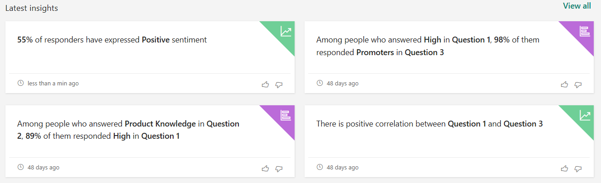

# Analyze survey insights

When there are sufficient responses to a survey, insights are generated to show correlation between questions and sentiment of the respondents. A summary of the insights is displayed on the **Analyze** tab.

  

To view detailed survey insights, select **View all**. The following insights are displayed:

- **Association insights**: Displays the correlation between one or more questions in the survey. This helps an organization to see if there is a pattern in the responders. These patterns will help to get a better understanding of their customers.

- **Sentiment insights**: Displays the average sentiment score and a word cloud for positive and negative feedback of the respondents. Sentiment score is calculated based on the sentiment of the responses to the text-based questions. Word cloud is generated by extracting the key phrases from the feedback.

