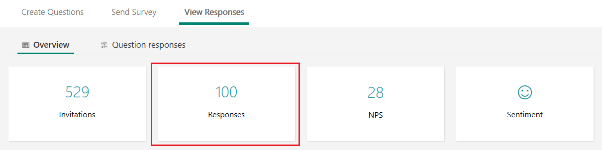
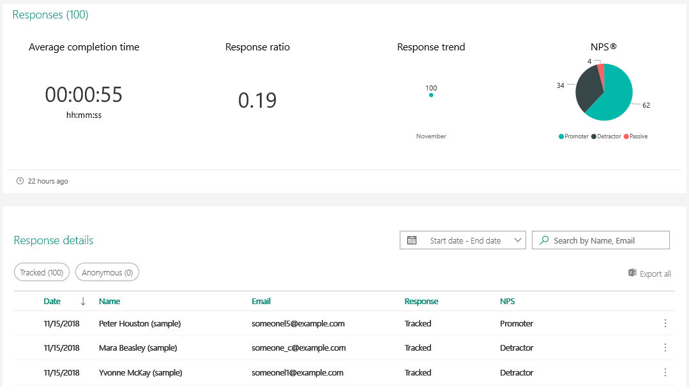
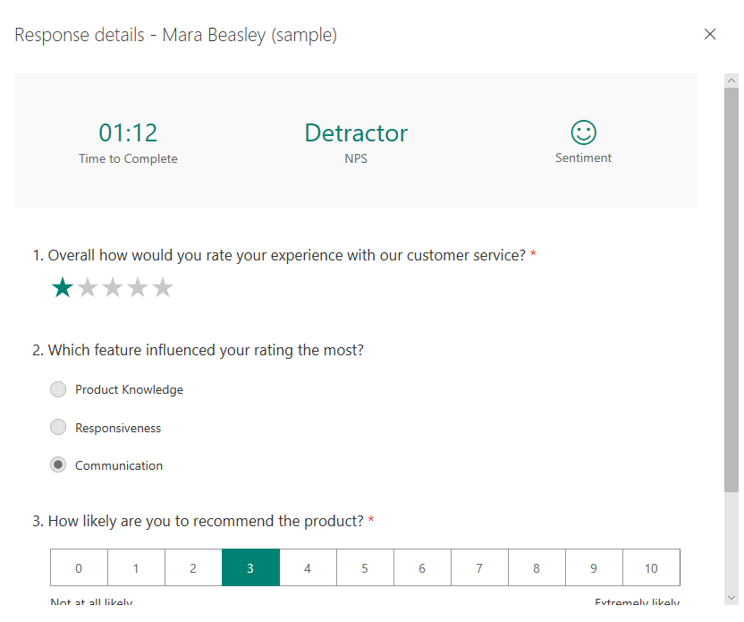
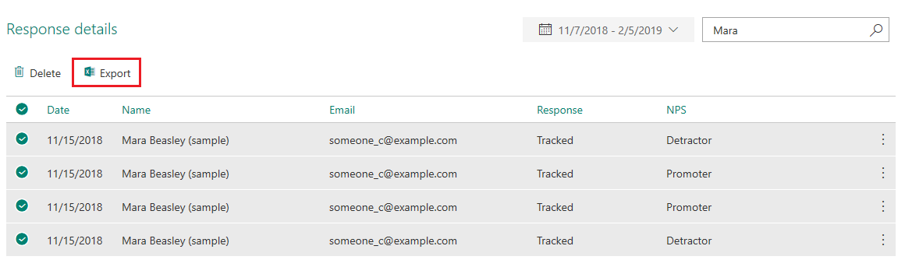
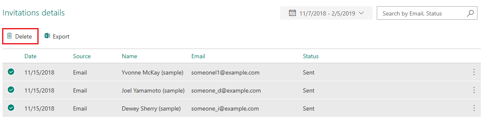

# Analyze survey responses

A survey response record is created after a respondent submits a survey. To see survey responses, go to **View Responses** &gt; **Overview**, and then select **Responses** from the summary information.

> [!div class=mx-imgBorder]
> 

The following survey response statistics are displayed in a summary pane at the top of the page and the list of survey responses received for a survey is displayed below the statistics in the grid format.

- **Average completion time**: Average time taken by a respondent, from opening a survey to submitting the survey.

- **Response ratio:** Ratio of closed invites to the total number of invites.

- **Responses trend**: Number of survey responses received per day.

- **NPS distribution**: Distribution of the Net Promoter Score (NPS), which shows the number of promoters, detractors, and passive supporters.

> [!div class=mx-imgBorder]
> 

## Filter responses

You can filter the responses by using the following:
- **Pre-defined filters**: Use the Tracked and Anonymous filters to filter the responses
- **Date range**: Select 30 days, 90 days, or a custom date range.
- **Respondent's name or email address**: Enter the respondent's name or email address in the search box.

## View response details

To view details of a survey response, double-click the response in the grid.

You'll see the time taken by the respondent to complete the survey, Net Promoter Score (NPS) type, and sentiment. Response to each question in the survey is also displayed on the details page. 

> [!div class=mx-imgBorder]
> 

## Export survey responses

You can export a single survey response or multiple survey responses to Microsoft Excel. To export survey response(s), select the required response(s), and then select **Export** in the **Response details** section.

Each question in your survey is a column and each response becomes a row in the Excel workbook. 

> [!div class=mx-imgBorder]
> 

## Delete survey responses

You can delete a single survey response or multiple survey responses from Forms, CDS, and insights store. To delete survey response(s), select the required response(s), and then select **Delete** in the **Response details** section. Select **Delete** in the confirmation message.

> [!div class=mx-imgBorder]
> 

## See also

[View summary information for your survey](view-summary-information.md) 
[View details for each question](view-details-each-question.md) 
[Analyze survey invitations](analyze-survey-invitations.md) 
[Analyze survey insights](analyze-survey-insights.md)
