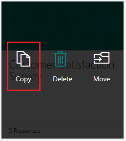
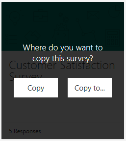

# Copy a survey to another environment

You can create a copy of your survey in the same environment or in another environment. To copy a survey to another environment:

1. Sign in to Forms Pro. 

2. Find the survey you want to copy from the list of surveys, and select **More form actions** (...) in the upper-right corner of the survey window. 

    

3. Select **Copy**.

    

    Two options are displayed for copying the survey.

4. Select **Copy to**.

    

    A list of environments is displayed in a pane on the right side of the screen.

5. Select the environment to which you want to copy the survey.