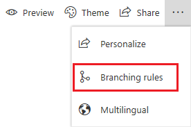
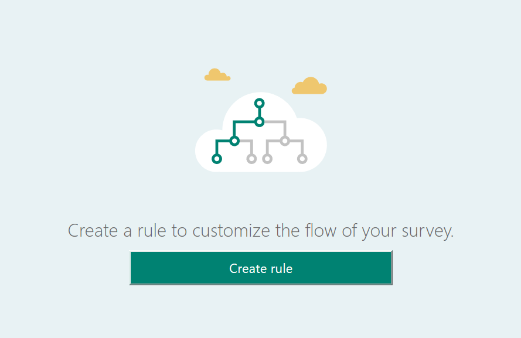
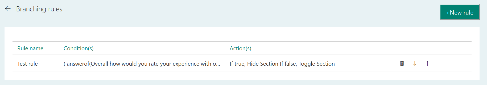
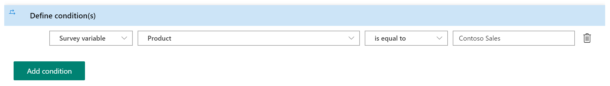
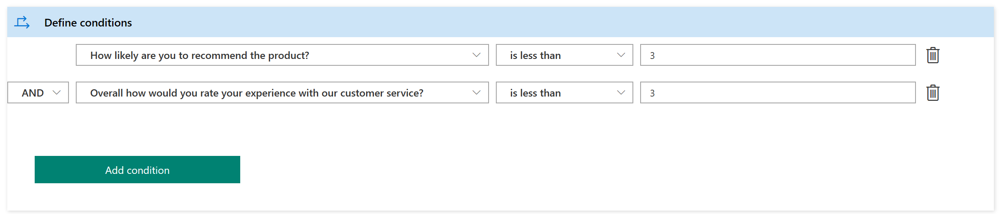
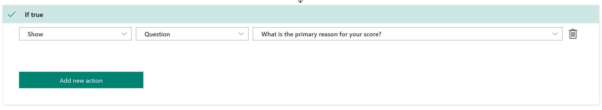
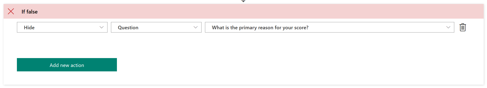

# Create a branching rule

[!include[cc-beta-prerelease-disclaimer](includes/cc-beta-prerelease-disclaimer.md)]

When you want to ask additional questions based on responses in a survey, create one or more branching rules for those responses. Branching rules make your surveys interactive and ensure that only the relevant questions are displayed to the responders. 

You can also choose to navigate to another question or survey, or even open a website based on the response to a question.

For example, for the question **How likely is it that you would recommend us to a friend?**, you can create a branching rule to ask the reason if someone responds **Not likely**.

1.	Open the survey in which you want to add a branching rule.

2.	On the **Create Questions** tab, select the ellipsis button (…) from the toolbar at the top of the page, and then select **Branching rules**. 

    
    
    If you don't have any rules created yet, the following page is displayed. Select **Create rule**. 

     

    If you have at least one rule created, a list of rules is displayed in a grid. Select **New rule**. 
 
    

3.	In the **Rule name** field, enter a name for the branching rule.

4.	In the **Define conditions** area, select **Add condition** to add a response condition.

5.	In the **Select question** list, choose the question for which you want to create a rule.

6.	Select values from the **Select operator** and **Select response** lists accordingly.

    

    You can add more conditions with the combination of **AND**/**OR** operators by selecting **Add condition**.

    

7.	Select **Add “If true”** to add the action that will trigger when the defined condition meets the criteria.

8.	Select **Add condition** to add the response action.

9.	In the **Select action** list, choose one of the following actions:

    - **Show**: Allows you to select a question to be displayed per the response to a question.
    - **Hide**: Allows you to select a question to be hidden per the response to a question.
    - **Toggle**: Allows you to toggle the state of the selected question per the response to a question.
    - **Navigate to**: Allows you to select a target to which a responder should be navigated.

10.	In the **Select target** list, choose a target for the selected action. If you select **Show**, **Hide,** or **Toggle** as the action, you can select **Question** as the target. If you select **Navigate to** as the action, you can choose one of the following targets:

    - **Question**: Allows you to skip to a question per the response to a question.
    - **End of survey**: Allows you to end the survey per the response to a question.
    - **Chain survey**: Allows you to open a different survey per the response to a question.
    - **URL**: Allows you to open a website per the response to a question.

11.	In the **Select value** list, enter or choose a value per the target.

    

12.	Select **Add “If false”** to add the action that will trigger when the defined condition does not meet the criteria. Then follow Steps 8 through 11. 

    

13. Select **Save**.

