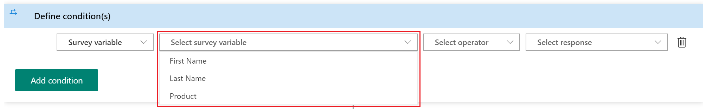
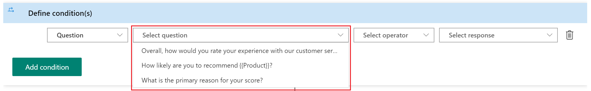
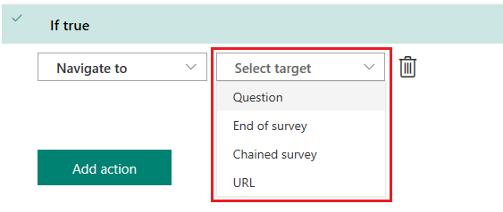

# Create a branching rule

When you want to ask additional questions based on responses in a survey, create one or more branching rules for those responses. Branching rules make your surveys interactive and ensure that only relevant questions are displayed to responders.

You can also choose to navigate to another question or survey, or even open a website based on the response to a question. If you have hidden a question from being displayed in a survey by using the **Visible** option, you can use the branching rule to display it based on the required response. For more information about setting the visibility for a question, see [Create a new survey](create-new-survey.md).

For example, for the question **How likely is it that you would recommend us to a friend?**, you can create a branching rule to ask the reason if someone responds **Not likely**.

**To create a branching rule**

1. Open the survey in which you want to add a branching rule.

2. Select the ellipsis button **(…)** from the toolbar at the top of the page, and then select **Branching rules**.

    > [!div class=mx-imgBorder]
    > 

    If you don't have any rules created yet, the following page is displayed. Select **Create rule**.

    > [!div class=mx-imgBorder]
    >  

    If you've created at least one rule, a list of rules is displayed in a grid. Select **New rule**.
 
    > [!div class=mx-imgBorder]
    > 

3. In the **Rule name** field, enter a name for the branching rule.

4. In the **Define conditions** area, select **Add condition** to add a response condition.

5. In the first list, choose whether you want to create a rule on a question or a survey variable.

    > [!div class=mx-imgBorder]
    > 

   - If you choose to create the rule on a survey variable, select a variable from the **Select survey variable** list.

     > [!div class=mx-imgBorder]
     > 

   - If you choose to create the rule on a question, select a question from the **Select question** list.

     > [!div class=mx-imgBorder]
     > 

6. Select values from the **Select operator** and **Select response** lists, respectively.

    > [!div class=mx-imgBorder]
    > 

    You can add more conditions by using the combination of **AND**/**OR** operators by selecting **Add condition**.

    > [!div class=mx-imgBorder]
    > 

7. Select **Add "If true"** to add the action that will be triggered when the defined condition meets the criteria.

8. Select **Add action** to add the response action.

9. In the **Select action** list, choose one of the following actions:

    - **Show**: Select a question to be displayed based on the response to a question.
    - **Hide**: Select a question to be hidden based on the response to a question.
    - **Toggle**: Toggle the state of the selected question based on the response to a question.
    - **Navigate to**: Select the target to which a responder should be navigated.

    > [!div class=mx-imgBorder]
    > 

10. In the **Select target** list, choose a target for the selected action. If you select **Show**, **Hide**, or **Toggle** as the action, you can select **Question** as the target. If you select **Navigate to** as the action, you can choose one of the following targets:

    - **Question**: Skip to a question based on the response to a question. The questions between the source and target questions are hidden from the responder.
    - **End of survey**: End the survey based on the response to a question.
    - **Chain survey**: Open a different survey, created by you, based on the response to a question.
    - **URL**: Open a website based on the response to a question. You must add `http://` to the URL for it to work properly.

    > [!div class=mx-imgBorder]
    > 

11. In the **Select value** list, enter or choose a value per the target.

    > [!div class=mx-imgBorder]
    > 

12. Select **Add "If false"** to add the action that's triggered when the defined condition doesn't meet the criteria. Then follow steps 8 through 11.

    > [!div class=mx-imgBorder]
    > 

13. Select **Save**.

After creating a branching rule, you can preview the survey and see whether the rule is working as expected.

## Manage branching rules

After you've created a branching rule or a set of branching rules, you can edit, delete, or change the order of their execution. The branching rules are executed in the order they were created in.

1. Open the survey in which you want to manage branching rules.
 
2. Select the ellipsis button **(...)** from the toolbar at the top of the page, and then select **Branching rules**.

    > [!div class=mx-imgBorder]
    > 

3. A list of rules is displayed in a grid.

    > [!div class=mx-imgBorder]
    > 

4. To edit a branching rule, select **Edit**  from the corresponding rule row.

5. To delete a branching rule, select **Delete**  from the corresponding rule row.

6. To change the order of execution of a branching rule, move a rule up or down in the grid. To move a rule up or down, select **Move up**  or **Move down**  from the corresponding rule row.

### See also

[Create a new survey](create-new-survey.md) 
[Apply a theme to a survey](apply-theme.md) 
[Preview and test a survey](preview-test-survey.md) 
[Personalize a survey](personalize-survey.md) 
[Format text in a survey](survey-text-format.md) 
[Create a classic form](create-classic-form.md) 
[Create a multilingual survey](create-multilingual-survey.md) 
[Create a multiple-page survey](create-multipage-survey.md)
