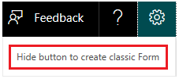

# Create a classic form

Microsoft Forms Pro allows you to create a classic form from within the Microsoft Forms Pro environment. This capability allows you to work with surveys and classic forms together. The classic forms created in Microsoft Forms Pro are opened in their interface and will have all the capabilities of basic forms. 

## Enable creation of classic form

To enable the capability for creating a new form:

1. Sign in to Forms Pro.

2. Select **Settings**  from the upper-right corner of the page.

3. Select **Show button to create classic Form**.

     

4. The **New Form** button is added under **My Forms**.

     

5. To create a form, follow the steps in [Create a form with Microsoft Forms](https://support.office.com/en-us/article/create-a-form-with-microsoft-forms-4ffb64cc-7d5d-402f-b82e-b1d49418fd9d).

## Disable creation of classic form

To disable the capability for creating a new form:

1. Sign in to Forms Pro.

2. Select **Settings**  from the upper-right corner of the page.

3. Select **Hide button to create classic Form**.

     
