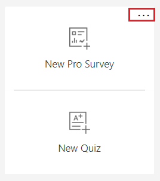
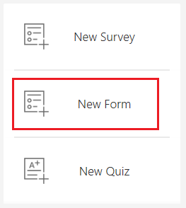

# Create a classic form

Microsoft Forms Pro allows you to create a classic form from within the Microsoft Forms Pro environment. This capability allows you to work with surveys and classic forms together. The classic forms created in Microsoft Forms Pro are opened in their interface and will have all the capabilities of basic forms. 

To create a classic form:

1. Sign in to Forms Pro.

2. Under **My Forms**, select **More options** (...) from the upper-right corner of the **New Pro Survey** button.

    > [!div class=mx-imgBorder]
    >  

4. Select **New Form**.

    > [!div class=mx-imgBorder]
    >  

5. To create a form, follow the steps in [Create a form with Microsoft Forms](https://support.office.com/article/create-a-form-with-microsoft-forms-4ffb64cc-7d5d-402f-b82e-b1d49418fd9d).

## See also

[Create a new survey](create-new-survey.md) 
[Apply theme to a survey](apply-theme.md) 
[Preview and test a survey](preview-test-survey.md) 
[Create a branching rule](create-branching-rule.md) 
[Personalize a survey](personalize-survey.md) 
[Format text in a survey](survey-text-format.md) 
[Create a multilingual survey](create-multilingual-survey.md) 
[Create a multipage survey](create-multipage-survey.md)
