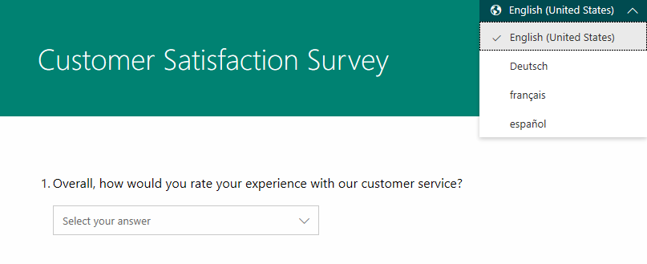
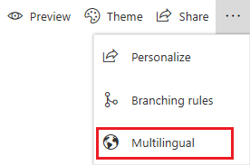
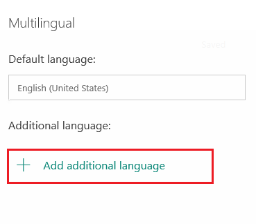
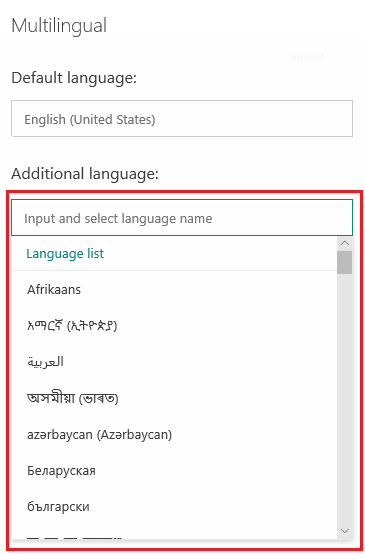
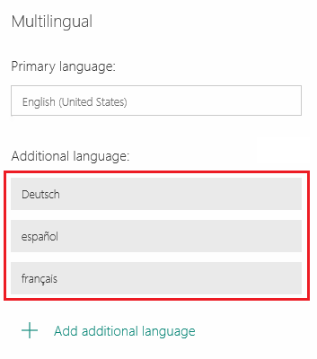
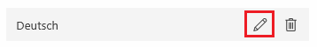
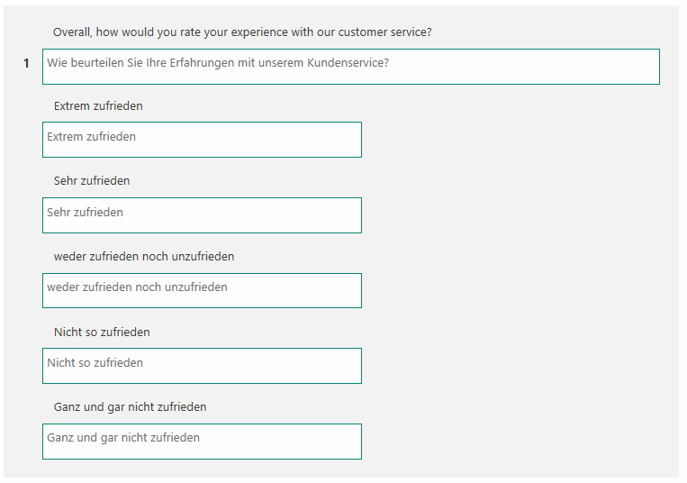
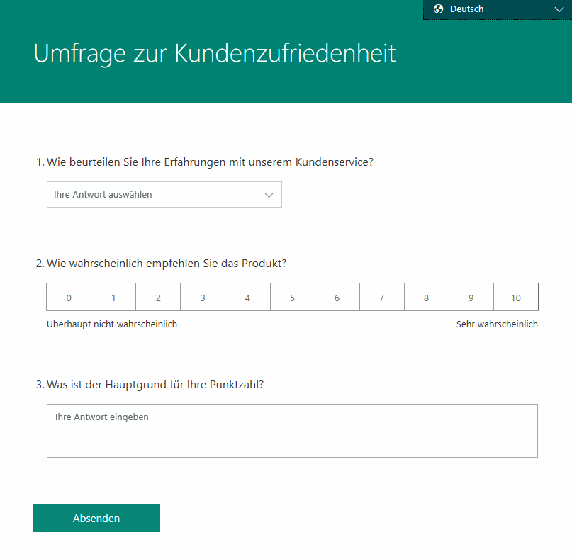
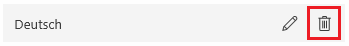

# Create a multilingual survey

You can create a multilingual survey by adding multiple languages to a single survey. You can then add translations for each language. This helps you increase your customer base and allows respondents to take the survey in their preferred language.

When you create a multilingual survey, respondents can choose their preferred language from the language selector at the upper-right corner of the survey.

 

To create a multilingual survey:

1.	[Add survey language](#step-1-add-survey-language)
2.	[Add translations](#step-2-add-translations)

## Step 1: Add survey language

1.	Open the survey in which you want to enable multiple languages.

2.	On the **Create Questions** tab, select the **ellipsis** button (…) from the toolbar at the top of the page, and then select **Multilingual**.

     

3.	In the **Multilingual** pane, select **Add additional language**.

     

4.	From the list of languages, browse and select the required language.

     

5.	If required, select **Add additional language** to add more languages. The added languages are displayed in the pane.

     

## Step 2: Add translations

1.	In the **Multilingual** pane, hover over the language for which you want to add translations, and then select **Edit language**.

     

2.	Select survey title, its description, questions, and their corresponding options in the survey, and enter the translated text for the question and its options.

     

3.	Once you've added translated text for all elements in the survey, select **Back** on the top-left corner of the page to go back to the survey editor.

4.	Repeat steps 2 - 3 to add translations for other languages.

After adding translations for all languages, you must preview the survey to see if everything works as expected. Select the language from the language selector at the upper-right corner of the survey.

 

## Manage translations  

After adding translations for the required languages in your survey, you can either edit the existing translation or delete a language.

1.	Open the multilingual survey in which you want to manage translations.

2.	On the **Create Questions** tab, select the **ellipsis** button (…) from the toolbar at the top of the page, and then select **Multilingual**.

     

3.	To edit the translations, hover over the language for which you want to edit translations, and then select **Edit language**.

     

4.	Edit the translations as required.

5.	To delete a language, hover over the language to be deleted, and then select **Delete language**.

     

## See also

[Create a new survey](create-new-survey.md) 
[Apply theme to a survey](apply-theme.md) 
[Preview and test a survey](preview-test-survey.md) 
[Create a branching rule](create-branching-rule.md) 
[Personalize a survey](personalize-survey.md) 
[Format text in a survey](survey-text-format.md) 
[Create a classic form](create-classic-form.md) 
[Create a multipage survey](create-multipage-survey.md)
