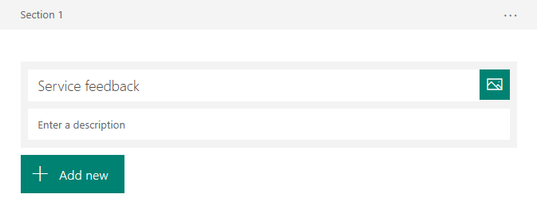
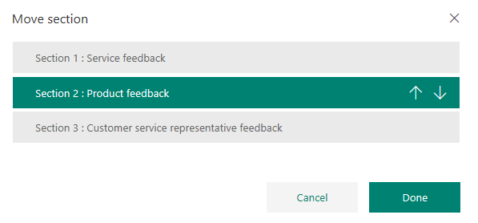

# Create a multiple-page survey

> [!NOTE]
> Microsoft Forms Pro has evolved into Dynamics 365 Customer Voice, providing you with additional survey capabilities and business benefits. The change is being introduced in phases and will be available in all geographical regions in the next few weeks, except for US Government Community Cloud customers. Dynamics 365 Customer Voice will be available on US Government Community Cloud by October 2020. For more information, see the [Dynamics 365 Customer Voice](https://go.microsoft.com/fwlink/p/?linkid=2128357) documentation.

When you create a survey, the survey is created on a single page by default. You can split your survey into multiple pages by adding sections. If your survey is very long and complex, you can use sections to group the questions logically.

> [!NOTE]
> You can add sections in an existing survey, and then move the questions up or down accordingly in the section. If you're creating a new survey, you can add sections while adding questions.

## Add a section

1.	Open the survey in which you want to add sections.

2.	Select **Add new**, select **More** (...), and then select **Section**.

    > [!div class=mx-imgBorder]
    > 

3.	A new section is added to the survey. Enter the section name. You can also enter an optional description for it.

    > [!div class=mx-imgBorder]
    > 

4.	Add new questions to the section, or move existing questions to the section as required.

## Manage a section

After adding the required sections in your survey, you can duplicate, remove, or change the order of the sections.

1.	Open the survey in which you want to manage a section.

2.	Select the ellipsis button **(...)** at the right side of the section header you need to manage, and then select one of the following options:

    - **Duplicate section**: Create a copy of the section, along with its questions.
    - **Remove section**: Select one of the following options:
        - **Just section**: Delete the section and move the questions to the previous section.
        - **Section and questions**: Delete the section and its questions.
    - **Move section**: Move the section up or down in the survey.

        > [!div class=mx-imgBorder]
        > 

### See also

[Create a new survey](create-new-survey.md) 
[Apply a theme to a survey](apply-theme.md) 
[Preview and test a survey](preview-test-survey.md) 
[Create a branching rule](create-branching-rule.md) 
[Personalize a survey](personalize-survey.md) 
[Format text in a survey](survey-text-format.md) 
[Create a classic form](create-classic-form.md) 
[Create a multilingual survey](create-multilingual-survey.md)
