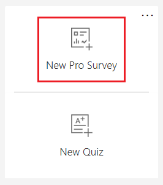
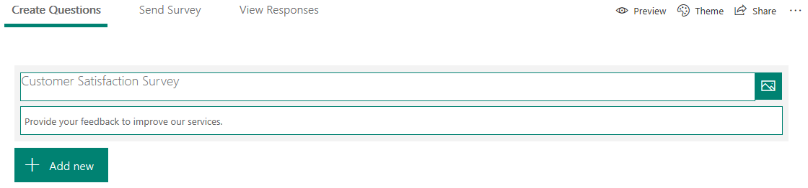
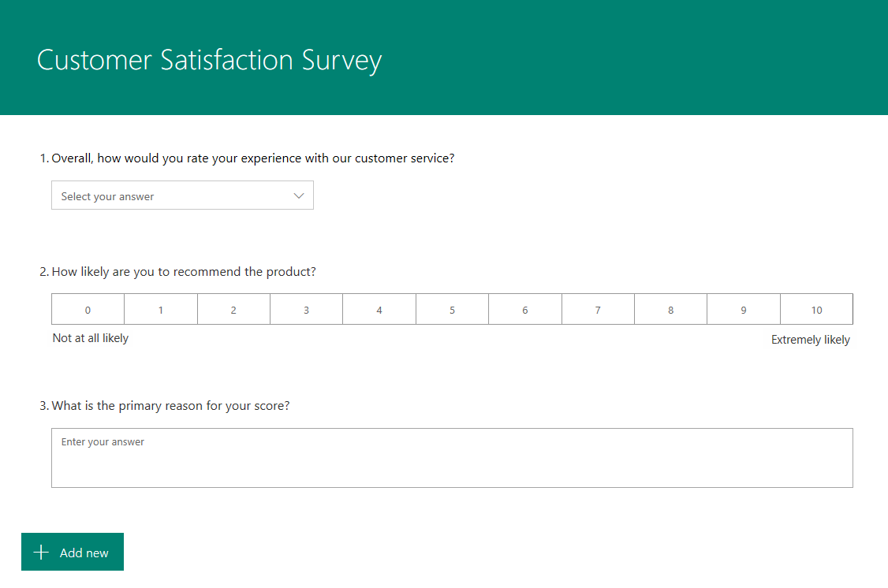
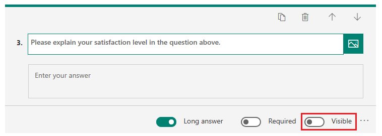

# Create a new survey

To create a new survey with Microsoft Forms Pro:

1.	Sign in to Forms Pro with your Office 365 credentials.

2.	Under **My Forms**, select **New Pro Survey**.

    > [!div class=mx-imgBorder]
    > 

3.	Select the default survey name, and enter a name for your survey. You can also enter an optional description for it.

    > [!div class=mx-imgBorder]
    >  

4.	Select **Add new** to view question types that can be added to your survey. You can choose from **Choice**, **Text**, **Rating**, or **Date** questions. You can also select **More** (...), and choose **Ranking**, **Likert**, or **Net Promoter Score** questions.

    > [!div class=mx-imgBorder]
    > 

5.	Select the question types you want to add.

6.	Enter the question text and its answer options. The survey is saved automatically.

    > [!div class=mx-imgBorder]
    > 

7. Optionally, apply formatting to the survey elements, such as survey heading, survey description, question text, and question subtitle. More information: [Format text in a survey](survey-text-format.md)

8. To change the order of questions in the survey, select a question, and then select the up or down arrow on the right side of each question to move it up or down.

9. To hide a question from being displayed in the survey, move the **Visible** toggle to the off position. By default, this toggle is turned on. You can show the question to the responder based on a branching rule. More information: [Create a branching rule](create-branching-rule.md)

    > [!div class=mx-imgBorder]
    > 

> [!NOTE]
> - You can personalize your survey by adding custom data to the questions. More information: [Personalize a survey](personalize-survey.md)
> - You can create a classic form within Forms Pro. More information: [Create a classic form](create-classic-form.md)
> - You can also create quizzes within Forms Pro to get real-time feedback. For steps to create a quiz, see [Create a quiz with Microsoft Forms](https://support.office.com/article/create-a-quiz-with-microsoft-forms-a082a018-24a1-48c1-b176-4b3616cdc83d).

## Proactive phishing prevention

Phishing attacks attempt to steal sensitive information through emails, websites, text messages, or other forms of electronic communication that often appear to be official communication from legitimate companies or individuals. The information that phishers attempt to steal can be passwords or other credentials.

In Forms Pro, we enable automated machine reviews to proactively detect malicious password collection in surveys.

### Survey designer experience

In any survey you design, if you ask questions that require a respondent to provide password, account information, or other security information, the survey is automatically blocked and can't be distributed. The administrator will receive a notification and an option to unblock the survey. If you want to distribute the survey, you must contact your administrator to unblock it.

### Administrator experience

When a survey is blocked automatically, the administrator receives a daily notification in **Message center** with an option to unblock the survey. For information about how to unblock a survey, see [Review and unblock forms detected and blocked for potential phishing](https://support.office.com/article/review-and-unblock-forms-detected-and-blocked-for-potential-phishing-879a90d7-6ef9-4145-933a-fb53a430bced).

## Add restrictions in text-based questions

Text questions allow you to add restrictions when you want your respondents to provide answers as a number, an email, or in a predefined format such as booking ID.

To add restrictions:

1. In the text-based question, select **More settings for question** (...), and then select **Restrictions**.
2. Select one of the following options from the **Restrictions** list:
    - **Number**: Allows you restrict the input to only numbers. You can choose to restrict the numbers by selecting from the various options such as Only number, Greater than, Less than, Between, and many others.
    - **Email**: Allows you restrict the input to only a valid email address.
    - **Custom**: Allows you to define a regular expression and restrict the input that matches the defined expression.

## Calculate sentiments from responses to text-based questions

Sentiment analysis allows you to determine whether user responses for a survey are positive, neutral, or negative. The sentiments are calculated from responses to the text-based questions. In a survey, you can select the text-based questions that should be used for calculating sentiment of the survey. To select text-based questions for sentiment analysis, go to the text-based question, and move the **Sentiment** toggle to the on position. By default, this toggle is turned off. If you don't select any text-based question for sentiment analysis, sentiment will not be generated.

### See also

[Apply a theme to a survey](apply-theme.md) 
[Preview and test a survey](preview-test-survey.md) 
[Create a branching rule](create-branching-rule.md) 
[Personalize a survey](personalize-survey.md) 
[Format text in a survey](survey-text-format.md) 
[Create a classic form](create-classic-form.md) 
[Create a multilingual survey](create-multilingual-survey.md) 
[Create a multipage survey](create-multipage-survey.md)
