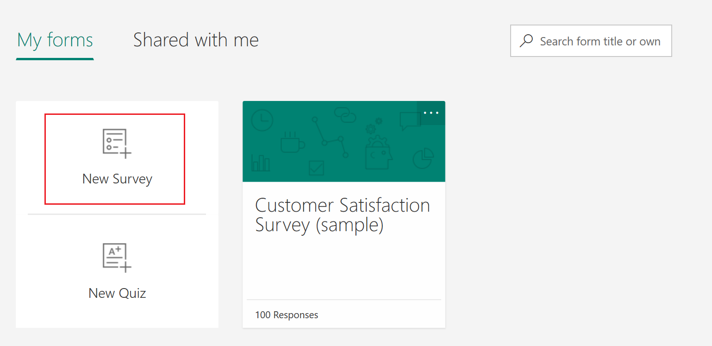

# Create a new survey

To create a new survey with Forms Pro:

1.	Sign in to Forms Pro with your Office 365 credentials.

2.	Under **My Forms**, select **New Survey**.

     

3.	Select the default survey name, and enter a name for your survey. You can also enter an optional description for it.

4.	Select **Add Question** to view question types that can be added to your survey.

5.	Select the required question type to be added.

6.	Enter the question text and its answer options. The survey is saved automatically.

     
