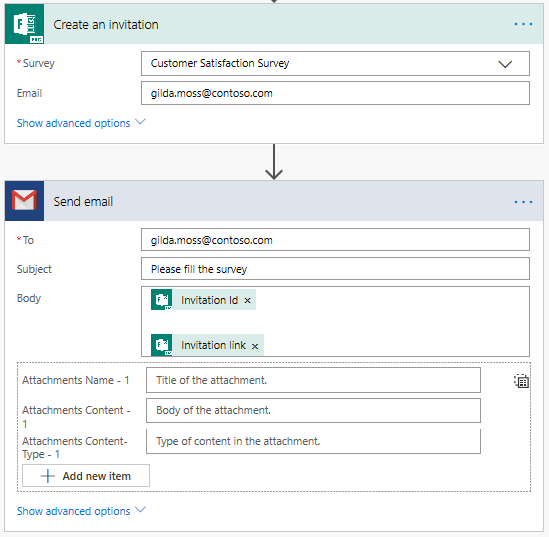

# Create a survey invitation

[!include[cc-beta-prerelease-disclaimer](includes/cc-beta-prerelease-disclaimer.md)]

If you want to send a survey using a platform other than Microsoft Forms Pro, such as Outlook, Gmail, or SMS, you can create a survey invitation using Microsoft Flow and send it accordingly. A survey invitation creates a unique survey invitation ID and a personalized link that can be distributed by using a platform of your choice.

1. Sign in to [flow.microsoft.com](https://flow.microsoft.com).

2. Start to create a flow from scratch. For information on creating a flow from scratch, see [Create a flow in Microsoft Flow](https://docs.microsoft.com/en-us/flow/get-started-logic-flow).

3. In the flow editor, add a new step and search for **Microsoft Forms Pro** connector.

4. In search results, select **Microsoft Forms Pro**.

    > [!div class=mx-imgBorder]
    >   

5. Select the **Create an invitation (preview)** action.

    > [!div class=mx-imgBorder]
    >  action")  

6. In the **Create an invitation** action, enter or select the following values:

    - **Survey**: Select the survey to be sent.
    - **Email**: Enter recipient's email address.

7. Add a new step and select the action to send the email. In this procedure, we have used Outlook to send the survey.

8. In the **Send an email** action, enter the following values: 
    - **To**: Recipient's email address.
    - **Subject**: Subject of the email.
    - **Body**: Enter the required text and add **Invitation Id** and **Invitation link** dynamic contents.

    After entering the required details, the flow looks as shown in the below image:

    > [!div class=mx-imgBorder]
    > 

    You can run the flow as per the configured trigger and send the survey.

    In the following example, Gmail is used to send the survey:

    > [!div class=mx-imgBorder]
    > 

## See also

[Define who can respond to a survey](invite-settings.md) 
[Send a survey by using email](send-survey-email.md) 
[Send a survey by using Microsoft Flow](send-survey-microsoft-flow.md) 
[Embed in a web page](embed-web-page.md) 
[Send a survey link to others](send-survey-link.md) 
[Send a survey QR code](send-survey-qrcode.md)

